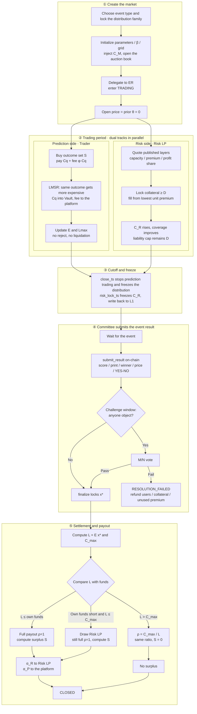

# Product Specification — Continuous PDF Prediction Market

**Continuous probability prediction market + risk-capital auction + layered tail coverage + pro-rata payout**

| Item | Content |
| --- | --- |
| Version | 1.0 |
| Status | Product specification (features are written as fully delivered; no MVP / later-phase split) |
| Key decisions | Soft solvency: do not reject trades when $L_{\max}$ exceeds capital. Settle on $L=E(x^*)$. If $L>C_{\max}$, one global pro-rata $\rho$ (no FIFO). $C_{\max}=R_{\mathrm{net}}+C_M+C_R^{\mathrm{final}}$. Fees never enter the payout pool. Price is pure probability; coverage is displayed only. Five market types and the risk auction are specified in full. $x^*$ only via `submit_result`. |

---

## 1. Product Definition

This protocol is a prediction market based on a **continuous probability density function (PDF)**.

Unlike traditional YES / NO prediction markets, it trades the full probability distribution of a continuous random variable, not a single binary event. Typical underlyings include:

- BTC / ETH expiry or close price
- CPI, interest rates, FX, commodity prices
- Other continuous economic indicators
- Football and other score-type events: one board per match, see section 4.6
- Macro prints such as CPI, elections, a same-day BTC price, whether an event occurs by a deadline: see sections 4.7–4.11

The market maintains a probability density curve $f(x)$ that always satisfies:

$$
f(x)\ge 0,\qquad \int_{\Omega} f(x)\,dx=1
$$

The curve evolves in a fixed order and is never rewritten by an oracle in the middle:

1. **Initialized at creation.** Write the prior $f_0(x)$ (uniform, or a parameterized family chosen by the creator). At this point $\theta(x)=0$, so the quoted price is the prior.
2. **Updated continuously during trading.** Each interval buy or sell only changes the state $\theta(x)$, then LMSR produces a new $f(x)$. Buying an interval raises density on that stretch; the rest is renormalized downward.
3. **Frozen after close.** Trading stops and $f(x)$ no longer changes. The oracle or committee only reports the realized outcome $x^*$; it does not go back and rewrite the distribution.

Users buy an arbitrary interval $I=[a,b]$. Contract payoff is:

$$
g_I(x)=1_{x\in[a,b]}
$$

The market price of that interval equals the current market probability:

$$
P(X\in[a,b])=\int_a^b f(x)\,dx
$$

The protocol consists of two linked markets:

| Market | What is discovered | Description |
| --- | --- | --- |
| Market A: prediction market | $P(X\in I)$ | The probability that the outcome falls in a given interval |
| Market B: risk-capital market | The price of tail risk | How much capital it costs to underwrite the gap if final payout exceeds the board’s own funds |

The product is therefore not “a prediction market + a generic LP pool”, but:

$$
\text{Probability Discovery}+\text{Risk Capital Discovery}
$$

The core innovation: turn the tail liability produced by the prediction market into a financial object that can be priced, auctioned, layered, and underwritten.

### 1.1 End-to-End Business Flow

A board’s lifecycle follows the path below. During the trading period the risk-capital auction runs in parallel. After the cutoff, the distribution is no longer changed; the board only waits for the outcome and pays out.

```text
① Choose the distribution family
② Initialize parameters and create the market (inject C_M, open the risk auction book)
③ Trade (LMSR: buying the same outcome makes it more expensive + fees; LPs quote at the same time)
④ At close_ts, cut off orders and freeze f / P
⑤ Wait for the event
⑥ The committee (or an authorized reporter) writes the outcome on-chain; Pyth / sports APIs are evidence only and never write themselves
⑦ Payout
      ├─ Own funds cover L              → full payout, then split surplus
      ├─ Own funds fall short, but L ≤ C_max → draw Risk LP, still full payout
      └─ L > C_max                      → pay all winners at the same ratio ρ = C_max / L
⑧ Only on full payout: surplus is split between risk capital and the platform
```

**① Choose the probability-distribution type.** Identify the underlying first, then lock the family. It cannot be swapped later.

| Event | Distribution family |
| --- | --- |
| Football score | Two-dimensional Poisson / Skellam |
| CPI, inflation, etc. | One-dimensional Gaussian |
| Who wins / top $n$ in an election | Dirichlet → categorical |
| Same-day BTC price | Lognormal |
| Whether it occurs by a deadline | Binary Dirichlet / Bernoulli |

**② Initialize and create the market.** Write prior parameters (e.g. $\lambda_H,\lambda_A$ or $\mu,\sigma$ or $\alpha_i$), the grid or atoms, $\beta$, $C_M$, the resolution source, and `close_ts`. At this point $\theta=0$, so board prices equal $f_0$ / $P_0$. Creating the market also opens that board’s risk auction book.

**③ Trade.** The user buys some outcome set $S$ (home win, exactly 1 goal, CPI in a bin, YES…). Each fill pays two amounts:

1. **Contract cost** $C_S(q)$: enters this board’s Vault, used for expiry payout
2. **Fee** $\phi\cdot C_S(q)$: goes to the platform immediately and does not enter the payout pool

The same outcome gets more expensive the more it is bought. Under LMSR, if at open $P(S)=0.2$, a first tiny order has a marginal price of about $0.2$; after it fills, that stretch of density is pulled up, and the next order for the same outcome has a marginal price strictly above $0.2$. Further buys keep lifting it. This is not a queue markup; the curve is rewritten by the fill itself. Selling (reducing a position) presses that stretch down and the price falls back.

During the trading period $L_{\max}$ may exceed available funds. **Orders are not rejected, and user positions are not force-liquidated.** Coverage is display-only. Risk LPs quote published layers and lock collateral in the same window.

**④ Cutoff.** When `now ≥ close_ts`, prediction-side fills stop and the distribution is frozen. Whether the risk side still accepts collateral depends on `risk_lock_ts`.

**⑤ Wait for the event.** Football waits for full time; CPI waits for the official print; a price board waits until `observe_ts`; a binary event waits until the deadline or an early occurrence.

**⑥ Submit the result.** The chain does not grow $x^*$ by itself. A `submit_result` transaction must write the settlement value into the market account. The reporter is a committee member or an authorized bot. The payload is a score, a published print, a winner, a price, or YES/NO — not “which line won”. Pyth and sports APIs are only evidence that this transaction may attach; see section 10. No payout before finalization.

**⑦ Payout.** This protocol has no futures-style liquidation. Settlement only compares face-value liability $L=E(x^*)$ with payable capital $C_{\max}=R_{\mathrm{net}}+C_M+C_R^{\mathrm{final}}$. $R_{\mathrm{net}}$ already deducts fees and premiums payable.

| Informal wording | Exact condition | What the user receives |
| --- | --- | --- |
| No liquidation, normal payout | $L \le R_{\mathrm{net}}+C_M$ | $\rho=1$; that Risk LP layer is not hit, or is hit only lightly |
| Draw risk capital, still normal payout | $R_{\mathrm{net}}+C_M < L \le C_{\max}$ | Still $\rho=1$; draw Risk LP by layer |
| Exceeds maximum payable risk capital | $L > C_{\max}$ | $\rho=C_{\max}/L$; all winners at the same ratio; first-come-first-served is forbidden |

Only the third case is a haircut. How $\rho$ is computed is in section 8.3: the denominator is the sum of face values that hit the realized outcome, not trading-period $L_{\max}$.

**⑧ Surplus allocation.** Surplus exists only when $\rho=1$ (users have already been paid at face value):

$$
S=\max(R_{\mathrm{net}}+C_M-L,0)
$$

$S$ is split into two parts at the ratios locked at market creation: $\alpha_R S$ to this board’s Risk LPs (then split by each LP’s $\alpha_i$), $\alpha_P S$ to the platform, with $\alpha_R+\alpha_P=1$. When $\rho<1$, $S=0$; neither risk capital nor the platform takes surplus.

### 1.2 Business Flow Diagram

The full figure is `business-flow.png` (same folder).




---

## 2. Problems to Solve

Traditional prediction markets have two structural defects:

1. **Insufficient expressiveness.** YES / NO can trade only one event. They cannot trade “which interval the price will fall into, and how wide the distribution is”.
2. **Scale is capped by own funds.** If the protocol requires $L_{\max}\le C_M$, the market cannot grow. If it allows naked shorting and then looks for a rescue after liquidation, user payout has no bound agreed in advance.

Goals of this protocol:

- Initialize the probability distribution first, then let trading continuously rewrite it
- Trade the full distribution with a continuous PDF
- Use Risk LPs to underwrite the tail in layers
- **Allow trading to continue even when risk capital has not yet caught up**
- **At expiry, pay only the liability on the realized outcome; if funds fall short, haircut all winners at the same ratio**
- Cap “who pays at most how much” on already-locked capital, not on after-the-fact top-ups

One-sentence principle:

> Orders are not rejected for insufficient funds. At expiry, only the liability on the realized $x^*$ is paid. Maximum payable capital is whatever is actually in place at settlement. If that is not enough, pay pro-rata — not by arrival order.

---

## 3. Roles

### 3.1 Trader

Buys an interval contract $q\cdot 1_I(x)$. If the final outcome falls in $I$, face-value payoff is $q$; the amount actually received is $\rho\cdot q$, where $\rho$ is the settlement recovery rate; see section 8.

Traders have no market-making obligation and do not provide risk capital.

### 3.2 Market

Maintains and executes:

- The PDF $f(x)$ and state $\theta(x)$
- Interval quotes and fills
- User positions and total exposure $E(x)$
- Market revenue, reserves, and current theoretical maximum liability $L_{\max}$
- Risk-capital demand and coverage display
- Expiry settlement and haircuts

### 3.3 Risk LP

A Risk LP is not a traditional AMM liquidity provider. It is a **tail underwriter**.

In a specified risk layer $[A,A+D]$, they commit to pay at most $D$ and lock collateral of at least $D$. Revenue comes from:

- Risk Premium
- Optional Profit Share (only residual profit after full payout and after reserves meet the bar)

They bear the Tail Loss when that layer is hit. Later fills do not increase their committed liability.

### 3.4 Risk Auction

Auctions, in layers, the tail risk that exceeds the board’s own funds. Risk LPs quote layer, size, premium, collateral, and profit share. The market selects a set of quotes under constraints, aiming to fill the required coverage and to keep total premium as low as possible.

In v1.1 the risk auction is a **continuous capital-top-up mechanism**, not a hard gate on open or on placing an order. When risk capital is insufficient, trading still proceeds; coverage falls and expiry may haircut.

### 3.5 Resolver

The person who **writes the final outcome $x^*$ as an on-chain transaction**. Without that transaction, no feed can enter the contract.

- A committee member or authorized reporting bot calls `submit_result`
- May attach evidence (the Pyth account read at that moment, a data-source hash)
- Finalization happens only after the challenge window or after a vote passes

---

## 4. Continuous PDF Market

The prediction market’s primary state is $f(x)$. The product cadence is: **initialize first, then keep deforming with every fill**.

```text
Create the market
   │  Choose Ω, β, prior f_0(x)
   │  θ(x) = 0
   ▼
f(x) = f_0(x)
   │
   ▼
Each buy / sell of interval I, quantity q
   │  θ_new(x) = θ_old(x) + q · 1_I(x)
   │  Recompute Z[θ], obtain the new f(x)
   │  Interval price = current ∫_I f(x) dx
   ▼
The next trade continues to rewrite f(x)
   │
   ▼
Close: freeze f(x) and positions, wait only for x*
```

$f(x)$ **is not specified by an oracle and is not rewritten at settlement**. The oracle only supplies $x^*$, used to compute $L=E(x^*)$. Price discovery comes entirely from trading.

### 4.1 Market State

Market state is a density $f(x)$ defined on the interval $\Omega=[x_{\min},x_{\max}]$, jointly determined by the prior $f_0(x)$ and the accumulated state $\theta(x)$.

### 4.2 Initial Distribution $f_0$

$f_0$ is written once at genesis and is never officially rewritten afterward. It is the starting point of the curve (or discrete mass), not the final distribution. **The underlying type determines the family**: football, CPI, elections, prices, and binary events each use a different state space and $f_0$; see 4.7.1. When information is missing, fall back only to the maximum-entropy / unbiased form *inside that family* (widen the Gaussian, set all Dirichlet $\alpha_i=1$, flatten Poisson $\lambda$, etc.). Do not switch families.

**1. Dirichlet / mutually exclusive categories**

Used when “exactly one option occurs”: 1X2, who is elected, whether a measure passes. The true outcome model is Categorical; Dirichlet is the prior on the probability simplex and supplies initial weights $(\alpha_1,\ldots,\alpha_K)$. After normalization:

$$
p_i=\frac{\alpha_i}{\sum_k\alpha_k},\qquad \sum_i p_i=1
$$

When $\alpha_i=1$, this degenerates to a uniform categorical prior. Thereafter trading rewrites $\theta_i$ on $K$ atoms, equivalent to discrete LMSR; no continuous grid is needed.

**2. Gaussian / continuous numeric**

Used for temperature, inflation, prices, FX, and other quantities that live on the reals (or a truncated interval):

$$
f_0(x)=\mathcal{N}(\mu_0,\sigma_0^2)
$$

Truncate and renormalize on $\Omega=[x_{\min},x_{\max}]$. When $\sigma_0$ is large, this approaches a uniform unbiased prior.

**3. Poisson / counts**

Used for goals, incidents, post counts, and other non-negative integers:

$$
P_0(K=k)=\frac{\lambda_0^k e^{-\lambda_0}}{k!},\qquad k=0,1,2,\ldots
$$

On-chain, truncate to $\{0,1,\ldots,K_{\max}\}$ and renormalize.

**4. Skellam / difference of two counts (primary sports scheme)**

If home and away goals are approximately independent, $X\sim\mathrm{Poisson}(\lambda_H)$, $Y\sim\mathrm{Poisson}(\lambda_A)$, then the margin

$$
D=X-Y\sim\mathrm{Skellam}(\lambda_H,\lambda_A)
$$

$$
P(D=d)=e^{-(\lambda_H+\lambda_A)}\left(\frac{\lambda_H}{\lambda_A}\right)^{d/2}I_{|d|}\bigl(2\sqrt{\lambda_H\lambda_A}\bigr)
$$

The same pair $(\lambda_H,\lambda_A)$ simultaneously yields:

| Derived line | Formula |
| --- | --- |
| Home | $P(D>0)$ |
| Draw | $P(D=0)$ |
| Away | $P(D<0)$ |
| Handicap / margin interval | $P(D\in[a,b])$ |
| Total goals | $X+Y\sim\mathrm{Poisson}(\lambda_H+\lambda_A)$ |
| Correct score | $P(X=i,Y=j)$ (independent Poisson or bivariate Poisson) |

Skellam is therefore not a fourth unrelated prior. It is the **generative bridge between a Poisson count market and a Dirichlet categorical market**: first initialize two attack intensities, then project many lines.

Independent Poisson underestimates draws and ignores attack–defense correlation. When needed, apply a Dixon–Coles low-score correction, or a bivariate Poisson with covariance; the margin can still keep Skellam form.

#### One match, one board

The product shape is: **one football match has exactly one board**. Everyone on that board buys different contracts — home / draw / away, home handicap, totals, correct score. It looks like several prediction markets, but underneath it is the same joint score distribution $P(X=i,Y=j)$, the same pot of funds, the same Risk LPs, and the same settlement score.

It is not a separate, unrelated market for each play type. Every buy is a different set of cells on this one score table.

The underlying state is a truncated score grid, e.g. $i,j\in\{0,1,\ldots,10\}$, $11\times 11=121$ atoms. At genesis, write independent Poisson (or Dixon–Coles / bivariate Poisson):

$$
P_0(X=i,Y=j)=\frac{\lambda_H^i e^{-\lambda_H}}{i!}\cdot\frac{\lambda_A^j e^{-\lambda_A}}{j!}
$$

(Renormalize after truncation.) Users always buy a cell set $S$. Payoff is $1_{(X,Y)\in S}$, price is $\sum_{(i,j)\in S}P(i,j)$. Common lines are just preset $S$:

| Line | Set $S$ |
| --- | --- |
| Home | $\{(i,j):i>j\}$ |
| Draw | $\{(i,j):i=j\}$ |
| Away | $\{(i,j):i<j\}$ |
| Home handicap $h$ | $\{(i,j):i-j>h\}$ (half / quarter lines split into two sets by rule) |
| Total goals over $k$ | $\{(i,j):i+j>k\}$ |
| Both teams to score | $\{(i,j):i\ge 1,j\ge 1\}$ |
| Home goals over $k$ | $\{(i,j):i>k\}$ |
| Correct score $i$-$j$ | Single cell $\{(i,j)\}$ |
| Margin in $[a,b]$ | $\{(i,j):a\le i-j\le b\}$ |

Trading any line updates $\theta_{ij}\leftarrow\theta_{ij}+q$ on the cells in $S$, then LMSR recomputes the entire $P(i,j)$. Therefore:

- Someone buys “home”: home cells rise, draw / away are pressed down, handicap and totals prices move with them
- Someone buys “over 2.5”: high-score cells rise, 0-0 / 1-0 / 0-1 fall; the draw and cheap low-score home wins become cheaper together
- All derived lines stay **arbitrage-free consistent**: “home 70% while $P(D>0)=55\%$” cannot occur

Settlement still looks only at the realized score $(x^*,y^*)$. Positions whose set contains that cell count toward $L$ at face value; if funds fall short, one global $\rho$. Risk LPs underwrite this match’s total exposure, not a mutually unrecognized pot per line.

Do not mix these two implementations:

| Approach | Meaning | Fit |
| --- | --- | --- |
| **Recommended: shared score grid** | One underlying PDF per match; many lines are different projections | Sports; needs cross-line consistency |
| Independent boards | Separate LMSR books for 1X2, totals, etc. | Simpler to implement, but prices can contradict |
| Update only $(\lambda_H,\lambda_A)$ | Parameterized AMM; state is two numbers | Tiny state; but “buy home” does not invert $\lambda$ uniquely, and cross-line behavior is stiff |

The sports line uses the shared score grid: Skellam / Poisson is only for initialization. After $f_0$ is written, trading freely shapes the table; it is not locked in a two-parameter family forever. Do not also build a parameterized AMM that only updates $(\lambda_H,\lambda_A)$.

In the continuous or truncated case it must hold that:

$$
\int_{\Omega}f_0(x)\,dx=1
$$

In the discrete case, replace with $\sum_k P_0(k)=1$.

### 4.3 Continuous Cost Function

The market maintains a continuous state function $\theta(x)$, initially $\theta(x)=0$. The cost function is:

$$
C[\theta]=\beta\log\int_{\Omega}f_0(x)\,e^{\theta(x)/\beta}\,dx=\beta\log Z[\theta]
$$

where:

- $f_0(x)$: initial distribution
- $\theta(x)$: accumulated state from historical trades
- $\beta$: liquidity / sensitivity parameter; larger $\beta$ makes the curve harder for a single trade to move
- $Z[\theta]=\int_{\Omega}f_0(x)\,e^{\theta(x)/\beta}\,dx$: partition function

The corresponding market PDF:

$$
f_{\theta}(x)=\frac{f_0(x)\,e^{\theta(x)/\beta}}{Z[\theta]}
$$

### 4.4 How Trades Rewrite $f(x)$

After open, the distribution changes only with fills. When a user buys interval $I=[a,b]$ in quantity $q$:

$$
\theta'(x)=\theta(x)+q\cdot 1_I(x)
$$

If historical trade $j$ bought $I_j$ in quantity $q_j$, then:

$$
\theta(x)=\sum_j q_j\cdot 1_{I_j}(x)
$$

Buying $I$ pulls density up on that interval; because $Z[\theta]$ renormalizes, density outside the interval is pressed down. Selling is equivalent to $q<0$ (implementation must separately check sellable position).

Let the current interval probability be:

$$
p_I=\int_I f_{\theta}(x)\,dx
$$

Then that trade has a closed-form cost:

$$
C_I(q)=\beta\log\bigl((1-p_I)+p_I e^{q/\beta}\bigr)
$$

Marginal price:

$$
P_I(q)=\frac{p_I e^{q/\beta}}{1-p_I+p_I e^{q/\beta}}
$$

Hence $P_I(0)=p_I$. **The fill price is quoted as pure probability**; expected haircut is not baked into the price. Coverage is displayed separately; see section 8.5.

The same outcome gets more expensive the more it is bought. Suppose at open $p_S=0.2$ (e.g. football “exactly 1 goal” currently 20%):

- First small order: marginal price about $0.2$, cost near $0.2q$
- After the fill, density on $S$ rises and $p_S$ becomes $0.26$
- The next buy of $S$ starts from $0.26$, higher than the first
- Keep buying the same $S$ and the price rises monotonically along $P_S(q)$ toward 1

User actually pays $=C_S(q)+\phi\cdot C_S(q)$. $\phi$ is the protocol fee rate, locked at market creation.

### 4.5 Positions and Liabilities

A user position is recorded as $(I_j,q_j)$, with payoff $q_j 1_{I_j}(x)$. All positions stack into an exposure curve:

$$
E(x)=\sum_j q_j 1_{I_j}(x)
$$

If the final outcome is $X=x$, the face-value total payout the market faces is $L(x)=E(x)$.

Theoretical maximum payout (a trading-period monitor, not the settlement formula):

$$
L_{\max}=\sup_x E(x)
$$

On a football board, exposure lives on score cells: $E(i,j)$. $L_{\max}=\max_{i,j}E(i,j)$, and settlement uses $L=E(x^*,y^*)$. Listing steps are in 4.6.

### 4.6 How a Football Market Is Created

A match calls the create instruction once and produces **one board**. 1X2, handicap, totals, and correct score are preset contracts on that board; they do not each call `create_market`.

#### 4.6.1 Who Creates It and When

An authorized creator (protocol ops or a multisig) lists the board before kickoff. Recommended: no later than a few hours before kickoff, so Risk LPs have time to lock collateral.

Trading covers pre-match and in-play: fills are allowed from listing until `close_ts`. `close_ts` defaults to the full-time whistle for that `score_scope` (end of regulation, or end of extra time), not kickoff. Kickoff does not close the board. During in-play the underlying is still the **final score** $(X,Y)$, not “the next goal”. Goals and red cards do not rewrite $P_0$; only traders buying and selling continue to change $\theta$. Live score is display and risk hint only.

#### 4.6.2 Creation Parameters

`create_football_market` writes the following fields in one shot.

**Match identity**

| Field | Description |
| --- | --- |
| `match_id` | External event ID (e.g. Sportradar / an in-house catalog) |
| `home` / `away` | Home and away teams |
| `kickoff_ts` | Kickoff time |
| `league` / `season` | Display and risk grouping |

**Settlement convention (must be locked before open)**

| Field | Rule | Description |
| --- | --- | --- |
| `score_scope` | `REGULATION_90` / `INCLUDE_ET` / `INCLUDE_PENS` | Must pick exactly one and lock it. League regulation boards use the first; cup extra-time boards and boards that include penalties are each a separate listing. One board must not mix conventions |
| `own_goals` | Count as goals | An own goal is a goal against the scoring side and a goal for the opponent |
| `abandon_policy` | `VOID` | Abandoned / postponed and not completed inside the window: void and refund |

The same `match_id` may have boards with different `score_scope` at the same time (e.g. one regulation, one including extra time). Funds and PDFs are independent. On one board, 1X2, handicap, and totals must share that board’s `score_scope`.

**Score grid**

| Field | Rule |
| --- | --- |
| `k_max` | `10` |
| Atom count | $(k_{\max}+1)^2=121$ |
| Overflow | If a realized score on one side is $>k_{\max}$, it falls into that side’s overflow bucket. E.g. 12-1 is recorded as $(10^+,1)$, the same settlement cell as $(10,1)$. At creation the UI must show “10+” |

**Prior $P_0$ (written once)**

| Field | Description |
| --- | --- |
| `prior_family` | `independent_poisson` (default) / `dixon_coles` / `uniform` |
| `lambda_home` / `lambda_away` | Pre-match expected goals, from a model or the creator |
| `dc_rho` | Dixon–Coles only; corrects 0-0 / 1-0 / 0-1 / 1-1 |
| `beta` | LMSR liquidity. Larger = harder for a single trade to move the whole table |

$$
P_0(i,j)=\frac{\lambda_H^i e^{-\lambda_H}}{i!}\cdot\frac{\lambda_A^j e^{-\lambda_A}}{j!},\quad i,j\in\{0,\ldots,k_{\max}\}
$$

After truncation, divide by $\sum_{i,j}P_0(i,j)$ so the 121 cells sum to 1. `uniform` gives each cell $1/121$, used only when there is no pre-match information at all.

**Capital and resolution source**

| Field | Description |
| --- | --- |
| `market_capital` $C_M$ | Seed reserve injected by the creator |
| `resolution_source` | `committee` (required) |
| `resolvers` | Committee roster or the public committee |
| `authorized_reporters` | Optional; sports-bot public keys; they may only propose; disputes still go to the committee |
| `close_ts` | Defaults to the full-time whistle for that convention; an in-play board must not close before kickoff |
| `risk_lock_ts` | Moment risk capital stops being accepted; must satisfy `close_ts ≤ risk_lock_ts ≤` before finalization |
| `report_window` | Post-match report / challenge window |

Football $x^*$ is an integer pair $(x^*,y^*)$, not a Pyth scalar. See 10.6.

#### 4.6.3 Preset Contracts (“multiple prediction markets” on one board)

Creation opens a set of templates. Each template is only a name for a set $S$; it does not open a separate pot. The following must be open:

| Contract group | Options the user sees | Set rule |
| --- | --- | --- |
| 1X2 | Home / Draw / Away | $i>j$ / $i=j$ / $i<j$ |
| Handicap | Integer, half, and quarter lines, e.g. $-0.5,-0.75,-1,-1.5$ | See below |
| Totals | e.g. $1.5,2.5,3.5,4.5$ | Over: $i+j>k$; under: $i+j\le k$ |
| Both teams to score | Yes / No | $i\ge 1,j\ge 1$ or its complement |
| Correct score | $0$-$0$ through $k_{\max}$-$k_{\max}$, plus overflow display | Single cell |
| Custom set | Optional | Any union of cells, for professional users |

Handicap settlement:

- **Integer / half** ($h\in\mathbb{Z}$ or $h=\cdot.5$): a single set. Home handicap $h$ wins if and only if $i-j>h$ ($-1.5$ means $i-j\ge 2$).
- **Quarter** (e.g. $-0.75$): one notional position $q$ splits into two adjacent half-line positions of $q/2$ each. E.g. home $-0.75$ = $q/2$ of $-0.5$ + $q/2$ of $-1.0$. Both win → credit $q$; one wins → credit $q/2$; both lose → $0$. On-chain this is still two `buy_set` calls; the frontend synthesizes one handicap ticket; the fee is the sum of the two $C_S$.

The frontend renders these templates as multiple lines; on-chain there is only `buy_set(S, q)`. Buying “home” is $S=\{(i,j):i>j\}$.

#### 4.6.4 Listing Steps

```text
1. Check the match is not already listed (unique match_id + score_scope)
2. Write identity, convention, grid, prior parameters, C_M, resolution source, close_ts
3. Generate P_0(i,j) from λ or uniform; θ_{ij}=0
4. Open contract templates (1X2 / handicap lines / totals lines / scores …)
5. Inject C_M into this match’s Vault (shared by the whole match, not split per line)
6. Open this match’s Risk Auction order book (with no LP quotes, Coverage is only C_M)
7. Delegate the score grid to the ER
8. State → TRADING; frontend shows current prices for each template
```

At open, each line’s price is the sum of $P_0$ on the corresponding set, e.g.:

$$
p_{\text{home}}=\sum_{i>j}P_0(i,j),\quad
p_{\text{over 2.5}}=\sum_{i+j\ge 3}P_0(i,j),\quad
p_{1-0}=P_0(1,0)
$$

Thereafter it changes only with fills; $\lambda$ is not rewritten.

#### 4.6.5 Trading Period (pre-match + in-play)

- The user picks an already-open contract (or a custom $S$), enters $q$, and pays $C_S(q)$
- The ER updates $\theta_{ij}\leftarrow\theta_{ij}+q$ on cells in $S$, recomputes the whole $P$, and refreshes every line quote together
- Update $E(i,j)$, $L_{\max}$, and coverage; do not reject for insufficient funds
- After kickoff, trading continues until `close_ts` (full-time whistle). Live score and time remaining are display only and do not automatically rewrite the prior
- After `now >= close_ts`, reject new orders and Commit back to L1

#### 4.6.6 Full Time and Settlement

1. After official full time, the Resolver reports $(x^*,y^*)$ (regulation score if `score_scope=REGULATION_90`)
2. After the challenge window, finalize; overflow maps into the $k_{\max}$ bucket
3. Every position with $S\ni(x^*,y^*)$ counts toward $L=E(x^*,y^*)$
4. Compute one $\rho$ from this match’s $C_{\max}$; winners on 1X2, handicap, totals, and correct score are paid at the same ratio
5. Profit share to this match’s Risk LPs only after $\rho=1$ and reserves meet the bar

Example: final 2-1. Home, home $-0.5$, over 2.5, BTTS, and correct score 2-1 all hit; draw, away, under 2.5, and 1-0 miss. Only the former are paid; if money is short, those winners share one $\rho$.

#### 4.6.7 Void

On any of the following, enter `VOID`, refund unsettled funds, unlock Risk LPs, and do not compute $\rho$:

- The match is abandoned or cancelled and is not completed inside the agreed window
- Home/away swap or eligibility change makes the underlying invalid
- The resolution source fails and the backup still has no valid score (take the `RESOLUTION_FAILED` refund path)

Convention disputes (whether a stoppage-time goal counts) are resolved only through challenge / committee. `score_scope` is not rewritten after settlement.

#### 4.6.8 Creation Example

```text
match:            EPL 2026-04-12  Arsenal vs Chelsea
score_scope:      REGULATION_90
k_max:            10
prior:            independent_poisson
lambda_home:      1.70
lambda_away:      1.15
beta:             (configured for target depth)
C_M:              50,000 USDC
templates:        1X2, AH [-0.5,-0.75,-1,-1.5], OU [1.5,2.5,3.5], BTTS, CS
resolution:       committee (3/5) or sports_feed + challenge
close_ts:         regulation full-time whistle
risk_lock_ts:     close_ts
```

After open, users see multiple lines; accounts and risk see the same `market_id`.

### 4.7 How Each Market Type Is Created (Master Table)

These four types differ from football not only in lines and resolution source, but in **the probability distribution itself**. Do not put a football score grid on CPI, and do not treat an election’s $K$ atoms as a Gaussian curve to integrate.

What is shared is only the outer protocol: LMSR rewrites $\theta$, one pot of funds per board, $L$ at expiry from the realized outcome, and the same $\rho$ if funds fall short. Inner state space, $f_0$ family, and normalization fork by underlying.

#### 4.7.1 Distribution Family Map

| Type | Outcome random variable | State space | $f_0$ / $P_0$ | What trading rewrites | Details |
| --- | --- | --- | --- | --- | --- |
| Football | Score $(X,Y)\in\mathbb{N}^2$ | 2D discrete grid | Independent Poisson; margin is Skellam | $\theta_{ij}$, $(k_{\max}+1)^2$ of them | 4.6 |
| CPI / macro | Continuous (or fine-grid) scalar $X\in\mathbb{R}$ | 1D interval $\Omega$ | Gaussian $\mathcal{N}(\mu,\sigma^2)$ | 1D $\theta(x)$ | 4.8 |
| Election winner | Categorical $C\in\{1,\ldots,K\}$ | $K$ mutually exclusive atoms | Dirichlet → Categorical | $K$-dimensional $\theta_i$ | 4.9 |
| Election top $n$ | $n$-person combinations | $\binom{K}{n}$ atoms | Dirichlet → Categorical | $\theta$ on combinations | 4.9 |
| Election vote share | Share vector $\sum s_i=1$ | Simplex grid | Dirichlet | $\theta$ on share regions | 4.9 |
| BTC daily price | Positive price $X>0$ | 1D (log axis common) | Lognormal, $\log X\sim\mathcal{N}(\mu,\sigma^2)$ | 1D $\theta(x)$ | 4.10 |
| Occurs by deadline | Binary $B\in\{\mathrm{YES},\mathrm{NO}\}$ | 2 atoms | Binary Dirichlet / Bernoulli | $\theta_{\mathrm{YES}},\theta_{\mathrm{NO}}$ | 4.11 |

Football is a **two-dimensional joint count distribution**. CPI is a **one-dimensional continuous density**. Elections are a **categorical distribution on the simplex**. BTC is also one-dimensional continuous, but supported on the positive half-line; the prior is lognormal, not a plain Gaussian (price cannot be negative; vol is approximately proportional). A binary event is the $K=2$ degeneration of an election, not “squash a CPI interval into two bins”.

Therefore market creation must first pick the correct `prior_family` and state container:

- Gaussian / lognormal: continuous grid; buys are interval integrals
- Dirichlet: discrete atoms; buys are a point or a union of points, with $\sum p_i=1$
- Poisson / Skellam: 2D score table; buys are cell sets; 1X2 is a projection of the joint, not a separately stored categorical

After initialization, trading still only changes $\theta$. **It will not turn a Gaussian board into a Dirichlet board.** The family is locked at creation.

| Type | Instruction | Finalization |
| --- | --- | --- |
| Football | `create_football_market` | Score pair $(x^*,y^*)$ |
| CPI / macro | `create_macro_market` | Official published value |
| Election winner / top $n$ | `create_election_market` | Winner or top-$n$ combination |
| Election vote share | `create_vote_share_market` | Certified vote-share vector |
| BTC and other daily prices | `create_price_market` | Price reported by the committee |
| Binary event | `create_binary_event_market` | YES / NO |

### 4.8 How a CPI / Macro Numeric Market Is Created

The distribution is a **one-dimensional Gaussian** (truncated on $\Omega$), not football’s 2D Poisson and not an election categorical. One board corresponds to one official release under one convention, e.g. “US March 2026 CPI year-over-year”. Users trade which interval $X$ falls into.

#### 4.8.1 Creation Parameters

`create_macro_market` writes:

| Field | Description | Rule |
| --- | --- | --- |
| `series_id` | Indicator: `US_CPI_YOY` / `US_CPI_MOM` / `CN_CPI_YOY`, etc. | Required |
| `release_id` | Which vintage, e.g. `2026-03` | Required |
| `unit` | Percentage points or index points | Match the official series |
| `print_rule` | `FIRST_PRINT` | Only the first official print; later revisions do not change settlement |
| `seasonal` | Seasonally adjusted / not | Must be bound to `series_id`; no ambiguity |
| `x_min` / `x_max` | Domain, e.g. YoY $[-2\%,12\%]$ | Creator-specified |
| `n_grid` | Grid count | $256$ |
| `prior_family` | `normal` / `uniform` | `normal` |
| `mu` / `sigma` | Prior mean and std (percentage points) | Survey median can be $\mu$, survey dispersion $\sigma$ |
| `beta` / `C_M` | Liquidity and seed capital | Required |
| `resolution_source` | `committee` | Official agencies are not on-chain; the committee transcribes |
| `source_url` | Specified BLS / statistics-bureau release page | Locked into the rules |
| `close_ts` | Usually before the official release time | Cut off before the print |
| `report_window` | Post-print report window | Hours to 1 day |

Prior (truncated and renormalized on $\Omega$):

$$
f_0(x)=\mathcal{N}(\mu,\sigma^2)
$$

#### 4.8.2 What Users Buy

The underlying is a one-dimensional continuous PDF. Preset contracts are only interval templates:

| Contract | Set |
| --- | --- |
| Custom interval | $I=[a,b]$ |
| Preset bins | e.g. $<2$, $[2,2.5)$, $[2.5,3)$, $\ge 3$ |
| Above / below $k$ | $(k,x_{\max}]$ / $[x_{\min},k]$ |

Do not open a separate independent board for “will it print above 2.5%”; that is just one interval on this CPI board. If it must share liquidity with “the exact YoY print”, it must live on the same `market_id`.

#### 4.8.3 Listing Steps

```text
1. Only one board per series_id + release_id + print_rule
2. Write convention, Ω, grid, N(μ,σ), C_M, committee, close_ts
3. Generate f_0, θ_k = 0
4. Open interval templates
5. Inject C_M, open the Risk Auction order book
6. Delegate → TRADING
```

#### 4.8.4 Finalization and Void

The committee reports a scalar $x^*$ (the official first print), mapped to the nearest grid. A convention error (YoY reported as MoM, SA reported as NSA) is an invalid report; after challenge, re-report. An official delay extends `report_window`; do not settle on a forecast. If that vintage is cancelled, `VOID`.

Creation example:

```text
series:     US_CPI_YOY
release:    2026-03
print:      FIRST_PRINT
Ω:          [-2%, 12%]
prior:      N(2.4, 0.35)
templates:  custom intervals + 0.5pct bins + above 2% / 2.5% / 3%
close_ts:   before the official release time
resolution: committee, specified BLS press release
```

### 4.9 How an Election Market Is Created

The distribution is **Categorical under a Dirichlet prior**. State lives on a $K$-dimensional probability simplex. There is no “goal count” and no continuous density $f(x)$. One board corresponds to one election under one winner rule; the default question is “who wins”.

#### 4.9.1 Creation Parameters

`create_election_market` writes:

| Field | Description | Rule |
| --- | --- | --- |
| `election_id` | Election identity, e.g. `US_2028_PRES` | Required |
| `contest_rule` | `PLURALITY` / `ABSOLUTE_MAJORITY` / `ELECTORAL_COLLEGE` / `TOP_N` | Locked; `TOP_N` must also supply `n` |
| `candidates[]` | Candidate id, name; last item recommended as `OTHER` | $K\ge 2$ |
| `alpha[]` | Dirichlet prior pseudo-counts | All $1$ when uninformative |
| `beta` / `C_M` | Liquidity and seed capital | Required |
| `resolution_source` | `committee` | Certified result, not a poll |
| `cert_source` | Specified certifying body / official page | Locked into the rules |
| `close_ts` | Voting deadline or before official counting starts | Creator-specified |
| `dropout_policy` | `MERGE_OTHER` | A dropout merges into `OTHER`; the whole board is not voided |

$$
p_{0,i}=\frac{\alpha_i}{\sum_k\alpha_k},\qquad \sum_i p_{0,i}=1
$$

`contest_rule` decides who $x^*$ is: plurality, must exceed half, or Electoral College winner. Polls and media “called the race” must not replace certification, unless the rules explicitly say “first Associated Press call” — that must be written and locked at creation.

#### 4.9.2 What Users Buy

| Contract | Set |
| --- | --- |
| Single winner | Atom $\{i\}$ (when `contest_rule` is a winner type) |
| Party / camp | Union of several candidates |
| Enters top $n$ | `contest_rule=TOP_N`: atoms are all $n$-person combinations; buying “A in top $n$” = union of combinations that contain A |

`TOP_N` and the winner board are two boards (same `election_id`, different `contest_rule`), because “enters the top two” atoms are combinations, not mutually exclusive single persons. E.g. 4 people, top 2: $\binom{4}{2}=6$ atoms. The committee reports the set of ids that enter the top $n$, mapped to a unique atom.

Do not make “A wins” and “B wins” two unrelated YES/NO boards, or $P(A)+P(B)$ can exceed 1. One winner board shares one simplex.

**Vote share** uses `create_vote_share_market`: candidate shares $(s_1,\ldots,s_K)$, $\sum s_i=1$, Dirichlet prior, outcome space a grid on the simplex (one share coordinate per candidate, truncated and normalized). Buying “A’s share $\in[a,b]$” is that band. Winner-board and vote-share-board funds are independent; both resolve from the same certified tally. The winner is derived from shares via `contest_rule`; the vote-share board pays the shares themselves. Both boards must be fully implemented; they are not half-finished versions of one board.

#### 4.9.3 Listing Steps

```text
1. Only one board per election_id + contest_rule (winner and TOP_N may coexist)
2. Write candidates, alpha, rule, C_M, committee
3. p_0 = normalize(alpha), θ_i = 0
4. Open single / camp / combination templates
5. Inject C_M, open the Risk Auction order book
6. Delegate → TRADING
```

#### 4.9.4 Finalization and Void

Winner board: the committee reports `winner_id` (an id on the list, or `OTHER`). `TOP_N` board: report exactly $n$ ids, mapped to the corresponding combination atom. Vote-share board: report a share vector or raw votes (then normalize). The challenge window checks the certified result. Candidate dropout: by `dropout_policy`, merge that atom’s unsettled positions into `OTHER` or refund by rule; others keep trading. Election cancelled, or the result is indefinitely invalid: `VOID`.

Creation example:

```text
election:    US_2028_PRES
rule:        ELECTORAL_COLLEGE
candidates:  [A, B, OTHER]
alpha:       [3, 3, 1]
close_ts:    election day 12:00 UTC
resolution:  committee, Congress certification / specified wire service (pick one and lock at creation)
```

### 4.10 How a Same-Day BTC Price Market Is Created

The distribution is **one-dimensional lognormal** ($\log X\sim\mathcal{N}(\mu,\sigma^2)$). It is in the same continuous family as CPI, but supported on $X>0$; a log axis is recommended for the grid. Do not use a football score table, and do not use a symmetric Gaussian that can generate negative prices. One board corresponds to one price convention at one timestamp, e.g. “BTC/USD at 2026-04-12 00:00 UTC”. Settlement is the committee reporting the price under that convention. Pyth may only be evidence on the reporting transaction itself: no reservation, no replay, no pricing by our formula.

#### 4.10.1 Creation Parameters

`create_price_market` writes:

| Field | Description | Rule |
| --- | --- | --- |
| `symbol` | `BTC-USD` / `ETH-USD`, etc. | Required |
| `observe_ts` | Observation timestamp | Required, including timezone |
| `price_rule` | Human-readable, verifiable pricing convention | E.g. Coinbase last @ observe_ts; or a live Pyth snapshot |
| `twap_window` | TWAP only, e.g. 300s before close | Optional |
| `x_min` / `x_max` | Price domain, e.g. $[10k,250k]$ | Must cover a reasonable tail |
| `n_grid` | Grid count | $256\sim 1024$ |
| `grid_space` | `linear` / `log` | Price boards should use `log` |
| `prior_family` | `normal` / `lognormal` / `uniform` | `lognormal` |
| `mu` / `sigma` | On $x$ or $\log x$ | Spot at listing time can be $\mu$ |
| `beta` / `C_M` | Liquidity and seed capital | Required |
| `resolution_source` | `committee` | Required |
| `pyth_feed_id` | Optional, for live evidence | Not automatic settlement |
| `close_ts` | Defaults to `observe_ts` | Observation is the cutoff |

Lognormal prior:

$$
\log X\sim\mathcal{N}(\mu,\sigma^2)
$$

Then truncate on $[x_{\min},x_{\max}]$, project onto the log grid, and renormalize.

#### 4.10.2 What Users Buy

| Contract | Set |
| --- | --- |
| Custom price interval | $[a,b]$ |
| Above / below $K$ | $(K,x_{\max}]$ / $[x_{\min},K]$ |
| Preset bins | e.g. every $5k$ or log-equal-width bins |

“Will BTC be above 100k that day” should not open a separate binary board unless the intent is *not* to share liquidity with the interval board. The default is one-sided interval on this price board.

#### 4.10.3 Listing Steps

```text
1. Only one board per symbol + observe_ts + price_rule
2. Write Ω, grid, prior, price_rule, committee, optional Pyth feed, C_M
3. Generate f_0, θ = 0
4. Open interval / above-K templates
5. Inject C_M, open the Risk Auction order book
6. Delegate → TRADING; close_ts observes the price and closes the board
```

#### 4.10.4 Finalization and Void

Inside the report window, `submit_result(price)`. If the same transaction attaches a valid Pyth snapshot, the proposed price must equal the snapshot. After missing the live window, committee members transcribe by `price_rule`. After clamp onto $\Omega$, drop into the nearest grid. Disputes follow the convention written at listing, not someone’s screen price.

Creation example:

```text
symbol:      BTC-USD
observe_ts:  2026-04-12 00:00:00 UTC
price_rule:  SPOT
Ω:           [10_000, 250_000]
grid:        log, N=512
prior:       lognormal(μ=log(spot), σ=0.25)   # widen σ with time to expiry
templates:   custom intervals + above 80k/100k/120k
price_rule:  Coinbase BTC-USD last at observe_ts
             (Pyth snapshot may be attached as evidence; Pyth does not auto-settle)
resolution:  committee
```

### 4.11 How a Deadline Event (Did It Happen) Market Is Created

The distribution is **Bernoulli / binary Dirichlet**: only $p$ and $1-p$. It is not slicing a CPI curve into two pieces, and it is not football 1X2 (1X2 is a projection of a joint score; there is no third “draw” here). One board corresponds to one locked proposition + one deadline.

#### 4.11.1 Creation Parameters

`create_binary_event_market` writes:

| Field | Description | Rule |
| --- | --- | --- |
| `title` / `description` | Full proposition text | Required; semantics cannot change after creation |
| `yes_definition` | What fact counts as occurred | Must be verifiable |
| `deadline_ts` | Deadline timestamp | Required |
| `early_resolve` | May finalize early if it already occurred before the deadline | `true` |
| `evidence_urls` | Specified evidence sources | Recommended |
| `alpha_yes` / `alpha_no` | Prior pseudo-counts | `1, 1` (50 / 50) |
| `beta` / `C_M` | Liquidity and seed capital | Required |
| `resolution_source` | `committee` | Required |
| `close_ts` | Defaults to `deadline_ts` | May be slightly after the deadline for verification |

$$
p_{\mathrm{YES}}=\frac{\alpha_{\mathrm{YES}}}{\alpha_{\mathrm{YES}}+\alpha_{\mathrm{NO}}}
$$

The proposition must be a closed question that can be decided at the deadline. Counter-example: “will some project succeed” has no standard. Positive example: “by 2026-12-31 23:59 UTC, has the ETF application received formal SEC approval”.

#### 4.11.2 What Users Buy

| Contract | Meaning |
| --- | --- |
| YES | By the deadline (inclusive), the event has occurred as defined |
| NO | At the deadline it still has not occurred |

$p_{\mathrm{NO}}=1-p_{\mathrm{YES}}$. Buying YES in quantity $q$ is $\theta_{\mathrm{YES}}\leftarrow\theta_{\mathrm{YES}}+q$ on the YES atom. Do not split this into two independent boards.

If the same theme also has a numeric question (“first-day volume after approval”, “what is CPI”), list a 4.8 / 4.10 board separately. Do not stuff it into this YES/NO.

#### 4.11.3 Listing Steps

```text
1. Check the proposition, deadline, and evidence rules are complete
2. Write YES/NO atoms, prior, C_M, committee
3. Open prices = p_YES / p_NO
4. Inject C_M, open the Risk Auction order book
5. Delegate → TRADING
```

#### 4.11.4 Finalization and Void

- Before the deadline the committee confirms it occurred and `early_resolve=true`: immediately $x^*=\mathrm{YES}$, stop trading and settle
- At the deadline it has not occurred: $x^*=\mathrm{NO}$
- Contradictory evidence, or the definition is still undecidable: challenge / delay; if still impossible, `RESOLUTION_FAILED` or `VOID`
- Occurs only after the deadline: NO, no look-back

$L=E(x^*)$ lands on only one atom. $\rho$ is still computed from this board’s $C_{\max}$.

Creation example:

```text
proposition:  By 2026-12-31 23:59 UTC, a spot BTC ETF receives formal SEC approval
yes_if:       Specified SEC notice page shows final approval
deadline:     2026-12-31 23:59 UTC
early_resolve: true
prior:        50 / 50
resolution:   committee
```

---

## 5. Engineering Representation of the PDF

The chain does not integrate an arbitrary continuous curve. It grids $\Omega$ and makes $\theta(x)$ piecewise constant.

### 5.1 Step PDF / Grid

1. Partition $\Omega=[x_{\min},x_{\max}]$ into $N$ equal grids (target $N=256\sim 1024$).
2. On the $k$-th cell $J_k=[x_{k-1},x_k]$, $\theta(x)=\theta_k$ is constant.
3. The partition function becomes a finite sum:

$$
Z[\theta]=\sum_{k=1}^{N}e^{\theta_k/\beta}\int_{J_k}f_0(x)\,dx
$$

Density inside a cell:

$$
f(x\in J_k)=\frac{e^{\theta_k/\beta}}{Z[\theta]}f_0(x)
$$

When a user buys cells covering $[start,end]$, update those cells’ $\theta_k$ and exposure $E_k$, then recompute the scalar $Z[\theta]$. An array or segment tree is fine; complexity is about $O(\log N)$ to $O(N)$, acceptable inside an Ephemeral Rollup.

### 5.2 No Parameterized AMM

One could assume $f(x)$ always belongs to a parametric family, e.g. $\mathcal{N}(\mu,\sigma^2)$. Trades would no longer accumulate step $\theta_k$, but would update $(\mu,\sigma)$.

This protocol **does not** use a parameterized AMM. State is always $\theta$ on a grid or on discrete atoms, freely shaped by trading. A parameterized book can only lock the distribution on $(\mu,\sigma)$ or $(\lambda_H,\lambda_A)$; it cannot express multimodality or irregular shapes, and it is not built.

### 5.3 Fixed-Point Arithmetic

ER / on-chain computation uses fixed point (e.g. Q64.64). $\exp/\ln$ use lookup tables plus polynomial fits; no floats. Settlement amounts round down; dust remainder enters the reserve so that the sum actually paid never exceeds $C_{\max}$.

---

## 6. Risk Capital

### 6.1 Why Risk Capital Is Still Needed

Even after $L_{\max}\le C_M+C_R$ is no longer a reject condition, the market still needs external capital to absorb the tail. Otherwise every shortfall becomes a user haircut, the prediction market degenerates into “a lottery that may fail to pay”, and probability discovery is polluted by payout risk.

Risk capital’s role is to:

- Raise coverage so $\rho$ stays as close to 1 as possible
- Price tail risk
- Lock “who loses at most how much” on collateral in advance

### 6.2 Risk Layers

A layer is defined as $[A,A+D]$:

- $A$: Attachment, the point at which underwriting starts after the market’s retention
- $D$: Capacity of that layer

Risk LP payout under realized loss $L$:

$$
H_{A,D}(L)=\min\bigl(\max(L-A,0),D\bigr)
$$

Example: market retains $0\rightarrow 2M$, layer A is $2M\rightarrow 5M$, layer B is $5M\rightarrow 10M$.

$$
H_A(L)=\min((L-2M)^+,3M),\qquad
H_B(L)=\min((L-5M)^+,5M)
$$

Total risk-capital payout:

$$
H_{\text{Risk}}(L)=\sum_i H_i(L)
$$

Single Risk LP profit:

$$
\Pi_i=\text{Premium}_i-H_i(L)+\alpha_i S
$$

where $S$ is residual profit and exists only after users have been paid in full. See section 9.

### 6.3 Quotes and Auction

A Risk LP submits:

```text
Capacity / Attachment / Detachment / Premium / Collateral / Profit Share
```

Constraints:

- $\text{Collateral}_i\ge D_i$
- A single LP’s share does not exceed $\gamma$ (e.g. 10%), to limit concentration
- Collateral must be locked in advance; “promised 10M, account holds 1M” is not allowed

The coverage the market needs is $D_{\text{required}}$. The auction selects a set of quotes so that $\sum D_i\ge D_{\text{required}}$ (fill what can be filled; a shortfall does not block trading) and minimizes:

$$
\sum_i\text{Premium}_i+\lambda_1\text{Concentration}+\lambda_2\text{Counterparty}+\lambda_3\text{Liquidity}
$$

Fill rule: each layer is filled from lowest unit premium to highest, subject to capacity and concentration $\gamma$. See 6.6.5.

Economic meaning of Risk Premium:

$$
\text{Premium}\approx \mathbb{E}[H(L)]+\text{risk loading}+\text{cost of capital}+\text{liquidity premium}+\text{counterparty premium}
$$

A Risk LP may choose:

- High-probability, small-payoff shallow layers
- Low-probability, high-payoff deep tail

### 6.4 Multiple Markets

The system may host BTC, ETH, CPI, gold, EUR/USD, and other prediction markets at the same time. A Risk LP may:

- Underwrite only a specified layer of a single market

One unit of collateral must not underwrite multiple boards at once. Cross-board combination underwriting is not built.

Capacity must not be freely reallocated across different risk regions. Maintain $C_R(I)$ by region, not one global number that can be moved at will.

### 6.5 Relationship Between Risk Capital and the PDF

The prediction market supplies $f(x)$, from which one can compute the payout distribution $P(L)$, $\mathbb{E}[L]$, $\mathrm{VaR}_\alpha(L)$, $\mathrm{CVaR}_\alpha(L)$, and then a suggested coverage amount. The chain is:

$$
\text{PDF}\rightarrow\text{Liability Distribution}\rightarrow\text{Tail Risk}\rightarrow\text{Risk Capital Requirement}
$$

This is a **suggested value** for auction and display, not a reject threshold.

### 6.6 How the Risk Capital Auction Works

The principle is locked: the auction **tops up coverage**; it does not decide whether an order may be placed. The following is the business order. Football / CPI / elections / daily price / binary events share this book — a Risk LP underwrites this board’s scalar liability $L$, regardless of whether the underside is a score table or a Gaussian curve.

#### 6.6.1 One Board, One Auction

Each `market_id` carries its own risk order book and one Vault. Football 1X2 and totals do not split the auction; CPI bins do not split it either. One unit of collateral must not carry multiple boards at once.

```text
Trader buys and sells on the prediction board
        │
        │  Exposure → L_max, suggested D_required
        ▼
This board’s Risk Auction (continuously open)
        │
        │  LP quotes and locks collateral
        ▼
C_R increases → coverage rises → enters C_max at settlement
```

#### 6.6.2 When It Opens and When It Closes

| Moment | Action |
| --- | --- |
| After successful listing and $C_M$ injection | Auction opens, even if there are not yet any prediction fills |
| While the prediction board is TRADING | Quotes are accepted continuously; more fills raise $L_{\max}$ and the suggested size |
| Prediction-board `close_ts` | Prediction side stops; whether the auction continues depends on `risk_lock_ts` |
| `risk_lock_ts` | Stop new fill quotes; already-locked $C_R$ freezes. Must have `close_ts \le risk_lock_ts`, and earlier than finalization |
| Settlement or VOID | Draw or return collateral by layer |

`risk_lock_ts` is a required field at listing. An in-play board may keep the lock window until the full-time whistle. If capital should still be topped up after cutoff, set `risk_lock_ts` between `close_ts` and the start of the report window. At the timestamp it freezes; there is no “extend later” exception.

#### 6.6.3 Layers Published by the Protocol, Not Freely Drawn by LPs

At listing, $C_M$ is the first retained layer; fixed layers are cut above it. Example:

```text
Layer 0   0        → C_M          market retention, not auctioned
Layer 1   C_M      → C_M + D_unit
Layer 2   C_M+D_unit → C_M + 2 D_unit
...
```

$D_{\mathrm{unit}}$ is specified at creation (e.g. 10,000 USDC). LPs may only quote published layers. They cannot invent their own Attachment, which would overlap or misalign layers.

Suggested demand (display only, not a reject):

$$
D_{\mathrm{required}}=\max(L_{\max}-C_M,0)
$$

Coverage:

$$
\mathrm{Coverage}=\frac{C_M+C_R}{L_{\max}}
$$

How $L_{\max}$ is computed varies by family; the auction only consumes this scalar:

| Market | $L_{\max}$ |
| --- | --- |
| Football | $\max_{i,j}E(i,j)$ |
| CPI / BTC | $\max_k E_k$ |
| Election | $\max_i E_i$ |
| Binary event | $\max(E_{\mathrm{YES}},E_{\mathrm{NO}})$ |

#### 6.6.4 How an LP Quotes

Submit against a given layer:

| Field | Meaning |
| --- | --- |
| `layer_id` | Which layer to buy |
| `capacity` $D_i$ | Maximum payout on that layer |
| `premium` | Required premium (absolute amount, or a rate on $D_i$) |
| `profit_share` $\alpha_i$ | Optional residual profit share |
| `collateral` | $\ge D_i$; locked from the LP account into this board’s Risk Vault at submit |

A quote that is not fully locked is invalid. The same LP’s already-filled capacity on this board is $\le \gamma C_R^{\mathrm{target}}$ (default $\gamma=10\%$; if $C_R$ is still tiny, use $D_{\mathrm{required}}$).

#### 6.6.5 How Fills Happen

Each layer queues separately and is filled from lowest **unit premium** to highest:

1. Remaining unfilled size on that layer: $D_{\mathrm{layer}}^{\mathrm{remain}}$
2. Take the cheapest valid quote and fill $\min(D_i,D_{\mathrm{layer}}^{\mathrm{remain}})$
3. Premium is paid in proportion to filled capacity: from this board’s Vault (first $C_M$ / realized trading revenue) into “premium payable”. Accepting a quote makes it a protocol debt immediately; at settlement it is a $R_{\text{net}}$ deduction
4. Collateral stays locked until settlement or VOID
5. After the layer is full, more expensive quotes stay on the book or are cancelled

Fill what can be filled. If every layer is empty, the prediction board still trades; Coverage is low and the frontend shows a strong warning.

#### 6.6.6 Premium, Payout, Profit Share

| Case | LP outcome |
| --- | --- |
| Settlement $L\le A_i$ | Layer not hit; LP keeps full Premium; collateral unlocked |
| $A_i<L\le A_i+D_i$ | Draw $L-A_i$; remaining collateral returned |
| $L>A_i+D_i$ | Draw the full $D_i$ |
| User-side $\rho<1$ | LP still pays only by the layer formula, no top-up; no Profit Share |
| $\rho=1$ and $S>0$ | Then split residual by $\alpha_i$ |
| VOID / finalization failure | Return collateral; unused premium returns to this board (see 10.5) |

An LP’s liability cap is always its own $D_i$. Later traders lifting $L_{\max}$ do not rewrite already-filled layer definitions.

#### 6.6.7 Relation to the Five Prediction Types

The auction does not know Gaussian from Dirichlet. Listing opens this order book:

- Football: underwrites the peak of the whole-match $E(i,j)$, not “home only”
- CPI / BTC: underwrites the 1D grid peak
- Election / binary: underwrites maximum atom exposure (if someone buys one candidate very deep, $L_{\max}$ is that atom)

What a Risk LP sees on the board: layers, rates, current $L_{\max}$, an estimate of $P(L>A)$ (from the current $f$ or $P$), and coverage. They do not need to maintain their own PDF.

#### 6.6.8 Business Loop (one board)

```text
List → inject C_M → open layers 1..n
   → prediction-side trading (does not check C_R)
   → LPs quote continuously, lock collateral, get filled
   → close / risk_lock
   → finalize x* (or score / YES)
   → L = E(x*)
   → first R_net + C_M, then draw C_R by layer
   → ρ = min(1, C_max / L)
   → pay users at ρ → residual only then is shared
```

---

## 7. Solvency Model (v1.1)

### 7.1 Principle No Longer Used as a Hard Constraint

v1.0 required, before accepting an order:

$$
L'_{\max}=\sup_x\bigl(E(x)+q\,1_I(x)\bigr)\le C_M+C_R
$$

If not met: reject, partial fill, or open an auction first.

v1.1 **removes that hard constraint**. Reasons:

- $L_{\max}$ is only theoretical liability on the worst cell; true settlement pays only $E(x^*)$
- Gating all trading on the worst case over-restricts market size
- Risk capital can keep topping up during trading; it need not be complete before every order

### 7.2 Order-Acceptance Rules

After a user submits $q\cdot 1_I(x)$, the protocol still computes the new $E'(x)$ and $L'_{\max}$, but the uses become:

- Update coverage
- Signal to trigger the risk auction / raise premium
- Strong frontend warning

**Do not reject a fill because $L'_{\max}>C_M+C_R$.**

Rejections are limited to ordinary trade checks: insufficient balance, interval out of bounds, illegal quantity, market already closed, session unauthorized, etc.

### 7.3 What to Do When Risk Capital Is Short

When suggested coverage exceeds already-locked coverage, in priority order:

1. Raise Risk Premium to attract new Risk LPs
2. Start or continue the Risk Auction
3. Fill as usual and lower public coverage
4. Stop treating Reject as a solvency tool

The only remaining hard rule:

> At any moment, the upper bound a user can be guaranteed never exceeds payable capital already locked at that moment. Anything above that was never “guaranteed payout”; it is face value that $\rho$ may haircut.

---

## 8. Settlement Payout and Haircut Ratio

### 8.1 Pay Only the Realized Outcome

After the market closes and $x^*$ is finalized, face-value liability is:

$$
L=E(x^*)=\sum_j q_j\,1_{I_j}(x^*)
$$

Positions that missed $x^*$ pay 0 and do not participate in the haircut allocation.

### 8.2 Maximum Payable $C_{\max}$

Money actually available at settlement:

$$
C_{\max}=R_{\text{net}}+C_M+C_R^{\text{final}}
$$

| Symbol | Meaning |
| --- | --- |
| $R_{\text{net}}$ | Net trading revenue: cost paid by users, minus protocol fees, premium already paid to Risk LPs, and incurred oracle / hedge costs |
| $C_M$ | The market’s own reserve |
| $C_R^{\text{final}}$ | Risk LP capital locked and drawable at settlement $\sum_i D_i$ |

Money users have already paid the market must be used for payout first. Leaving $R_{\text{net}}$ out of the numerator would haircut users while the market sits on premium income.

$C_R^{\text{final}}$ is collateral actually locked at settlement. Risk LPs that top up after the trading period still count in the numerator if they finish locking before settlement; unlocked promises do not.

### 8.3 Recovery Rate

$$
\rho=\min\left(1,\;\frac{C_{\max}}{L}\right)
$$

Actual payout on a hitting position is $\rho\cdot q_j$. All winners share the same $\rho$.

### 8.4 First-Come-First-Served Is Forbidden

When funds fall short, later positions **must not** be treated as junior debt and cut alone by fill time.

First-come-first-served would harm later users because of queue position, conflicting with “do not block orders, cap at final capital”. Later users share the same funding gap as every winner; they do not have a worse seniority.

| User | Entry | Face value | Received at $\rho=5/6$ |
| --- | --- | --- | --- |
| A | Bought first | 600,000 | 500,000 |
| B | Bought later | 300,000 | 250,000 |

### 8.5 Division of Labor Between $L_{\max}$ and $L$

| Metric | When used | Role |
| --- | --- | --- |
| $L_{\max}=\sup_x E(x)$ | Trading period | Display worst-case coverage $C_{\max}/L_{\max}$ |
| $L=E(x^*)$ | Settlement | Compute true $\rho$ |

Even if some cell is bought out, if $x^*$ lands in an un-oversold region, $\rho=1$ is still possible.

During trading the UI may also show: if the user buys $I$, worst-case recovery is about

$$
\hat\rho_I=\min_{x\in I}\min\bigl(1,C_{\max}/E(x)\bigr)
$$

This is a warning only. It is not the fill price and does not lock final $\rho$.

### 8.6 Capital Draw Order

```text
R_net + C_M
    │
    ├─ Enough to pay L  → users paid in full; Risk LP H_i=0 on that layer, or by the layer formula
    │
    └─ Short
           │
           ▼
     Draw Risk LP by layer, cap C_R_final
           │
           ├─ C_max ≥ L → ρ = 1
           └─ C_max < L → ρ = C_max / L, same ratio for everyone
```

Risk LPs pay at most $C_R^{\text{final}}$ and are not topped up because of later orders. After layers are exhausted, the remaining gap is shared by all winners.

### 8.7 Numeric Example

At expiry the cell of $x^*$ has face-value total payout $L=12{,}000{,}000$.

- Net trading revenue $3{,}000{,}000$
- Market reserve $2{,}000{,}000$
- Locked Risk LP $5{,}000{,}000$

Then $C_{\max}=10{,}000{,}000$, $\rho=1000/1200=5/6$.

If the same market has $L_{\max}=20{,}000{,}000$ but $x^*$ lands on a cell with only $4{,}000{,}000$ of exposure, then $L=4{,}000{,}000$, $\rho=1$.

### 8.8 Coverage Display

The board continuously displays:

- Current $C_{\max}$
- Current $L_{\max}$
- Worst-case coverage $C_{\max}/L_{\max}$
- Estimated worst $\hat\rho_I$ for the user’s selected interval

When coverage is too low, show a strong warning; **orders are still allowed**. Price is always quoted as $p_I$; $\rho$ is not folded into LMSR.

---

## 9. Revenue, Waterfall, and Profit Share

### 9.1 Market Revenue and Fees

Each trade the user pays:

$$
\mathrm{Pay}=C_S(q)+\phi\cdot C_S(q)
$$

- $C_S(q)$: LMSR contract cost, enters this board’s Vault, booked as `TradingRevenue`
- $\phi\cdot C_S(q)$: fee, swept to the platform immediately, **does not enter** the $C_{\max}$ payout pool

$$
R_{\text{net}}=\text{TradingRevenue}-\text{RiskPremium}-\text{HedgeCost}-\text{OracleCost}
$$

The fee was already taken before entering the pool; it is not deducted from $R_{\text{net}}$ a second time.

### 9.2 Residual Profit

Only when users have already been paid in full at face value ($\rho=1$):

$$
S=\max(R_{\text{net}}+C_M-L,0)
$$

When $\rho<1$, $S=0$ and there is no profit share.

### 9.3 Allocation

Surplus is split into only two parts: risk capital and the platform.

$$
S=S_R+S_P,\qquad \alpha_R+\alpha_P=1
$$

- $S_R=\alpha_R S$: this board’s Risk LPs, then allocated by each LP’s $\alpha_i$ agreed at fill
- $S_P=\alpha_P S$: the platform (treasury; the platform may on its own move some of this into reserves — that is not a claim of users or LPs)

Profit Share is a residual claim, not a guaranteed return. The fee $\phi$ was already paid to the platform at trade time; it is a different pot from $S_P$ here.

### 9.4 Full Waterfall

```text
Trading revenue
    │
    ▼
Market reserve
    │
    ▼
User payout (ρ · face value, one global ρ)
    │
    ▼
Risk Layer draw (by H_i, cap each layer’s D_i)
    │
    ▼
Residual profit (only when ρ = 1)
    ├── Risk LP (α_R)
    └── Platform (α_P)
```

Seniority must not be inverted: user payout precedes Risk LP profit share; profit share precedes discretionary withdrawal.

A Risk LP’s Premium is the consideration for underwriting. It is paid in the trading period or at settlement per the auction fill terms. It is already deducted when computing $R_{\text{net}}$, so the same money is not both premium and user payout.

---

## 10. Result Finalization

$x^*$ does not appear on-chain by itself. A Solana program can only write an account inside some transaction. Without `submit_result`, a football score, CPI print, election, or December 1 BTC price cannot enter settlement.

Therefore **the only on-chain path is the committee (or an authorized reporter) submitting the settlement value**. Pyth, sports APIs, and statistics-bureau pages are evidence, not settlers.

### 10.1 Why Pyth Cannot “Settle Itself”

What Pyth provides on-chain is the **current** BTC/USD aggregate, a `publishTime`, and a confidence interval. It cannot:

- Reserve “at 00:00 UTC on December 1, automatically write a price into our contract”
- Later re-read “that day’s December 1 price”: after that moment, the on-chain feed only has the latest price
- Price by our custom algorithm (specified-exchange average, a custom TWAP window, drop a source, etc.)

So “same-day BTC price” is like CPI and elections: someone must submit the number on-chain. The only difference is whether the report can **also attach a live Pyth snapshot** as evidence.

| Intended action | Actual procedure |
| --- | --- |
| BTC at 00:00 December 1 | Inside the report window a member/bot calls `submit_result(price)`; if the transaction happens near that moment, the same tx may read Pyth; the program checks `publishTime` is inside tolerance and treats that price as the proposal |
| Missed that moment | On-chain Pyth is no longer that day’s price. The committee must transcribe and report by the convention written at listing (e.g. Coinbase midnight, or a Pyth history page) |
| Our own TWAP / multi-venue average | Pyth will not compute it for us. The convention is written into market rules; the committee computes by the convention and reports one number |
| Football / CPI / election / event | Pyth has no such feed. A score, print, winner, or YES/NO must be reported |

Sports data sources are the same: there is no “Sportradar automatically writes our PDA”. An authorized bot reads the API and then calls the same `submit_result`.

### 10.2 On-Chain Instructions (shared by all markets)

After the market closes and state is back on L1, the report window opens. Nobody may rewrite the PDF by bypassing this instruction.

```text
submit_result(market, value, evidence?)
challenge(market, value, bond)
finalize(market)          // challenge window ends with no objection
vote(market, value)       // after entering a vote
```

`value` by board type:

| Market | Must report |
| --- | --- |
| Football | $(x^*,y^*)$, consistent with `score_scope` |
| CPI / macro | Official first-print scalar |
| Election winner | `winner_id` |
| Election top $n$ | $n$ ids |
| Vote share | Shares or raw votes |
| BTC and other daily prices | One price scalar |
| Binary event | YES or NO |

Reporting “home won” or “above 100k holds” is invalid. Line win/loss is derived from cells.

### 10.3 Committee Flow

Each board binds a Resolver: the creator’s roster, or the protocol’s public committee. Optimistic report + challenge:

1. A member or authorized reporter submits `value` and posts a bond. On a price board, if a valid Pyth snapshot is attached, the proposed price must equal that snapshot (program-enforced), so nobody can say “Pyth” while handwriting another number.
2. If nobody objects inside the challenge window, `finalize` locks it.
3. If someone objects and posts a bond, enter an $M/N$ vote; price/macro may use the median inside a tolerance $\varepsilon$.
4. If the vote fails, extend the report window; if it still fails, `RESOLUTION_FAILED`.

An authorized bot (sports feed, price keeper) is only “a member who may propose first”. Disputes still return to the same committee; no separate settlement channel is opened.

### 10.4 How a Price Board Uses Pyth (evidence only)

Listing may fill `pyth_feed_id`, `observe_ts`, `max_publish_skew`. This does not hand settlement authority to Pyth.

**Live evidence (optional):** the report transaction occurs inside `[observe_ts, observe_ts+Δ]`, and the instruction also reads the Pyth price account. The program checks:

- Feed id matches
- `publishTime ∈ [observe_ts - skew, observe_ts + skew]`
- Confidence interval and publisher count meet the bar

If they pass, that price becomes the proposal and still goes through the challenge window. After $\Delta$, this path closes — reading Pyth later is no longer “that day’s price”.

**Missed window, or the algorithm is not Pyth spot:** the committee computes from the `price_rule` text and reports a number by hand. `price_rule` must be locked at listing and verifiable, e.g. “Coinbase BTC-USD last at `observe_ts`” or “arithmetic mean of Binance + Coinbase 1-minute averages”. The contract only stores the number; it does not re-run the algorithm.

Do not write `price_rule` as “let Pyth compute by our on-chain formula”. The chain has no such capability.

### 10.5 Report Failure ≠ Insufficient Funds

| State | Meaning | Handling |
| --- | --- | --- |
| `RESOLUTION_FAILED` | No lawful on-chain $x^*$ | Extend the window or refund. There is not yet a $\rho$ |
| $\rho<1$ | The outcome is already finalized; money is short | Haircut winners per section 8 |

Do not pro-rata cut positions before the result is finalized.

If the report window + challenge window ends still without a valid $x^*$: auto-extend once; if it fails again, refund user funds, return LP collateral, and return unused premium.

### 10.6 Football Score Finalization

Football must be submitted as a score by a reporter; Pyth has no such data. An authorized sports bot only calls `submit_result` on someone’s behalf. Submit:

- `home_score` / `away_score`: non-negative integers
- Consistent with the creation-time `score_scope` (default regulation only)

The reported score must match that board’s `score_scope` (regulation / including extra time / including penalties). Map onto the grid: $\hat{x}=\min(x^*,k_{\max})$, $\hat{y}=\min(y^*,k_{\max})$, take $L=E(\hat{x},\hat{y})$.

Reporting “home” is invalid; a score must be reported. 1X2 is derived from the cell, so the resolution source and line convention cannot fight. Inside the challenge window, compare to the official score; if inconsistent, vote or enable a backup source. Abandoned matches take the 4.6.7 `VOID` path; they are not a “0-0 full time”.

### 10.7 Macro, Election, and Binary-Event Finalization

| Market | Report content | Mapping |
| --- | --- | --- |
| CPI / macro (4.8) | Official first-print scalar | Nearest grid, yielding $L=E_{k^*}$ |
| Election winner (4.9) | `winner_id` | $L=E_{\mathrm{winner}}$ |
| Election top $n$ (4.9) | $n$ ids | $L=$ that combination atom’s exposure |
| Election vote share (4.9) | Share vector | The share cell it falls into |
| BTC daily price (4.10) | Committee-reported price (may attach a live Pyth snapshot) | Nearest grid after clamp |
| Binary event (4.11) | YES or NO | $L=E_{\mathrm{YES}}$ or $E_{\mathrm{NO}}$ |

Elections must not report a poll. Binary events must not finalize YES early because it “looks about to happen”. Macro must match the creation-time `series_id` + `print_rule`.

---

## 11. Market Lifecycle

```text
CREATED
   │  Generic board: initialize PDF, C_M, resolution_source, grid
   │  Football / CPI / election / daily price / binary event: see 4.6–4.11
   ▼
PDF_ACTIVE / DELEGATED
   │  State delegated to MagicBlock ER
   ▼
TRADING
   │  Interval buy/sell, update θ and E(x), display coverage
   │  In parallel: RISK_AUCTION → RISK_COMMITTED (top up capital; does not block trading)
   ▼
MARKET_CLOSED
   │  Stop fills; ER state Commit / Undelegate back to L1
   ▼
ORACLE_FINAL
   │  submit_result on-chain → challenge / vote → x*
   ▼
SETTLEMENT
   │  Compute L, C_max, ρ; pay users; draw Risk LP
   ▼
PROFIT_DISTRIBUTION
   │  Only when ρ = 1 and reserves meet the bar
   ▼
CLOSED
```

Exceptions:

```text
RESOLUTION_FAILED → delay / backup source / refund
RISK_LP_DEFAULT  → that LP’s collateral is forfeited and counted in C_max; any remainder is still absorbed by ρ
```

If a Risk LP defaults, its already-locked collateral must still be used for payout. “Promised but not received” must not be counted in $C_R^{\text{final}}$.

---

## 12. Protocol Invariants

The protocol must always maintain:

**Invariant 1 — PDF normalization**

$$
\int_{\Omega}f(x)\,dx=1
$$

**Invariant 2 — Payout cap**

$$
\sum_j \text{ActualPayout}_j \le C_{\max}=R_{\text{net}}+C_M+C_R^{\text{final}}
$$

Trading-period $L_{\max}\le C_M+C_R$ is no longer required.

**Invariant 3 — Risk LP collateral**

$$
\text{Collateral}_i\ge D_i
$$

Size that is not fully locked must not be counted in $C_R^{\text{final}}$.

**Invariant 4 — Profit share does not exceed residual**

$$
\text{ProfitShare}\le S
$$

**Invariant 5 — Users first**

User payout precedes Profit Share. When $\rho<1$, $S=0$.

**Invariant 6 — One recovery rate**

Every position with $x^*\in I_j$ uses the same $\rho$. Distinguishing seniority by entry time is forbidden.

**Invariant 7 — Risk LP liability cap**

$$
H_i(L)\le D_i
$$

Later trades must not increase an already-locked LP’s $D_i$.

---

## 13. Protocol Economic Loop

```text
Trader ──buy interval──► Prediction Market ──revenue──► Vault
                         │
                         │ display coverage / suggested coverage size
                         ▼
                   Risk Capital Market
                         │
              Risk LP locks collateral, receives Premium
                         │
                         ▼
              Expiry x* → L = E(x*) → ρ → payout
```

- No tail, or the layer is not breached: Risk LP receives Premium and may receive Profit Share
- Layer breached but $C_{\max}\ge L$: Risk LP pays by $H_i$; users still receive full face value
- $C_{\max}<L$: Risk LP pays the already-locked layers in full; users are haircut at $\rho$

A Risk LP’s core metric is not nominal APY, but risk-adjusted return:

$$
\mathrm{RAR}=\frac{\text{Premium}+\mathbb{E}[\text{ProfitShare}]-\mathbb{E}[\text{Loss}]}{\text{CapitalLocked}}
$$

---

## 14. Technical Architecture

Landing stack: **Solana L1 + MagicBlock Ephemeral Rollup**.

```text
┌─────────────────────────────────────────────────────────────┐
│                    Solana L1                                │
│  Global Vault (USDC) / Risk LP Vault / Oracle / Settlement  │
└───────────────┬──────────────────────────────▲──────────────┘
                │ Delegate                     │ Commit / Undelegate
                ▼                              │
┌──────────────────────────────────────────────┴──────────────┐
│              MagicBlock Ephemeral Rollup                    │
│  Grid θ[] / E[] / Fast Math / buy_interval / coverage update │
└──────────────────────────▲──────────────────────────────────┘
                           │ <10ms trades
                    Traders / Solvers
```

### 14.1 Layered Responsibilities

| Layer | Responsibility |
| --- | --- |
| Solana L1 | Fund custody, Risk LP collateral lock, market creation, Delegate / Commit, `submit_result` finalization, settlement transfers |
| MagicBlock ER | Grid state, LMSR pricing, fills, $E(x)$ / $L_{\max}$ / coverage updates, WebSocket PDF push |
| Client | Next.js only: website / PWA / in-wallet browser / official-site TWA. Connect wallet first, deposit USDC, open a Session |

### 14.2 Key State

A market account contains at least:

- `market_id` / `creator` / `liquidity_beta`
- `total_grid_count` / `x_min` / `x_max`
- `market_capital` / `committed_risk_capacity` / `current_max_liability`
- `resolution_source` and its config
- `is_delegated` / lifecycle state

Grid buffers:

- `theta_states[N]`
- `exposure_states[N]`

### 14.3 Trade-Instruction Notes

`buy_interval(start_grid, end_grid, q)` on the ER:

1. Check the market is open, the interval is legal, and the user balance can pay $C_I(q)$
2. Compute $p_I$ and $C_I(q)$
3. Update $\theta_k$, $E_k$, $L_{\max}$
4. Update and push coverage
5. **Do not** reject because $L_{\max}\le C_M+C_R$ fails

Solvency checking moves from “whether a fill is allowed” to computing $\rho$ at settlement.

### 14.4 Performance Targets

| Metric | Target |
| --- | --- |
| Latency inside the ER | < 10ms |
| Gas inside the ER | 0 |
| Grid size | $N=256\sim 1024$ |
| Frontend experience | Session Keys; interval point-and-click close to a CEX |

Settlement, committee votes, and fund transfers run on L1 and do not require sub-millisecond latency.

### 14.5 How Users Connect a Wallet (product convention)

There is no “login with account and password”. Identity is the wallet public key. Desktop browser, PWA, and in-wallet browser share the same flow; only how the wallet is invoked differs. There is no standalone native app.

```text
Connect wallet → sign in (SIWS, for the query session)
    → deposit USDC into the protocol Vault (main-wallet popup, on L1)
    → authorize a trading Session (main wallet pops again: time bound + size bound + buy/sell only)
    → in-board point-and-click orders no longer pop
    → withdraw / report as a committee member / create a market: must invoke the main wallet again
```

Rules:

- No deposit, no fill. In-board debit is confirmed available balance in the Vault, not USDC casually scanned in the wallet
- If a Session is lost or stolen, loss does not exceed the authorized size and term; withdrawal rights stay with the main wallet
- Users may revoke a Session at any time; disconnecting the wallet is not on-chain revocation — the product must also provide “revoke session”
- Fills are public. Connecting a wallet does not provide on-chain anonymity

Implementation stack (locked; details in `technical-architecture.md`): the user client is **Next.js only** (PWA + wallet WebView + Android official-site TWA). **Do not list** on the App Store / Play, and do not build Flutter / RN. Contracts = **Anchor**. Frictionless orders = MagicBlock Session Keys + this protocol’s limits. Funds do not go through store IAP.

### 14.6 Fills and Bookkeeping Recognize Only USDC

Every amount inside the protocol — contract cost $C_S(q)$, fees, Vault balance, $C_M$, Risk LP collateral, premium, $L$, $C_{\max}$, $\rho$ payout, surplus — is **priced and transferred only in Circle SPL USDC**.

| Question | Answer |
| --- | --- |
| Use a stablecoin? | **USDC only**. Not “any stablecoin” |
| Can users order in SOL? | **No**. SOL is only for L1 network fees (deposit, open Session, withdraw, report) |
| Can users send any coin and have the protocol swap into USDC? | **No**. The Vault does not connect Jupiter, does not connect an FX oracle, and does not accept a second mint |
| Wallet holds only SOL / other coins? | The user **themselves** swaps into USDC in the wallet or an external DEX, then `deposit`. FX risk, slippage, and failures stay outside the protocol |

Reason: $C_{\max}$ and $L$ must be the same unit, or $\rho$ would bake FX noise into payout. Auto-swap would stuff oracle and AMM slippage into the reserve and fake the solvency numbers.

`vault.deposit` checks mint == official USDC. Token Accounts of other mints are rejected outright. Risk LP collateral uses the same mint. Payouts send only USDC.

---

## 15. Product Structure Overview

```text
┌─────────────────────────────────────────┐
│     Continuous PDF Prediction           │
│     f(x) / probability quotes / positions / coverage │
└───────────────────┬─────────────────────┘
                    ▼
┌─────────────────────────────────────────┐
│     Risk Engine                         │
│     E(x) / L_max / suggested coverage size │
└───────────────────┬─────────────────────┘
                    ▼
┌─────────────────────────────────────────┐
│     Risk Capital Auction                │
│     layers / premium / collateral (does not block trading) │
└───────────────────┬─────────────────────┘
                    ▼
┌─────────────────────────────────────────┐
│     Resolution                          │
│     submit_result → challenge / vote → x* │
└───────────────────┬─────────────────────┘
                    ▼
┌─────────────────────────────────────────┐
│     Settlement                          │
│     L=E(x*) / ρ=min(1,C_max/L) / profit share │
└─────────────────────────────────────────┘
```

Compressed mathematical objects:

| Object | Formula |
| --- | --- |
| Probability | $f(x)$ |
| User face value | $g_I(x)=1_{x\in I}$ |
| Exposure | $E(x)=\sum_j q_j g_{I_j}(x)$ |
| Settlement liability | $L=E(x^*)$ |
| Payable | $C_{\max}=R_{\text{net}}+C_M+C_R^{\text{final}}$ |
| Recovery rate | $\rho=\min(1,C_{\max}/L)$ |
| User received | $\rho\cdot q_j\cdot 1_{I_j}(x^*)$ |
| Risk layer | $H_i(L)=\min((L-A_i)^+,D_i)$ |
| LP profit | $\Pi_i=\text{Premium}_i-H_i(L)+\alpha_i S$ |

Final chain:

$$
\text{Probability}\rightarrow\text{Liability}\rightarrow\text{Tail Risk}\rightarrow\text{Risk Capital}\rightarrow\text{Premium}\rightarrow\rho\cdot\text{Payout}
$$

---

## 16. Locked Rules

Implementation must follow the conventions below. There is no remaining fork of “fill this in later”.

| Topic | Rule |
| --- | --- |
| Reject for insufficient funds? | Do not reject |
| Settlement liability | $L=E(x^*)$, not $L_{\max}$ |
| Haircut method | One global $\rho$; FIFO forbidden |
| $C_{\max}$ | $R_{\text{net}}+C_M+C_R^{\text{final}}$ |
| Trading fee | Each fill adds $\phi\cdot C_S(q)$ to the platform; not in the payout pool |
| Price of the same outcome | LMSR marginal price rises with fills; buying more makes it more expensive |
| Surplus allocation | Split to Risk LP and the platform only when $\rho=1$, $\alpha_R+\alpha_P=1$ |
| Fill price | Pure probability $p_I$; haircut is displayed, not quoted |
| Low coverage | Strong warning; orders still allowed |
| Resolution source | Always `submit_result` on-chain; committee finalizes; Pyth / sports APIs are evidence only |
| Committee | Each board names a roster or cites the public committee; optimistic report + challenge + $M/N$ |
| PDF representation | Grid or discrete atoms; no parameterized AMM |
| Football | One `score_scope` per match, one board; pre-match + in-play; integer / half / quarter lines; report a score pair |
| CPI | `create_macro_market`; Gaussian; first official print |
| Election | Winner board, `TOP_N` board, and vote-share board must all be completed |
| Daily price | `create_price_market`; lognormal; committee reports by `price_rule`; Pyth is live evidence only |
| Binary event | YES/NO; YES may finalize early before the deadline |
| Distribution family | Locked by underlying at creation; trading does not switch families |
| Risk auction | Book opens at listing; published layers, lowest unit premium first; `risk_lock_ts` required and not earlier than `close_ts` |
| Finalization failure | Refund user funds, return LP collateral, return unused premium |
| Chain | Solana + MagicBlock ER |
| Bookkeeping and fill currency | **Only** Circle SPL USDC; SOL only pays L1 fees; no other coins, no in-protocol auto-swap |
| Fill durability | A receipted fill does not vanish because a single node crashes; $\theta$ is replayed from the fill journal; L1 Commit is a checkpoint, not the fill criterion |
| User client | Next.js only; PWA / in-wallet browser / official-site TWA; **not on the App Store / Play** |
| Stores | Do not submit a trading app; do not build a Flutter / RN “degraded package” |
| Wallet path | Connect → SIWS → `vault.deposit` → open Session → in-board Session sign; withdraw / create / report must use the main wallet |
| Contracts | Anchor + MagicBlock ER SDK + session-keys; four programs; `vault` / `resolution` do not Delegate and do not accept a Session |
| Backend | Rust Axum throughout; chain client `@coral-xyz/anchor` + `@solana/web3.js` |

---

## 17. Out of Scope

The following capabilities are explicitly not built, and are not written as “maybe later”.

- Rewriting LMSR prices with expected haircut
- Layered payout by user entry order
- Trading-period hard reject $L_{\max}\le C_M+C_R$
- One unit of risk capital underwriting multiple boards at once
- Parameterized AMM (updating only $\mu,\sigma$ or $\lambda_H,\lambda_A$)
- A full on-chain $\mathrm{CVaR}$ portfolio optimizer (suggested size from $L_{\max}-C_M$ is enough)
- Committee token governance and a large on-chain dispute court
- Using SOL or other SPL tokens as margin / collateral / payout
- In-protocol auto-swap of arbitrary coins into USDC (no Jupiter / aggregator / oracle FX into the Vault)
- Multi-collateral, synthetic dollars, or a home-grown stablecoin
- Flutter / React Native / a standalone native store app
- Submitting a trading client or a “read-only degraded package” to the App Store or Google Play
- Funding or selling chips / prediction tokens via Apple IAP or Play Billing
- Building circumvention for listing (in-store prompts to buy chips off-site)

---

## 18. Related documents

1. `software-requirements-specification.md` — numbered SHALL / SHALL NOT for implementation and QA
2. `system-architecture.md` / `system-arch.png` — Web / PWA / CLI / services / network / machines
3. `technical-architecture.md` / `tech-arch.png` — frameworks, middleware, LMSR and settlement algorithms
