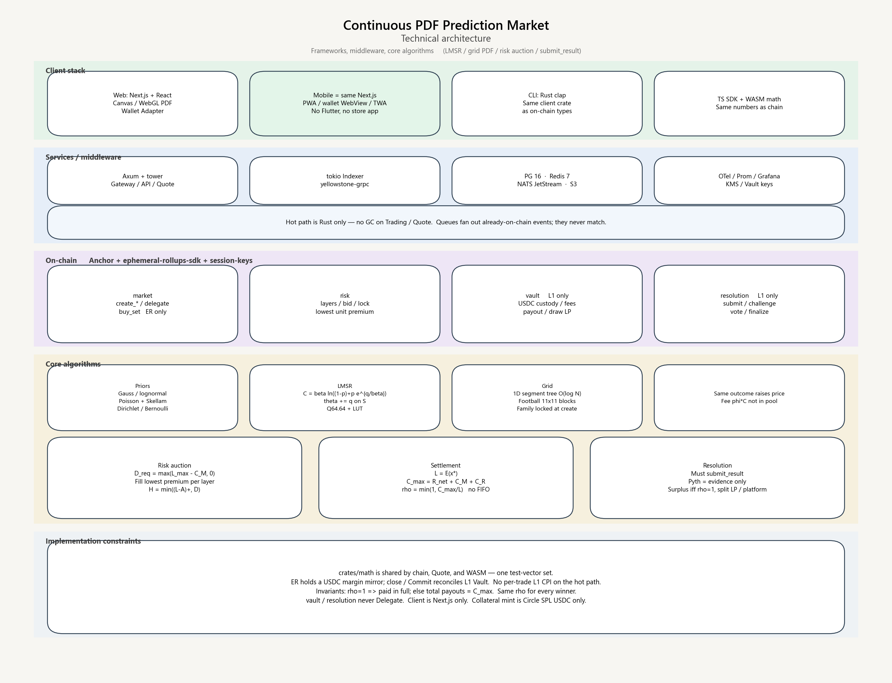

# Technical Architecture — Continuous PDF Prediction Market

**Continuous PDF Prediction Market**

| Item | Content |
| --- | --- |
| Version | 1.1 |
| Corresponding product | `product-specification.md` v1.0 |
| Corresponding system | `system-architecture.md` |

This document answers: which frameworks, which middleware, and how the core algorithms are implemented.



---

## 1. Technology stack summary

| Layer | Choice (locked; no parallel alternatives) | Purpose |
| --- | --- | --- |
| Web | TypeScript, **Next.js App Router**, React, Tailwind CSS | Lobby, trading board, auctions, committee entry |
| Web state | **Zustand** (quotes in a dedicated store) | Avoid full-tree re-renders that stall the PDF |
| Mobile | **The same Next.js stack**: PWA + in-wallet browsers + official-site Android TWA | No App Store / Play |
| CLI | Rust `clap` + `crates/client` | Market creation, Keeper, reporting |
| All backends | **Rust Axum** (no Node/Fastify) | Query, trading gateway, indexer, Keeper |
| On-chain programs | **Anchor** + `ephemeral-rollups-sdk` + `session-keys` | Not hand-written-entrypoint pure native |
| Chain client | `@coral-xyz/anchor` + `@solana/web3.js` (do not use `@solana/kit`) | Build transactions from IDL |
| Indexing | `yellowstone-grpc` | Write to PG |
| Database | PostgreSQL 16 | Indexing and audit |
| Cache | Redis 7 | Quotes, rate limits, login sessions |
| Messaging | **NATS JetStream** | Fill fan-out, notifications |
| Object storage | S3 protocol | Evidence, fill ledgers |
| Observability | OpenTelemetry, Prometheus, Grafana, Loki | Metrics / traces / logs |
| Web wallets | Wallet Standard + `@solana/wallet-adapter-react` | Phantom / Solflare / Backpack are required integrations |
| Mobile wallets | Wallet Adapter + deep links / wallet WebView; Android TWA may use MWA | External wallet signs; no in-store IAP |
| Stablecoin | Circle **SPL USDC** (official mainnet mint) | Deposits, collateral, payouts |

Do not introduce a second “off-chain matching engine” as a substitute for LMSR. Off-chain Quote is read-only preview only; fills are authoritative once an ER receipt exists.

---

## 2. Client technology

The only user trading client is **this Next.js stack**. No Flutter, no React Native, no standalone Swift/Kotlin, no second chain client (do not use `@solana/kit`). The sole LMSR implementation is Rust (WASM for the browser).

### 2.1 Web

| Item | Locked |
| --- | --- |
| Framework | **Next.js App Router** + React + TypeScript |
| Styling | Tailwind CSS |
| State | **Zustand**; `quoteStore` is separate from the UI store |
| Charts | Canvas / WebGL for the PDF and the football 121-cell heatmap |
| Realtime | `quote`-domain WSS market data + fill receipts |
| Offline shell | **PWA** (manifest + service worker): add to home screen, cache static assets; fills remain authoritative only from online ER |
| Deployment | `www` SSR lobby; trading-board pages are `'use client'`; instructions are not forwarded through a business API |

Minimum route set: `/` lobby, `/m/[id]` trading board, `/auction/[id]`, `/portfolio`, `/resolve/[id]`. The full committee desk lives in `apps/committee` (also Next.js).

### 2.2 How phones are used: no native store apps

A real-money prediction book will be rejected by the App Store / Play as gambling. Building Flutter or RN would face the same clauses; **if it cannot be listed, that client is not built**.

| Entry | Approach |
| --- | --- |
| Desktop / laptop | Open Next.js in a browser |
| iPhone | Open the same site in Safari; “Add to Home Screen” for PWA; or open in Phantom / Solflare **in-app browsers** (wallet already connected; best experience) |
| Android | Same PWA / wallet WebView; for an icon install, download the official-site **TWA APK** (Trusted Web Activity: Chrome runs the same site fullscreen, **not via Play**) |
| Solana Seeker and similar | Open the same URL from the wallet or a dApp directory |

Push: Web Push (PWA) + email / in-app. Do not depend on an APNs store package. iOS Web Push is available only on a PWA already added to the home screen; product copy must say so.

Quotes: `crates/math` → WASM, computed in the browser. No Flutter FFI.

### 2.3 CLI

- `crates/cli`, `clap`
- Instruction encoding comes only from `crates/client` (generated from the Anchor IDL); do not hand-write a second discriminator

### 2.4 Shared SDK

```text
crates/math              Q64.64, LMSR, ρ, auctions
crates/client            RPC, transaction building (CLI / Keeper)
crates/math-wasm         wasm-bindgen, for Next.js
packages/sdk             Next.js: IDL, SIWS, WASM calls
apps/web                 Next.js (includes PWA)
apps/android-twa         Official-site TWA wrapper, no independent business code
programs/*               Anchor
```

Forbidden: rewriting LMSR in TypeScript; opening a Flutter / RN repo.

### 2.5 How web wallets are connected

Stack:

- `@solana/wallet-adapter-react` + `@solana/wallet-adapter-react-ui`
- Wallets: Wallet Standard auto-discovery; **must test** Phantom, Solflare, Backpack
- Connection: `ConnectionProvider` points at self-hosted `l1-rpc` (via Gateway; do not bake vendor URLs into the frontend bundle)
- Program client: `AnchorProvider` + the four program IDLs

User path (order is fixed):

```text
1. Click “Connect wallet” → Adapter selects a wallet → authorize public key
2. Sign-In with Solana (SIWS) → BFF verifies and issues a JWT (for positions / push binding, not on-chain identity)
3. Deposit: main wallet popup signs vault.deposit (L1)
   User USDC ATA → protocol Vault Token Account
4. Open a trading session: main wallet popup once
   Create Session Keypair + MagicBlock SessionToken
   Then write this protocol’s limits on-chain: expiry, remaining USDC, allowed ixs, market whitelist
5. In-book buy_set / sell_set: Session Key signs; main wallet no longer pops
6. Withdraw, create market, inject C_M, authorize committee members: must be a main-wallet popup; Session has no authority
7. “End session”: revoke SessionToken + delete the key locally; “Disconnect wallet”: clear JWT
```

How the frontend stores keys:

- Session private key goes into **IndexedDB**, wrapped with WebCrypto; **plaintext `localStorage` is forbidden**
- Refreshing the page can restore an unexpired session; revoke or expiry requires repeating step 4
- Seed phrases never enter the page

### 2.6 How wallets are connected on phones

There is no second native wallet SDK. Still Wallet Standard + Adapter; the invocation method differs by shell:

| Shell | How to connect |
| --- | --- |
| Safari / Chrome / PWA | Deep-link out to Phantom, Solflare; jump back to this site with the signature |
| In-wallet browser | Injected provider; Adapter connects directly, one fewer hop (**prefer guiding users to open from here**) |
| Android TWA | Same as Chrome; if detectable, use **MWA** |
| Desktop extensions | Phantom / Solflare / Backpack extensions |

The path is the same as 2.5: connect → SIWS → `deposit` → Session → place orders. The Session private key still lives in IndexedDB + WebCrypto. Do not build an in-page seed-phrase wallet. Do not integrate IAP.

### 2.7 Which class of operation is signed by whom

| Operation | Signer | Chain |
| --- | --- | --- |
| Connect, SIWS | Main wallet (message, not on-chain) | — |
| `vault.deposit` / `withdraw` | **Main wallet** | L1 |
| Open / renew / revoke Session | **Main wallet** | L1 (SessionToken + this protocol’s limit account) |
| `buy_set` / `sell_set` | **Session** | ER |
| Risk auction `bid` / `cancel` | Main wallet (locking collateral is a funds action) | L1 or ER per program, but must be the main wallet |
| `create_*`, inject $C_M$ | Main wallet / ops multisig | L1 |
| `submit_result` / `challenge` / `vote` | Committee member main wallet or KMS hot key | L1 |
| Program upgrade | Multisig + timelock | L1 |

The Trading Gateway **forwards but does not sign**: it assembles the ER transaction, the Session signs on the client, and the Gateway only relays. Gateway memory must not hold Session private keys long-term.

### 2.8 USDC accounts

The protocol **recognizes only one mint**: Circle’s official mainnet SPL USDC. Not a “stablecoin basket,” not SOL, no in-protocol FX.

- The user must have an ATA for that mint; if missing, `createAssociatedTokenAccount` before deposit
- `USDC_MINT` is Circle’s official SPL mint on that cluster (mainnet `EPjFWdd5…`). `initialize` does not accept a deployer-chosen mint. `vault.deposit` / Risk lock-collateral: `mint == USDC_MINT`; other coins are rejected
- Protocol Vault: one USDC Token Account per funds domain (user-margin pool, fees, each book’s Risk Vault)
- Deposit confirmation: wait for L1 finalized before increasing the ER available-balance mirror; unconfirmed funds grant no trading quota
- The client may link to an external DEX; that is a jump, **not** a Vault CPI
- SOL network fees for L1 transactions are paid from the main wallet; the ER hot path is 0 gas and does not debit SOL as margin

### 2.9 Why not list in stores, and which path to use

Review will reject a **full trading app** as real-money gambling. Maintaining Flutter / RN when listing is impossible means a second client that can never ship.

**Locked: do not submit a trading app to the App Store or Google Play. The user client = Next.js.**

| Surface | What it does |
| --- | --- |
| Next.js website | Full trading: deposit, order, withdraw, auctions, committee |
| PWA | The same site, added to the home screen |
| In-wallet browser | The same URL, wallet already injected; primary mobile path |
| Official-site Android TWA APK | Fullscreen shell of the same site, downloaded from the official site, not via Play |
| CLI | Ops / Keeper, not a user app |

Do not adopt: Flutter, RN, store-downgraded read-only packages, IAP deposits, or a second “pay outside the store” circumvention narrative written just to get listed.

Legal and regional switches are ops configuration (disable trading by jurisdiction), not another client.

---

## 3. Server-side frameworks

| Service | Framework | Notes |
| --- | --- | --- |
| Gateway | Axum + tower middleware | Rate limits, timeouts, tracing |
| Market API | Axum + sqlx | Read PG |
| Trading Gateway | Axum / raw TCP+WSS | Connection pool to ER |
| Quote Engine | Standalone process, in-memory grid | Subscribes to Indexer or ER accounts |
| Indexer | tokio tasks | gRPC yellowstone |
| Keeper | tokio + cron/slot clock | Fires L1 transactions at the due slot |
| Notifier | Consumes NATS | Templated messages |

Process model: each service is its own binary, a K8s Deployment. Quote and Trading are **not** co-located with the Indexer.

---

## 4. Middleware and infrastructure

| Middleware | Usage |
| --- | --- |
| PostgreSQL | Markets, fills, position snapshots, auctions, committee proposals, reconciliation |
| Redis | `quote:{market}`, coverage, nonce, rate-limit token buckets |
| NATS JetStream | `fills`, `markets.updated`, `resolution.*` |
| S3 | `evidence/{market}/{proposal}` |
| Nginx / Envoy | TLS, routing to Gateway / WS |
| GitHub Actions + Anchor | Program builds, IDL, images |
| Keys | AWS KMS / GCP KMS / Vault; Keeper hot-key shards |

Messaging only fans out projections of **already-on-chain events**; it does not match in the queue.

---

## 5. On-chain program structure

**Use Anchor, not pure native.** Entrypoints, account constraints, IDL, and TS/Rust clients all go through Anchor. The LMSR kernel is ordinary Rust (`crates/math`), called from Anchor handlers; formulas are not written into macros.

Locked dependencies:

| Item | Choice |
| --- | --- |
| Framework | **Anchor** (the 1.x line consistent with MagicBlock docs) |
| ER | `ephemeral-rollups-sdk` (`delegate` / `commit` / `#[ephemeral]`) |
| Frictionless signing | MagicBlock **`session-keys`** (`SessionToken` + `#[session_auth_or]`) |
| Token | `anchor-spl`, Circle USDC |
| Math | `crates/math`, Q64.64; IEEE floats are forbidden in consensus |

Four programs, one workspace, each with its own program id, calling one another via CPI:

```text
programs/
  market/          create_{skellam,gaussian,lognormal,dirichlet,bernoulli},
                   buy_set, sell_set, buy_skellam_set, sell_skellam_set,
                   delegate, commit
  risk/            layers, bid, fill, lock
  vault/           deposit, withdraw, fee, payout, draw_lp, settle
  resolution/      submit_result, challenge, vote, finalize
```

Create is **by family**. Listing recipes (CPI, election, BTC) are `topic` / `tag` metadata. Do not add product-named create ixs.

- `buy_set` / `sell_set` / `buy_skellam_set` / `sell_skellam_set` only on **ER** (`is_delegated=true`); `#[session_auth_or]`: a valid Session or the main wallet itself. L1 is the pre-Delegate test path.
- `vault` / `resolution` **never Delegate**, and **never accept Session** as authority
- `risk.bid` lock-collateral: main wallet; Session is rejected
- Close trading: Keeper main wallet `commit` + `undelegate`, writing $\theta$, $E$, $L_{\max}$, `trades_root` back to L1
- Settlement: after `finalize`, `vault.settle` reads the same $x^*$

Every handler hard-codes Anchor constraints: signer, PDA seeds, mint, vault token owner. Remaining LMSR numerics go into `crates/math`. The IDL is committed to the repo; `packages/sdk` and `crates/client` are both generated from the same IDL; hand-written discriminators are forbidden.

---

## 6. Core algorithm design

### 6.1 Distribution containers (forked by underlying)

| Family | Create ix | State | What is bought |
| --- | --- | --- | --- |
| Gaussian | `create_gaussian_market` | 1-D `theta[N]`, $N\le 1024$ | Interval $[a,b]$ |
| Lognormal | `create_lognormal_market` | 1-D log grid | Interval $[a,b]$ |
| Skellam / 2D score | `create_skellam_market` | 2-D `theta[K+1][K+1]` | Cell set $S$ (1X2, AH, totals, score) |
| Dirichlet | `create_dirichlet_market` | atoms / $C(K,n)$ / simplex (`layout`) | Atoms or unions |
| Bernoulli | `create_bernoulli_market` | `theta_yes`, `theta_no` | YES / NO |

The family is locked at creation; trading does not switch containers. Football lines share one $\theta$; they are not extra families.

### 6.2 Prior $P_0$ / $f_0$

- Gaussian: $\mathcal{N}(\mu,\sigma^2)$ truncated to $\Omega$ then renormalized
- Log-normal: $\log X\sim\mathcal{N}(\mu,\sigma^2)$, grid on the log axis
- Independent Poisson: $P_0(i,j)\propto \lambda_H^i\lambda_A^j/(i!j!)$, Dixon–Coles multiplied by a low-score correction
- Dirichlet: $p_i=\alpha_i/\sum\alpha$
- Uniform: the family’s maximum entropy when there is no information

Computed once at market creation and written into `p0_mass[]` (prior mass per cell); never changed afterward.

### 6.3 LMSR fills (hot path)

State:

$$
Z=\sum_k p0_k\,e^{\theta_k/\beta},\qquad
p_S=\frac{\sum_{k\in S}p0_k e^{\theta_k/\beta}}{Z}
$$

Cost and marginal price:

$$
C_S(q)=\beta\log\bigl((1-p_S)+p_S e^{q/\beta}\bigr)
$$

$$
P_S(q)=\frac{p_S e^{q/\beta}}{1-p_S+p_S e^{q/\beta}}
$$

Steps (ER `buy_set` / `buy_skellam_set`):

1. Resolve $S$: typed Skellam template → mask via `crates/math::football`; or caller bitmask
2. Validate $S$, balance ≥ $C+\phi C$
3. Compute $p_S$, $C_S(q)$ in `crates/math` (one LMSR)
4. For $k\in S$: $\theta_k\leftarrow\theta_k+q$, $E_k\leftarrow E_k+q$
5. Update $L_{\max}=\max E_k$ (football: $\max_{ij}E_{ij}$)
6. Debit $C$; fee $\phi C$ recorded as payable to the platform (settlement-time or real-time transfer to the L1 fee account; pick one implementation but keep a single accounting convention)
7. Emit event: new $p$, new $L_{\max}$

Repeated buys of the same $S$ raise $p_S$ and raise $C$. That is the algorithm, not a manual markup.

Football-specific (SHALL):

- `buy_skellam_set` is the only typed path; it MUST call the same `lmsr_update` as `buy_set`
- Buying home MUST raise exact-score prices that sit in $\{i>j\}$
- A later totals or handicap fill MUST add $q$ on the intersection cells
- Quarter line: two sequential half-fills of $q/2$ on the same book; fee is the sum
- After mixed fills, $p_{\mathrm{1}}+p_{\mathrm{X}}+p_{\mathrm{2}}=1$
- Masks and LMSR live in `crates/math`. Quote / WASM / programs call that crate only

Engineering:

- 1-D intervals maintain $\sum p0 e^{\theta/\beta}$ with a segment tree; one buy/sell is $O(\log N)$
- Football sets (home-win is about half the table) can even brute-force in $(11\times11)$ blocks and still be enough for ER
- All `exp/ln` go through LUTs; overflow saturates to the maximum legal Q64.64 value and rejects out-of-range $q$

### 6.4 Coverage and $\rho$

During trading, display:

$$
\mathrm{Coverage}=\frac{C_M+C_R}{L_{\max}},\qquad
\hat\rho_S=\min_{k\in S}\min\bigl(1,C_{\max}/E_k\bigr)
$$

At settlement:

$$
L=E(x^*),\quad
C_{\max}=R_{\mathrm{net}}+C_M+C_R^{\mathrm{final}}+C_P^{\mathrm{alloc}},\quad
\rho=\min(1,C_{\max}/L)
$$

Payout: winning positions $\lfloor\rho\cdot q\rfloor$; dust goes to the reserve. **FIFO is forbidden.**

### 6.5 Risk-auction matching

Each layer has an independent priority queue: key = unit premium ascending, stably broken by timestamp.

```text
remain = D_layer
while remain > 0 and book not empty:
    take lowest fee bid
    fill = min(bid.D, remain)
    lock collateral, accrue premium
    remain -= fill
```

Do not solve CVaR on-chain. The suggested size $D_{\mathrm{required}}=\max(L_{\max}-C_M,0)$ is display-only.

LP payout:

$$
H_{A,D}(L)=\min(\max(L-A,0),D)
$$

### 6.6 Settlement waterfall

```text
1. finalize(x*)
2. L = E(x*)
3. Draw R_net (trading). C_M is optional and may be 0
4. If L ≤ R_net+C_M: H=0, do not draw C_P
5. Else draw H_i on leftover shortfall only, then C_P^alloc if still short
6. ρ = min(1, C_max / L)
7. Pay all winners ρ·q
8. If ρ==1 then S = max(R_net+C_M-L, 0)
9. If C_R^final>0 split S by α_R / α_P; else S to the platform
10. Fees stay in the platform pot; sweep into C_P is a later, explicit transfer
```

### 6.7 Finalization (not written automatically by an oracle)

`submit_result(value, evidence?)` → challenge window → `finalize` or `vote`.

The algorithmic convention lives in the `price_rule` text and is executed by the committee; the chain stores only the result scalar. No oracle or feed account is read.

---

## 7. Critical sequences

### 7.1 Placing an order

```text
UI calls Quote.preview(S,q)     // read-only, may be slightly stale
UI signs the Session transaction
Trading Gateway → ER RPC
ER: buy_set
Indexer / WS pushes the new PDF
L1 Vault fees and margin (per account model: bookkeeping inside ER, netted after close; or per-fill CPI debit of L1)
```

The funds model locks one option: **an ER-internal margin mirror**. The user first `vault.deposit`s to L1; available balance is mirrored to ER; the hot path only mutates the mirror; close / periodic Commit nets against L1. Per-fill `buy_set` cross-site CPI debit of L1 is forbidden.

### 7.2 Market creation through close

```text
create_* on L1 → inject C_M → open risk layers
delegate market + grid → ER
trading + auctions
Keeper: clock >= close_ts → stop buy_set
Keeper: undelegate / commit
Keeper: clock >= risk_lock_ts → stop bid fill
enter report_window
```

### 7.3 Reporting through payout

```text
submit_result → (challenge?) → finalize
vault.settle(L, ρ)
notify Indexer → app push
```

---

## 8. Precision, testing, and security

| Item | Approach |
| --- | --- |
| Precision | On-chain, Quote, and WASM share the same `crates/math` test vectors |
| Property tests | Normalization $\sum p=1$; after buying $S$, $p_S$ does not fall; $\sum$ actually paid $\le C_{\max}$ |
| Invariants | Product-specification section 12, run in CI |
| Audit | Anchor account checks, Vault withdraw authority, Delegate-scope whitelist |
| Replay | Per-user per-market nonce |
| Sessions | Session Key limits, expiry, revocability |

---

## 9. Suggested directory layout

```text
apps/web                 Next.js + PWA
apps/android-twa         Official-site TWA, no independent business
apps/committee           Committee back office (Next.js)
crates/cli
crates/math
crates/math-wasm
crates/client
crates/services/*        gateway, market-api, quote, trading, indexer, keeper
programs/*               market, risk, vault, resolution
packages/sdk             TypeScript (Next.js)
infra/                   k8s, terraform, dashboards
```

---

## 10. Credibility and TEE

**Conclusion: to raise credibility, first harden a verifiable public ledger. Do not treat TEE as a substitute for the committee or settlement. TEE only strengthens the claim that “the high-speed execution layer and automated evidence collection were not privately altered by the operator.”**

### 10.1 What users are actually afraid of

| Concern | Can TEE solve it? | What should actually be relied on |
| --- | --- | --- |
| Was the outcome changed by ops? | No. CPI, elections, football, custom price algorithms — hardware does not know “the truth” | Committee `submit_result` + challenge + $M/N$; evidence is public |
| Was the Dec 1 BTC price invented after the fact? | No. Hardware does not know the listing `price_rule` | Committee `submit_result` by `price_rule` + challenge + $M/N$ |
| Was LMSR on ER altered by the node? | **This is TEE’s proper job.** Prove the audited image is what ran | Plus: funds on L1, Commit is replayable, `crates/math` is open source |
| Can the high-speed layer abscond with the money? | TEE alone cannot | `vault` / `resolution` never Delegate |
| Would hiding the PDF make it more trustworthy? | The opposite. A prediction book needs a public curve | Do not use MagicBlock PER’s “default privacy” mode |

MagicBlock’s Private ER (Intel TDX) is primarily **confidential state**; clients call `verifyTeeRpcIntegrity` to check the TDX quote. This protocol’s PDF, $E$, and $L_{\max}$ **must be public**; do not stuff the whole book into a private ER. If TDX is used, use it for **execution-integrity proofs**, not book encryption.

### 10.2 Credibility main path (must exist first)

1. Programs and `crates/math` are open source; Quote / WASM / chain share the same test vectors
2. User funds, collateral, and payouts live only in the L1 Vault
3. Outcomes can only be `submit_result`ed on-chain, with challenge and vote
4. Anyone can recompute $C$, $L$, $\rho$ from public $\theta$, $E$, $x^*$
5. The terminal state Committed back to L1 can be checked against the ER event log

Without these five, adding TEE is only “another unverifiable box around an unverifiable box.”

### 10.3 TEE is used in only two places

**A. ER execution attestation (worth doing)**

Trading nodes run inside Intel TDX (or equivalent). Remote attestation binds:

- Program measurements (consistent with the published `market` / math-library hashes)
- Current `market` code version
- Recent state root or Commit hash

Clients verify the quote before connecting to ER; proofs may be attached when Commit returns to L1, for audit. This answers “did the operator change LMSR,” not “what was the football score.”

**B. Evidence-collection Keeper (optional)**

A keeper may hash off-chain source material for the reporter. That hash is `evidence_hash` only. The program does not parse it, and it does not write $x^*$. Football / CPI / elections / prices are still submitted by the committee.

### 10.4 Things not to use TEE for

- Replacing committee finalization
- Computing a custom formula inside the enclave as the final $x^*$ and forbidding challenge
- Making user positions and the PDF a privacy book (credibility depends on being able to recompute)
- Assuming TDX has no side channels, Intel revocations, or vendor image-swap risk — proofs must bind measurements, and TCB rotation must be allowed

### 10.5 How to connect with MagicBlock

| Mode | This protocol |
| --- | --- |
| Ordinary ER | Default trading execution layer; state is public |
| TDX-hardened ER | The same public accounts, plus quote verification; recommended for production trading nodes |
| Private ER (account encryption + token gating) | Not used for prediction-book main state |

Client: Trading Gateway / Web call the official integrity check when connecting to production ER; on failure, refuse to place orders rather than silently falling back to an unattested node.

### 10.6 Decision

- **Introduce TEE: yes, but narrowly scoped** — ER node integrity + optional on-the-spot price evidence.
- **Do not** prop up the entire credibility story with TEE, and do not weaken the committee or L1 funds isolation because of it.

---

## 11. Relationship to system architecture

- Machines and networks: `system-architecture.md`
- Product rules: `product-specification.md`
- This document: languages, middleware, implementation constraints for LMSR / auctions / $\rho$, and the TEE boundary

Choices are locked: the user client is only Next.js (including PWA / TWA / wallet WebView). No native store apps. Contracts must be Anchor. LMSR lives only in `crates/math`. A parallel Flutter / RN second fill semantics must not grow.

Funds authority, tiered storage, crash recovery, fill ledgers, Light, and data security are in `system-architecture.md` sections 9–12: Vault only on L1; receipted fills survive single-node crash, $\theta$ is replayed from the ledger; the book is public and recomputable; Light only archives already-closed books.
