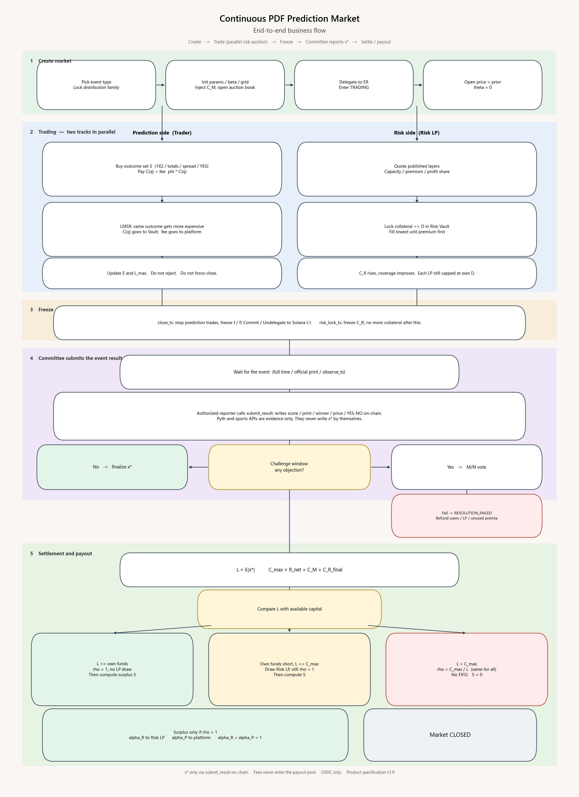
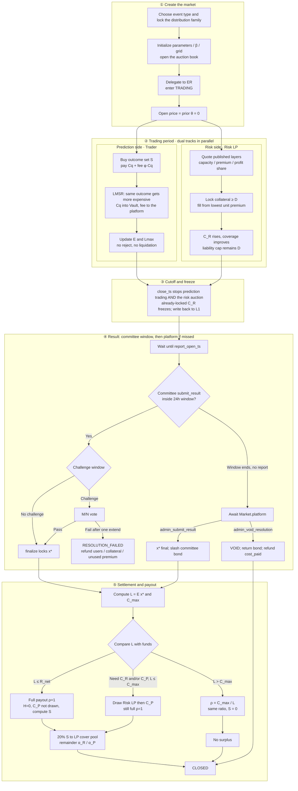

# Product Specification — Continuous PDF Prediction Market

**Continuous probability prediction market + risk-capital auction + pro-rata payout**

| Item | Content |
| --- | --- |
| Version | 1.33 |
| Status | Product specification (features are written as fully delivered; no MVP / later-phase split) |
| Language | English |
| Key decisions | Soft solvency: do not reject trades when $L_{\max}$ exceeds capital. Settle on $L=E(c)$ at $c=\mathrm{cell}(x^*)$ (product §8.1). **Settlement gate:** write $\rho=\min(1,C_{\max}/L)$ *before* any user payout — $\rho=1$ if $C_{\max}\ge L$, else the actual ratio $C_{\max}/L$ (SRS FR-SET-03 / FR-SET-11). Do not mix implied PDF $p_k$, exposure $E$, and ticket face. One global pro-rata $\rho$ on **face** (no FIFO). $C_{\max}=R_{\mathrm{net}}+C_R^{\mathrm{final}}+C_P^{\mathrm{alloc}}$. Trading is the primary payout source; $C_R$ is optional. Fees go to the platform fee ledger and do not enter this prediction market’s $C_{\max}$ or $C_P$; the platform may claim them at any time. At `close_ts` both prediction fills and the risk auction stop (`risk_lock_ts \le close_ts`). Committee `submit_result` waits for `report_open_ts` ($\ge$ `close_ts`; required at create). Report window default 24h; a missed report does **not** auto-fail or auto-extend — only `Market.platform` MAY `admin_submit_result` (slash `committee_bond`) or `admin_void_resolution` (return the bond). Price is pure probability; coverage is displayed only. Markets are created by **distribution family**. Football is Skellam. $x^*$ only via `submit_result` (or platform admin after the deadline). |

---

## 1. Product Definition

This protocol is a prediction market based on a **continuous probability density function (PDF)**.

Unlike traditional YES / NO prediction markets, it trades the full probability distribution of a continuous random variable, not a single binary event. Typical underlyings include:

- BTC / ETH expiry or close price
- CPI, interest rates, FX, commodity prices
- Other continuous economic indicators
- Football and other score-type events: one prediction market per match, see section 4.6
- Macro prints such as CPI, elections, a same-day BTC price, whether an event occurs by a deadline: see sections 4.7–4.11

The market maintains a probability density curve $f(x)$ that always satisfies:

$$
f(x)\ge 0,\qquad \int_{\Omega} f(x)\,dx=1
$$

The curve evolves in a fixed order and is never rewritten by an oracle in the middle:

1. **Initialized at creation.** Write the prior $f_0(x)$ (uniform, or a parameterized family chosen by the creator). At this point $\theta(x)=0$, so the quoted price is the prior.
2. **Updated continuously during trading.** Each interval buy or sell only changes the state $\theta(x)$, then LMSR produces a new $f(x)$. Buying an interval raises density on that stretch; the rest is renormalized downward.
3. **Frozen after close.** Trading stops and $f(x)$ no longer changes. The committee only reports the realized outcome $x^*$; it does not go back and rewrite the distribution.

Users buy an arbitrary interval $I=[a,b]$, mapped to a frozen atom set $S$ (§8.1.2.1). The continuum contract is the Arrow–Debreu indicator; on-chain the same idea is $1_{c\in S}$ with $c=i^*(x^*)$:

$$
g_S(x^*)=1_{c\in S}
$$

The market **price** of that claim equals the current probability mass (continuum: $\int_a^b f$; chain: $p_S$). That number is what an infinitesimal share **costs**, not what it **pays**. One share pays $1$ USDC if it hits ($\rho=1$), so the cash multiple on a small ticket is $\approx 1/p_S>1$ when $p_S<1$. Do not write the share size as $1/p_S$ (product §1.2.2 / §8.1.0).

The protocol consists of two linked markets:

| Market | What is discovered | Description |
| --- | --- | --- |
| Market A: prediction market | $P(X\in I)$ | The probability that the outcome falls in a given interval |
| Market B: risk-capital market | The price of tail risk | How much capital it costs to underwrite the gap if final payout exceeds the board’s own funds |

The product is therefore not “a prediction market + a generic LP pool”, but:

$$
\text{Probability Discovery}+\text{Risk Capital Discovery}
$$

The core innovation: turn the tail liability produced by the prediction market into a financial object that can be priced, auctioned, layered, and underwritten.

### 1.1 Locked business rules

These are protocol rules, not UI hints. Programs, Quote, and the desk SHALL follow them.

| Rule | What happens |
| --- | --- |
| After trading close, no fills | **Every** prediction market (all five families). When `now ≥ close_ts`, `buy_set` / `buy_skellam_set` SHALL NOT execute. Kickoff, live score, committee report, and Bernoulli early VOID SHALL NOT reopen trading. The trade ticket SHALL disable buy. Compose SHALL refuse those ops (`403`) when the indexed `close_ts` has elapsed. The chain SHALL reject with `Closed`. |
| Sells are closed | Unwinding inventory at the **live LMSR price** (`sell_set` / `sell_skellam_set` / wide `is_buy=false`) is forbidden. That is not a refund of `cost_paid`. Proceeds could be higher or lower than the buy. A fill stays until settlement claim ($\rho\cdot\mathrm{face}$ if $c\in S$) or VOID / failed-resolution refund of `cost_paid`. The market program SHALL reject with `SellsClosed`. Compose SHALL `403` sell ops. The ticket SHALL read **Sells closed**. CLI SHALL bail. |
| Trading close stops the risk auction | When `now ≥ close_ts`, prediction fills **and** new risk-auction quotes / fills SHALL stop. Already-locked $C_R$ stays locked until settlement or VOID. `risk_lock_ts` MAY be earlier than `close_ts` (freeze capital while trading continues). `risk_lock_ts` SHALL NOT be after `close_ts`. Default at listing: `risk_lock_ts = close_ts`. |
| Fees never enter $C_P$ | Listing locks `fee_bps` and **when** the fee is taken. **At fill** (default): buy pays $C_S+\phi C_S$; $\phi C_S$ accrues on `fees_accrued`. **At claim**: buy pays only $C_S$; when a winner claims, $\phi$ of that payout accrues (miss / VOID: $0$). **Only** `Market.platform` MAY `claim_fees` into the platform UserVault, at any time including VOID. Fees never enter $C_{\max}$, $S$, $S_P$, or $C_P^{\mathrm{pool}}$. §1.2.7. |
| `Market.platform` locked at create | Official `Protocol` PDA (`init_protocol`, signer = platform). `create_*` **reads that account and writes** `platform`, `fee_bps`, `fee_timing`, `report_window_secs`, `challenge_secs`, `committee_bond`, $\alpha_R$ onto `Market`. Instruction `CreateCommon` fields for those keys SHALL NOT be used. Applicant / reviewer / compose cannot choose them. Lobby hides markets whose `platform` ≠ official key. `/lp` cover, `/resolve` admin, claim $\phi$, and `set_tap` SHALL use indexed `Market.platform`. |
| $C_P$ is a capped tap | One protocol pool $C_P^{\mathrm{pool}}$. Listing tap $C_P^{\mathrm{board}}$ MAY be $0$ (create default). At settlement, if $L>T$, $C_P^{\mathrm{alloc}}=\min((L-T-C_R)^+,C_P^{\mathrm{board}},C_P^{\mathrm{pool}})$; else $0$. Not a percent of $L$. Not an unlimited guarantee. $\rho$ recipe: **§1.2.1**. |
| Soft solvency | Do not reject fills because $L_{\max}$ exceeds capital. After $x^*$ is final, write $\rho=\min(1,C_{\max}/L)$ **before** any user payout. One $\rho$ for every winner; no FIFO. |
| Surplus vs fees | **§1.2.7.** $\phi$ is always platform (`claim_fees`). $S_P$ is a settlement residual (`pay_surplus_platform`) only when $\rho=1$ and $S>0$, after $S_C=20\%S$. They SHALL NOT be mixed, SHALL NOT enter $C_P$ automatically, SHALL NOT pay winners. |
| Board comments after the market is live | Comments exist only on an **already indexed** market (`/m/[id]`). `/create` writes the public card (title / tags / event / description) and SHALL NOT collect comments — there is no live market yet. A connected wallet posts as `author` pubkey (same grade as listings; SIWS is not required). The thread is a flat off-chain catalog (`market_comment`): not on-chain, not nested, not $C_{\max}$, not $C_P$, not the fee ledger. Unknown / unindexed market: `404`. |
| The created object is a prediction market | Users create a **prediction market**. Product copy SHALL NOT use “board”, “book”, “open the book”, or “close the book” as the product noun. One football match has one prediction market — 1X2 / handicap / totals are contracts on that market, not separate books. On-chain leftover names (`Board`, `board_phase`) are implementation only. |
| Anyone logged in may apply; review **opens trading** | After SIWS, any wallet MAY submit a **market application**. That is not live. `close_ts` is an **absolute** unix time locked at submit (whistle / first print). Solana `Clock` only reads *now* at the create instruction — it cannot learn the event time. If `now ≥ close_ts` at approve, create SHALL fail; the reviewer rejects or the applicant resubmits. The reviewer wallet signs `create_*` (pays rent). **Open the prediction market** means the prediction market exists on-chain, the lobby shows it, and traders MAY fill. **Open the risk auction** means Risk LPs MAY quote published layers for payout coverage. Both start together on approve. Do not call the created object “board”, and do not say “listing” or “open the risk book” in product copy. Fees $\phi$ accrue on that prediction market’s fee ledger; `claim_fees` goes to the protocol `platform` (`PLATFORM_PUBKEY`). Compose `create_*` and lobby ingest SHALL require an approved application — a chain account that skipped review SHALL NOT appear as a live market. Rejected applications never become markets. |
| Duplicate listings are refused | Two applications SHALL NOT cover the same event. Duplicate key = distribution family + normalized **canonical English** title + trading event (trim / case-fold ASCII). Translations SHALL NOT create a second market. If another row is `PENDING_REVIEW` or `OPEN`, submit returns `409`. The reviewer MAY reject an application as duplicate. |
| Listing language | Anyone MAY apply from any country. The **canonical** title, trading event, and description are **English** (product §1.2.5). Optional locale strings are display only. Geo-IP blocks are access policy, not language. |
| Geo-IP region block | A listing MAY lock blocked countries / regions (ISO 3166-1 alpha-2, optional subdivision). Enforcement is the client IP via GeoIP on lobby, info, quote, compose, trade, auction, and comments. A blocked visitor SHALL NOT see the prediction market as tradable (`403` / hidden). The reviewer MAY add or confirm the block list at review. This is access policy, not settlement math. |
| Report clocks, committee bond, platform timeout | Create SHALL require `report_open_ts ≥ close_ts` (no omitted / `0` default) and `committee_bond > 0`. Trading still stops at `close_ts`. The committee MAY `submit_result` only in `[report_open_ts, report_open_ts + report_window_secs)` (product default **86400** seconds). Committee VOID is allowed after `close_ts` until `report_deadline`. Bernoulli `early_resolve`: if the event occurs before `close_ts`, **halt and VOID** (refund `cost_paid`); do **not** settle YES. After `report_deadline` with no committee `submit_result`: **no auto-extend** and **no auto-`RESOLUTION_FAILED`**. Only the protocol platform (`Market.platform` / `PLATFORM_PUBKEY`) MAY act: `admin_submit_result` writes $x^*$ and **slashes** the committee bond; `admin_void_resolution` VOIDs and **does not slash** (bond MAY be released). A failed **vote** after a proposal is a different clock (FR-RES-03: one extend, then `RESOLUTION_FAILED`). |

SRS: FR-TRD-01, FR-TRD-04, FR-TRD-14, FR-RSK-05, FR-HAL-01, FR-RES-06, FR-RES-07, FR-SET-06–08, FR-UI-32, FR-UI-37, FR-UI-42–45.

### 1.2 End-to-End Business Flow

A prediction market’s lifecycle follows the path below. During the trading period the risk-capital auction runs in parallel. At `close_ts` both prediction fills and the risk auction stop; the prediction market then only waits for the outcome and pays out.

```text
① Choose the distribution family
② Initialize parameters and **apply** (SIWS), locking absolute close_ts. Reviewer approves and **opens trading** (create_*). The risk auction opens at the same time.
③ Trade (LMSR: buying the same / overlapping outcome makes $C_S$ rise — product §1.2.4; fees; LPs may quote at the same time)
④ At close_ts, cut off prediction fills **and** the risk auction; freeze f / P
⑤ Wait for the event
⑥ The committee (or an authorized reporter) writes the outcome on-chain after `report_open_ts`, inside the 24h report window. No oracle writes $x^*$. If the window ends with no report, the platform writes $x^*$ (slash bond) or VOIDs (no slash).
⑦ Payout (commercial stack: trading first, then optional C_R, then optional C_P)
      ├─ Trading covers L               → full payout; risk capital not drawn
      ├─ Those own funds fall short, but L ≤ C_max → draw Risk LP, then C_P if still short; still full payout
      └─ L > C_max                      → pay all winners at the same ratio ρ = C_max / L
⑧ Only on full payout: surplus is split. First $S_C=20\%S$ funds the protocol LP cover pool. Of the remainder, if risk capital filled this prediction market, α_R / α_P; if no risk capital entered, residual goes to the platform. Fees stay on the fee ledger until claim_fees — they never enter C_P.
```

**① Choose the probability-distribution type.** Identify the underlying first, then lock the family. It cannot be swapped later.

| Distribution family | Create instruction | Example underlyings (metadata only) |
| --- | --- | --- |
| Skellam (2D score grid) | `create_skellam_market` | Football / other scores; 1X2 and totals are projections |
| Gaussian | `create_gaussian_market` | CPI, inflation, other 1-D prints |
| Lognormal | `create_lognormal_market` | Same-day BTC / ETH price |
| Dirichlet | `create_dirichlet_market` | Election winner, `TOP_N`, vote share (`layout`) |
| Bernoulli | `create_bernoulli_market` | Deadline YES / NO |

**② Initialize and open trading.** The applicant writes prior parameters (e.g. $\lambda_H,\lambda_A$ or $\mu,\sigma$ or $\alpha_i$), the grid or atoms, $\beta$, the resolution source, and an **absolute** `close_ts`. After review approve, the reviewer signs `create_*` — that is **open the prediction market**: it is live, the lobby shows it, traders MAY fill. The same step **opens the risk auction**: Risk LPs MAY quote published layers. Fees stay on the prediction market until the protocol platform claims them. At this point $\theta=0$, so prices equal $f_0$ / $P_0$. Status is `OPEN` once the market key is attached.

**③ Trade.** The user buys some outcome set $S$ (home win, exactly 1 goal, CPI in a bin, YES…). Each fill pays two amounts:

1. **Contract cost** $C_S(q)$: enters this prediction market’s Vault, used for expiry payout
2. **Fee** $\phi\cdot C_S(q)$: goes to the platform immediately and does not enter the payout pool

The same outcome gets more expensive the more it is bought (product **§1.2.4**). Under LMSR, if at open $P(S)=0.2$, a first tiny order has a marginal price of about $0.2$; after it fills, that stretch of density is pulled up, and the next order for the same outcome has a marginal price strictly above $0.2$. Further buys keep lifting it. This is not a queue markup and not “later on the clock”; the curve is rewritten by the fill itself. Selling (reducing a position) presses that stretch down and the price falls back. Unpopular or disjoint intervals can get cheaper as mass moves to the hot stretch.

During the trading period $L_{\max}$ may exceed available funds. **Orders are not rejected, and user positions are not force-liquidated.** Coverage is display-only. Risk LPs quote published layers and lock collateral in the same window.

**④ Cutoff.** When `now ≥ close_ts`, prediction-side fills stop, the distribution is frozen, **and the risk-capital auction stops**. New quotes and auction fills SHALL be rejected. Already-locked $C_R$ stays until settlement or VOID. `risk_lock_ts` MAY close the auction earlier; it SHALL NOT be after `close_ts`.

**⑤ Wait for the event.** Football waits for full time; CPI waits for the official print; a price board waits until `observe_ts`; a binary event waits until the deadline or an early occurrence.

**⑥ Submit the result.** The chain does not grow $x^*$ by itself. Create locks `report_open_ts` (required, $\ge$ `close_ts`), `report_window_secs` (default **24 hours**), and `committee_bond > 0`. A committee / authorized-reporter `submit_result` may write the settlement value only when `now ≥ report_open_ts` and `now < report_deadline`. There is no early-YES submit. If a Bernoulli event occurs before `close_ts` and `early_resolve` is set, halt trading and **VOID** (refund `cost_paid`); do not write $x^*=\mathrm{YES}$. If the report window ends with no `submit_result`, the market waits for the protocol platform: `admin_submit_result` (finalize $x^*$, slash the bond) or `admin_void_resolution` (VOID, return the bond). The payload is a score, a published print, a winner, a price, or YES/NO — not “which line won”. An optional `evidence_hash` may be stored; the program does not parse it. No payout before finalization. Details: §10.5.

**⑦ Settlement gate — compute $\rho$, then pay.** This protocol has no futures-style liquidation. After $x^*$ is final, settlement **first** locks $L=E(c)$ and $C_{\max}=R_{\mathrm{net}}+C_R^{\mathrm{final}}+C_P^{\mathrm{alloc}}$, **then** writes one board-wide recovery rate

$$
\rho=\min\bigl(1,C_{\max}/L\bigr)
$$

($\rho=1$ if $L=0$). **No** `vault.payout` / claim SHALL run until that $\rho$ is written. Two cases only:

| Funds vs liability | $\rho$ | What winners receive |
| --- | --- | --- |
| $C_{\max}\ge L$ (enough) | $\rho=1$ | Full face $\lfloor\mathrm{face}\rfloor$ USDC |
| $C_{\max}<L$ (short) | $\rho=C_{\max}/L$ | Same actual ratio on every winning ticket: $\lfloor\rho\cdot\mathrm{face}\rfloor$ |

$R_{\mathrm{net}}$ is trading revenue; fees never entered it. $C_R$ may be zero; then the prediction market pays from trading, plus any allocated platform adjustment $C_P$. How the pot is drawn when $\rho=1$ still uses the stack below. The commercial stack is section 9. VOID / `RESOLUTION_FAILED` **do not** compute $\rho$ — they refund `cost_paid`.

| Informal wording | Exact condition | What the user receives |
| --- | --- | --- |
| Own funds cover (no risk draw) | $L \le R_{\mathrm{net}}$ | $\rho=1$; $H_i=0$; $C_P$ not drawn |
| Draw risk / adjustment, still full | $R_{\mathrm{net}} < L \le C_{\max}$ | Still $\rho=1$; draw Risk LP by leftover shortfall, then $C_P$ if needed |
| Exceeds maximum payable | $L > C_{\max}$ | $\rho=C_{\max}/L$; all winners at the same ratio; first-come-first-served is forbidden |

Only the third case is a haircut. How $\rho$ is computed is in section 8.1.8 / 8.3: the denominator is the sum of face values that hit the realized outcome, not trading-period $L_{\max}$. SRS: FR-SET-03, FR-SET-11.

**⑧ Surplus allocation.** Surplus exists only when $\rho=1$ (users have already been paid at face value):

$$
S=\max(R_{\mathrm{net}}-L,0)
$$

If $\rho=1$ and $S>0$, **20% of $S$ is sliced first** as $S_C$ into the protocol **LP cover pool** (one ledger `LossPool`, USDC stays in the vault ATA). That pool reimburses Risk LPs whose **cumulative** risk P&L $\Pi$ is negative (`UserVault.risk_pnl`), not the losers of this one market only. The remaining $80\%$ is split at the listing lock when $C_R^{\mathrm{final}}>0$: $\alpha_R$ of the remainder to those Risk LPs, $\alpha_P$ to the platform. If no risk capital entered, $S_R=0$ and the remainder is $S_P$. When $\rho<1$, $S=0$. $\phi$ stays on the platform fee ledger until `claim_fees`; it SHALL NOT enter $C_P$ or the cover pool. $S_P$ is a separate surplus claim. The platform MAY later `fund_pool` from its own vault; that is a $C_P$ top-up, not a fee sweep and not cover.

### 1.2.1 Core business rule: recovery rate and surplus (locked)

This section is the commercial rule, not an implementation memo. **Which ledger is which, and who clicks what:** §1.2.6. Vault `begin_settle` / `payout` / `draw_lp` / `pay_surplus_*` / `pay_surplus_cover` / `cover_lp_loss` / `claim_fees`, Quote, and the public result card MUST follow both. Math kernel: `crates/math` `recovery_rate`, `surplus`, `surplus_split`, `payout_floor`, `c_p_alloc`, `layer_loss`.

**The committee writing \(x^*\) does not compute \(\rho\).** `submit_result` only writes a proposed outcome. After the challenge window and `finalize` lock \(x^*\), `begin_settle` writes \(L\), \(C_{\max}\), \(\rho\), and surplus in one step. Until \(\rho\) is on-chain, every winner claim MUST reject. Trading-period \(\hat\rho\) / coverage is **not** this settlement \(\rho\). VOID / `RESOLUTION_FAILED` **do not** use \(\rho\); they refund `cost_paid`.

**Lock liability and capital first, then write one market-wide \(\rho\).**

| Symbol | Definition | Not |
| --- | --- | --- |
| \(c=\mathrm{cell}(x^*)\) | The atom that the locked realized outcome falls into | The hottest cell during trading |
| \(L=E(c)\) | Face stacked on \(c\) (`grid.exposure[c]`) | \(L_{\max}\), \(\sum_k E_k\), the buy price |
| \(T=R_{\mathrm{net}}\) | `Board.trading_revenue` (contract cost paid by buyers). Fees never entered. **Premium is not subtracted here** | \(\phi\); LP premium (claimed after winners if \(\rho=1\)) |
| \(C_R^{\mathrm{final}}\) | Capital locked in the risk auction and drawable at settle; MAY be \(0\) | Unfilled quote promises |
| \(C_P^{\mathrm{alloc}}\) | Three-way min after \(T\) and \(C_R\) (recipe below). MAY be \(0\) | Unlimited guarantee; a % of \(L\); automatic fee sweep |
| \(C_{\max}\) | \(T+C_R^{\mathrm{final}}+C_P^{\mathrm{alloc}}\) | Including \(C_M\) (removed) |

**How \(\rho\) is computed (locked recipe).** One pass inside `begin_settle`. VOID / `RESOLUTION_FAILED` skip this and refund `cost_paid`.

1. Lock \(L=E(c)\) at \(c=\mathrm{cell}(x^*)\). Not \(L_{\max}\). If \(L=0\), write \(\rho=1\) and stop.
2. Lock \(T=\) trading revenue. Do **not** deduct payable premium from \(T\) before this gate (winners are not haircut to prepay quotes).
3. Lock \(C_R^{\mathrm{final}}\) = filled, drawable \(D\) (or \(0\)).
4. **How much \(C_P\) this market may take** — not a free parameter, not a percent of \(L\):
   - If \(L\le T\): \(C_P^{\mathrm{alloc}}=0\) (own funds cover; do not touch the pool).
   - If \(L>T\): leftover after risk capital is \((L-T-C_R)^+\). Then
     \[
     C_P^{\mathrm{alloc}}=\min\bigl((L-T-C_R)^+,\; C_P^{\mathrm{board}},\; C_P^{\mathrm{pool}}\bigr).
     \]
     Missing `BoardTap` or empty pool \(\Rightarrow 0\). Listing default tap is **\(0\)** (`set_tap` optional). The pool is only what `fund_pool` has already put in. Two markets settling in the same window share remaining pool cash; there is no reserved slice except each listing’s tap.
5. \(C_{\max}=T+C_R^{\mathrm{final}}+C_P^{\mathrm{alloc}}\).
6. Write one board-wide
   \[
   \rho=\min\bigl(1,\,C_{\max}/L\bigr).
   \]
7. Winner claim \(\lfloor\rho\cdot\mathrm{face}\rfloor\). Same \(\rho\) for every hit. FIFO forbidden.

| \(C_{\max}\) vs \(L\) | \(\rho\) | Winner claim | Miss | \(C_P\) |
| --- | --- | --- | --- | --- |
| \(L\le T\) | \(1\) | Face | \(0\) | Not drawn |
| \(T<L\le C_{\max}\) | \(1\) | Face | \(0\) | Drawn only the leftover after \(C_R\), still \(\le\) tap and pool |
| \(L>C_{\max}\) | \(C_{\max}/L\) | Same ratio | \(0\) | Already took the three-way min; no extra draw |

Worked \(C_P\) / \(\rho\): \(T=600\), \(L=1\,000\), \(C_R=300\), tap \(=200\), pool \(=50\). Leftover after \(T\) and \(C_R\) is \(100\). \(C_P^{\mathrm{alloc}}=\min(100,200,50)=50\). \(C_{\max}=950\). \(\rho=0.95\). Same market with default tap \(0\): \(C_P^{\mathrm{alloc}}=0\), \(C_{\max}=900\), \(\rho=0.90\). Same market with \(L=500\): \(C_P=0\), \(\rho=1\), surplus from \(T-L\).

Ordinary contracts: \(\mathrm{face}=q\). Football quarter handicaps: both hit \(\to q\), one hit \(\to q/2\). Floor dust stays in reserve.

**Spend order for a shortfall** (so winners can still be at \(\rho=1\)): \(T\) first, then filled quotes (each at most filled \(D_i\)), then \(C_P^{\mathrm{alloc}}\). Premium is a **reward after users are whole**, not a haircut of winners. The listing tap and pool size are **policy numbers** (create / `fund_pool`); the **formula** that turns them into \(C_P^{\mathrm{alloc}}\) and then \(\rho\) is this recipe.

**If cash remains after payout, how it is split.** Surplus exists **only when \(\rho=1\)** (winners already paid full face):

$$
S=\max(R_{\mathrm{net}}-L,\,0)
$$

When \(\rho<1\), \(S=0\); there is no leftover to split.

Always, when \(S>0\):

$$
S_C=0.20\,S,\qquad \tilde S=S-S_C
$$

\(S_C\) is credited to the protocol **LP cover pool** (`pay_surplus_cover`). It is **not** split among this market’s quotes.

| Condition | \(S_R\) (this market’s Risk LPs) | \(S_P\) (platform) | \(S_C\) (cover pool) |
| --- | --- | --- | --- |
| \(C_R^{\mathrm{final}}=0\) | \(0\) | All of \(\tilde S\) | \(0.20 S\) |
| \(C_R^{\mathrm{final}}>0\) | \(\alpha_R\tilde S\) | \(\alpha_P\tilde S=(1-\alpha_R)\tilde S\) | \(0.20 S\) |

Worked default (\(\alpha_R=70\%\)): \(S=100\) and \(C_R>0\) \(\Rightarrow\) \(S_C=20\), \(S_R=56\), \(S_P=24\). Same \(S\) with \(C_R=0\) \(\Rightarrow\) \(S_C=20\), \(S_R=0\), \(S_P=80\).

When \(C_R^{\mathrm{final}}>0\) **and** a draw was taken (\(H>0\)), \(S_R\) is weighted by each filled quote. When \(H=0\), \(S_R\) is paid **down the rank** (lowest unit premium, then earlier timestamp), each quote up to its premium, **until \(S_R\) is exhausted**. Dust quotes below listing min \(D\) SHALL be rejected.

**Cumulative LP P&L \(\Pi\) (locked).** Each Risk LP wallet has `UserVault.risk_pnl`:

- `draw_lp` subtracts paid \(H\)
- `pay_premium` / `pay_surplus_lp` add the credit
- \(\Pi\) is **lifetime across prediction markets**, not reset per listing

**How the cover pool pays losers.** \(S_C\) is **not** a wallet anyone may drain after each settlement. Inflows (`pay_surplus_cover`) MAY land at any time. Outflows are **not** calendar-gated. **Only** `Market.platform` MAY `cover_lp_loss` for an LP. The platform chooses **when** (and whether) to reimburse; that decision is operational, not a unix epoch. The vault **SHALL** keep two separate ledgers on each Risk LP `UserVault`:

- `risk_pnl` \(\Pi\): lifetime **operating** P&L only (`draw_lp` minus \(H\); `pay_premium` / `pay_surplus_lp` plus the credit). Cover SHALL NOT rewrite \(\Pi\).
- `cover_paid`: cumulative USDC already paid from `LossPool` to that wallet.

The credit is \(\min((-\Pi)^+-\texttt{cover\_paid},\,\text{pool available})\). It increases that UserVault `available` and `cover_paid` by the same amount (so a loss is not reimbursed twice). Rank inside this market does **not** order cover claims. Cover is a protocol insurance ledger, not \(C_P\) and not \(S_R\).

\(\alpha_R\) (`alpha_r_bps`) is locked when the prediction market opens. Default **7000 bps of \(\tilde S\)**. The platform share is `pay_surplus_platform`. Fees \(\phi\) go through `claim_fees` and **do not** enter \(C_{\max}\), \(S\), or the cover pool. Later `fund_pool` is the platform topping up the adjustment pool from its own vault, not sweeping fees into \(C_P\) or cover.

### 1.2.2 Core business rule: the product sells probability; share face is 1 (locked)

This section locks what a PDF prediction market sells. Quote, fills, public preview, and settlement cards MUST use the same names. Math kernel: `crates/math` `interval_prob` / `buy_cost` / `lmsr_cost` / `ticket_face`.

**The sale is interval probability, not a misread of the PDF.** Opening the prediction market writes prior \(f_0\) (CPI Gaussian uses \(\mu,\sigma\) in percentage points — e.g. median \(5\%\), dispersion \(1\%\) — not “total probability equals \(5\%\)”). When the user buys \([a,b]\) (snapped to a node set \(S\) per §8.1.2.1), the quote is that probability mass:

\[
p_I=\int_a^b f_\theta(x)\,dx\qquad\text{(continuum)},\qquad
p_S=\sum_{k\in S}p_k\qquad\text{(on-chain)}.
\]

\(p_S\in(0,1)\). A fill only changes \(\theta\), then renormalizes to a new \(f_\theta\); the next fill uses the new \(p_S\). The committee only reports \(x^*\); it does not rewrite the distribution.

**The derivative in quantity is price, not expiry payoff.** The derivative of LMSR cost \(C_S(q)\) in \(q\) is the marginal price:

\[
P_S(q)=\frac{\partial C_S}{\partial q}=\frac{p_S e^{q/\beta}}{1-p_S+p_S e^{q/\beta}}\in(0,1),\qquad P_S(0)=p_S.
\]

Expiry is Arrow–Debreu: **hit pays 1 USDC, miss pays 0** (then multiply by market-wide \(\rho\)). The cash multiple \(\approx 1/p_S>1\) is the return on “pay \(p\), receive \(1\)”. It is **not** a share size of \(1/p_S\), and \(C'(q)\) is not settlement.

| Phrase | In the product | Forbidden |
| --- | --- | --- |
| Price \(=\int_a^b f\) | \(p_S\), what an infinitesimal share costs | Treating \(p_S\) as hit payout |
| Price in \((0,1)\) | Marginal \(P_S(q)\) | Writing the derivative as payoff |
| Payout \(>1\) | Pay about \(p_S\), hit receives \(1\), multiple \(\approx 1/p_S\) | Face \(=1/p_S\) then times shares (that is \(1/p_S^2\)) |
| Shares \(\times\) price | Small ticket \(\approx q\cdot p_S\) | Charging a large ticket as \(q\cdot p_S\) (MUST use \(C_S(q)\)) |
| Shares \(\times\) payoff | Hit \(\lfloor\rho\cdot q\rfloor\) | \(\lfloor\rho\cdot q/p_S\rfloor\) |
| Distribution moves with trade | Re-quote after \(\theta\) updates | Rewriting \(p_0\) / \(\mu,\sigma\) after a fill |

Exact payable:

\[
C_S(q)=\beta\ln\bigl((1-p_S)+p_S e^{q/\beta}\bigr)
\]

The user pays \(C_S(q)+\phi C_S(q)\) and receives \(q\) shares frozen on \(S\). Small tickets: \(C_S(q)\approx q\cdot p_S\). Buying more raises \(p_S\); linear \(q\cdot p_S\) is not enough.

Example: \(p_S=0.7\), buy \(q=10\). Pay about 7 USDC (plus fee and slippage). The position is still 10 shares. If \(i^*(x^*)\in S\) and \(\rho=1\), receive **10**, not \(10/0.7\). VOID refunds the buy principal; it does not use \(\rho\).

### 1.2.3 Core business rule: how the holder reads the claim amount (locked)

What a ticket pays is **not** “one over price” and **not** a \(\rho\) the user computes. A ticket is \(q\) shares on frozen set \(S\). Ordinary face is **1 USDC** per hitting share (football quarter lines: §1.2.1). The committee only reports \(x^*\); after `finalize`, `begin_settle` locks one market-wide \(\rho\). The claim ix uses that on-chain \(\rho\) and face to credit \(\lfloor\rho\cdot\mathrm{face}\rfloor\) into UserVault.

**Three readouts (Quote, public result card, `/portfolio` settlement ticket MUST match):**

| When | What the user sees | Is it final cash? |
| --- | --- | --- |
| Before the order | Quote ticket: hit face \(q\) (ordinary), miss \(0\); display \(\hat\rho\) / coverage | No. \(\hat\rho\) is a warning, not settlement \(\rho\) |
| After the outcome is locked | Public result: \(x^*\), hitting cell \(c\), \(L=E(c)\), \(C_{\max}\), written \(\rho\) | \(\rho\) is locked. This ticket still depends on \(c\in S\) |
| On claim | Settlement ticket: hit \(\lfloor\rho\cdot q\rfloor\), miss \(0\); VOID / failed resolution refund `cost_paid` | Yes. Vault `payout` books this; the user does not compute it |

**This ticket:** the position stores \(q\) and \(S\) (interval mask, or football `--kind` / \(a,b\)). \(c\) is the nearest node to \(x^*\) (§8.1.2.1). If \(c\in S\) then \(\mathrm{face}=q\), else \(0\). Paid \(\lfloor\rho\cdot\mathrm{face}\rfloor\); if the fee is taken at claim, subtract \(\phi\). Enough capital \(\Rightarrow\rho=1\) (full face). Short \(\Rightarrow\) every winner the same \(\rho=C_{\max}/L\); no FIFO.

One line: claim \(=\) **my \(q\) × hit × market-wide \(\rho\)**. Not \(p_S\), not \(q/p_S\).

### 1.2.4 Core business rule: popular intervals get more expensive (locked)

This section is for traders. On-chain fills, Quote, and the `/m/[id]` trade ticket MUST use the same wording. Kernel: `crates/math` `lmsr_cost` / `lmsr_update`; program `buy_set` / `sell_set` / `buy_skellam_set` / `sell_skellam_set`. SRS: FR-TRD-03, FR-TRD-07, FR-UI-47.

**The user buys a set \(S\) on probability space. It is not a queue markup and not “later on the clock costs more”.** Payable cost

\[
C_S(q)=\beta\ln\bigl((1-p_S)+p_S e^{q/\beta}\bigr).
\]

For \(q>0\), **a larger current \(p_S\) means a larger \(C_S\) for the same \(q\)**. Each buy only updates \(\theta\) and mass on cells in \(S\), then renormalizes: the more a popular interval is bought, the higher \(p_S\), so a later buy of **the same stretch or an overlapping stretch** pays more USDC. Fee \(\phi\cdot C_S\) stacks on that cost; it does not replace it. Coverage \(\hat\rho\) **does not** change \(p_S\) or \(C_S\).

| Easy to think | What the product does |
| --- | --- |
| Later wall-clock orders cost more | With no buys, \(C_S\) barely moves; it rises when hot cells are bought |
| Popular intervals take a separate “heat fee” | There is no extra markup switch; it is LMSR |
| Every cell gets more expensive | **Cold / disjoint** cells can cheapen after mass is pulled away |
| A buy cannot press the price back | An LMSR sell would reduce \(\theta\). Product sells are closed, so traders cannot unwind to press \(C_S\) |
| Quoted \(C_S\) is the ledger | Display uses indexed \(\theta\); debit follows the on-chain fill |

Example: at open \(p_S=0.2\), a small buy has marginal price about \(0.2\). After the fill that density is higher, so the next buy of the same \(S\) has marginal price **strictly above** \(0.2\). Keep buying hot cells and \(C_S\) keeps rising. Nearby cells nobody bought can get relatively cheaper.

The trade ticket SHALL state this rule in trader language (FR-UI-47) and SHALL keep \(p_S\), \(C_S(q)\), fee, and coverage as separate rows.

### 1.2.5 Core business rule: how a global lobby names a market (locked)

Anyone with SIWS MAY apply (product §1.1). The product UI is English. Traders still need to know **what event is being predicted** when the applicant’s first language is not English.

**Do not** run a second settlement in each language. **Do not** make the lobby a pile of untranslated native-only titles. **Do not** treat Geo-IP as a language switch.

**Canonical identity is English; other languages are a display layer.**

| Layer | What it is | What it is not |
| --- | --- | --- |
| Canonical `title` / `event` / `description` | English strings locked at review `OPEN`. Duplicate key, committee evidence, and fallback UI use these. | On-chain account data. $x^*$. $\rho$. |
| Structured facts | Family, $\Omega$ / grid, `close_ts` (UTC), $x^*$ meaning, resolution source, catalog tag **keys** (`football`, `cpi`, `epl`) | Prose that changes the hit rule |
| Locale strings | Optional `listing_i18n` rows: BCP-47 (`zh-Hans`, `ja`, `pt-BR`, …) → title, event, description | A second market. A second $S$. |
| Product chrome | Buttons and tickets stay English (product Language row) until a later chrome-i18n slice | Applicant prose |

**Create (`/create`).** The applicant MAY draft in any language. Submit SHALL still carry **English** title, event, and description that a stranger can use to decide the outcome (who vs who / which official print / which deadline; settlement rule; data source). Native draft MAY be stored as `source_locale` + source strings. If English is missing or too thin to identify the event, review SHALL NOT open the prediction market.

**Review.** The reviewer reads the English card. They MAY attach or edit locale strings. They SHALL reject if English event + description cannot uniquely identify $x^*$. Opening trading does not freeze translations: later locale rows MAY be added without changing canonical English (canonical English SHALL NOT change after `OPEN`, same as today’s “semantics cannot change after creation”).

**Display.** Lobby, market card, auctions, portfolio, and committee desks SHALL pick the user’s `Accept-Language` / browser locale, then parent (e.g. `zh-Hans` → `zh`), then **English**. If the shown strings are not canonical English, the card SHALL label them as a translation and SHALL keep a control to show English. Search SHALL match canonical English **and** the requested locale.

**Tags.** Catalog keys stay English (`football`, `epl`). The UI MAY show a locale label for a key; the key on the wire does not change.

**Comments.** Author language as posted. The protocol SHALL NOT auto-translate comments into settlement text.

**Chain.** `Market` still holds `id_hash` / topic / tag only. Locale maps live in PostgreSQL with the listing (Next.js still SHALL NOT open Postgres).

SRS: FR-UI-36, FR-UI-45, FR-UI-48.

### 1.2.6 Core business rule: settlement cash map (locked)

USDC sits in **one** vault token account. Settlement is **ledgers**, not four bank accounts. Mixing these names is a product error.

| Ledger | Pays | Does not pay | Who moves it | When |
| --- | --- | --- | --- | --- |
| Trading revenue \(T=R_{\mathrm{net}}\) | Winning tickets (first) | Fees, Risk LP rewards | Locked at `begin_settle`; winners **Claim** on Portfolio | After \(\rho\) is on-chain |
| Risk capital \(C_R\) (filled \(D\)) | Winning tickets (second), if \(L>T\) | Cover-pool insurance | `/lp` **Draw H**; unused \(D\) unlocks | After \(\rho\); each quote ≤ filled \(D\) |
| Adjustment pool \(C_P^{\mathrm{pool}}\) | Winning tickets (third), capped by \(C_P^{\mathrm{board}}\) | Risk LP losses, fees | Drawn only inside `begin_settle` if \(L>T\): \(\min((L-T-C_R)^+,\,\text{tap},\,\text{pool})\) | Never if \(L\le T\); never from \(\phi\); default tap \(0\) |
| LP cover pool \(S_C\) / `LossPool` | Risk LP wallets with lifetime uncovered \((-\Pi)^+\) | Winners, platform fees | `/lp` **Fund cover** anytime (this market’s \(20\%S\)); **Claim cover** only `Market.platform` | Inflow if \(\rho=1\) and \(S>0\); outflow when the platform signs |
| Platform surplus \(S_P\) | Protocol `platform` UserVault | Winners, \(C_P\), cover, \(\phi\) | `pay_surplus_platform` after Lock ρ (any payer; credit only) | Only if \(\rho=1\) and \(S>0\); residual of \(\tilde S=S-S_C\); withdraw is platform owner |
| Fee ledger \(\phi\) | Protocol `platform` via `claim_fees` | \(T\), \(C_{\max}\), \(C_P\), cover, \(S_P\) | `/create` **Claim fees**; `Market.platform` signer | Anytime (incl. VOID); never waits on \(\rho\) |
| Committee bond | Slashed to platform on `admin_submit_result`; else released | Winners | Slash / release after timeout VOID or committee settle | Not \(C_P\), not cover |

**Two gates, two desks.**

1. **Lock ρ** (`begin_settle`) — once per prediction market. Writes \(L\), \(C_{\max}\), \(\rho\), \(S\). No winner Claim and no Draw H until this lands. VOID / `RESOLUTION_FAILED` skip \(\rho\) and refund `cost_paid`.
2. **Claims are per ticket / per quote**, not one tx for every market:
   - Traders: Portfolio **Claim** / **Refund** (`payout` / `payout_skellam` / `refund`)
   - Risk LPs: `/lp` **Draw H → Premium → Surplus → Fund cover → unlock D**; **Claim cover** is platform-signed; vault shows \(\Pi\) and `cover_paid`
   - Platform: `claim_fees` (platform signer), `pay_surplus_platform` (anyone may credit), optional later `fund_pool` into \(C_P\); only the platform owner withdraws

**Spend order when covering a shortfall** (so winners can still be at \(\rho=1\)): \(T\) first, then filled \(C_R\), then \(C_P^{\mathrm{alloc}}\). Premium and \(S_R\) are **after** winners are whole. If even \(C_{\max}<L\), every winner takes the same \(\rho=C_{\max}/L\); \(S=0\); no \(20\%\) cover slice.

```text
finalize x*
    → Lock ρ
         ├─ winners: Portfolio Claim  ⌊ρ·face⌋   (or VOID: refund cost_paid)
         ├─ risk quotes: Draw H / premium / S_R / unlock D
         ├─ if ρ=1 and S>0: 20% S → cover pool; rest S_R / S_P
         └─ fees: claim_fees anytime (never into C_P or cover)
```

Formal identities stay in §1.2.1. \(\phi\) vs \(S_P\): **§1.2.7**. Risk-LP walkthrough: `docs/risk-capital-guide.md`. SRS: FR-SET-03–04, FR-SET-07, FR-SET-11–12, FR-TRD-04, FR-WAL.

### 1.2.7 Core business rule: \(\phi\) is always the platform; \(S_P\) is settlement leftover (locked)

These two credits both land in the protocol `platform` UserVault (`Market.platform` / `PLATFORM_PUBKEY`). They are **not** the same money and SHALL NOT be booked as one pile.

| | Fee \(\phi\) | Platform surplus \(S_P\) |
| --- | --- | --- |
| What it is | Listing `fee_bps` on trading | Residual of this market’s surplus after \(S_C\) |
| When it exists | On each fill (`fee_timing=0`, default: \(\phi\cdot C_S\)) or on a **winning** claim (`fee_timing=1`: \(\phi\) of \(\lfloor\rho\cdot\mathrm{face}\rfloor\); miss / VOID: \(0\)) | Only after `begin_settle` with \(\rho=1\) and \(S=\max(T-L,0)>0\) |
| Ledger | `Board.fees_accrued` | `Board.surplus_p` (written with \(\rho\)) |
| Who may take it | **Only** `Market.platform` (`claim_fees`) | Credits **only** the platform UserVault. **Anyone** MAY submit `pay_surplus_platform` (permissionless credit). **Only** the platform owner MAY `withdraw` |
| Depends on \(\rho\)? | **No.** Fill-time \(\phi\) stays claimable after haircut or VOID | **Yes.** \(\rho<1\), \(L>T\) (\(S=0\)), VOID / `RESOLUTION_FAILED` \(\Rightarrow S_P=0\) |
| Enters \(T\) / \(C_{\max}\) / \(C_P\) / \(S_C\)? | SHALL NOT | SHALL NOT. \(S_C=20\%S\) is cover, not platform |
| Instruction | `vault.claim_fees` | `vault.pay_surplus_platform` |

**\(\phi\) (always platform).** Buyer cash splits at the fill: \(C_S\to T\) (winners), \(\phi\cdot C_S\to\) fee ledger (platform). Accrual is not a wallet transfer until `claim_fees`; USDC stays in the vault ATA. After `claim_fees`, it is platform unused margin and MAY be withdrawn. It SHALL NOT auto-`fund_pool`. Haircut, surplus, and VOID do **not** confiscate fill-time \(\phi\) for users or LPs.

**\(S_P\) (this market’s settlement only).** Same gate as §1.2.1: \(S\) exists only if winners are already whole (\(\rho=1\)) and \(T>L\). Then \(S_C=0.20\,S\) (cover pool, not platform). Remainder \(\tilde S=S-S_C\):

- no filled \(C_R\): \(S_P=\tilde S\) (80% of \(S\)); \(S_R=0\)
- filled \(C_R\): \(S_P=\alpha_P\tilde S=(1-\alpha_R)\tilde S\); default \(\alpha_R=7000\) bps \(\Rightarrow S_P=24\%\) of \(S\)

`pay_surplus_platform` rejects if the board is not SETTLED or \(\rho<1\) (`NoSurplus`). The ix does **not** require a platform signer: it only writes \(S_P\) into `Market.platform`’s UserVault. That is not an outflow. `withdraw` from that vault still requires the platform owner. Default \(\alpha_P\) is **not** “the rest of \(T\)” and **not** \(\phi\).

| This market ends | Platform \(\phi\) | Platform \(S_P\) |
| --- | --- | --- |
| Still trading / waiting | `claim_fees` of accrued fill fees | \(0\) (no \(\rho\) yet) |
| \(L\le T\), \(\rho=1\), no \(C_R\) | `claim_fees` | \(0.80\,S\) |
| \(L\le T\), \(\rho=1\), filled \(C_R\) | `claim_fees` | default \(0.24\,S\) |
| \(T<L\), \(\rho=1\) (drew \(H\) / \(C_P\)) | `claim_fees` | \(0\) (\(S=0\)) |
| \(\rho<1\) | `claim_fees` | \(0\) |
| VOID / `RESOLUTION_FAILED` | `claim_fees` (fill-time only) | \(0\) |

Worked: \(T=1\,000\), \(L=800\), \(\phi\) already \(30\) on the fee ledger, filled \(C_R\). \(S=200\Rightarrow S_C=40\), \(S_R=112\), \(S_P=48\). Platform later holds \(30+48\) in its UserVault **as two claims**, not one sweep.

### 1.3 Business Flow Diagram

The full figure is `business-flow.png` (same folder).





---

## 2. Problems to Solve

Traditional prediction markets have two structural defects:

1. **Insufficient expressiveness.** YES / NO can trade only one event. They cannot trade “which interval the price will fall into, and how wide the distribution is”.
2. **Scale is capped by own funds.** If the protocol requires $L_{\max}$ to stay inside a creator reserve, the market cannot grow. If it allows naked shorting and then looks for a rescue after liquidation, user payout has no bound agreed in advance.

Goals of this protocol:

- Initialize the probability distribution first, then let trading continuously rewrite it
- Trade the full distribution with a continuous PDF
- Use Risk LPs to underwrite the tail in one pool
- **Allow trading to continue even when risk capital has not yet caught up**
- **At expiry, pay only the liability on the realized outcome; if funds fall short, haircut all winners at the same ratio**
- Cap “who pays at most how much” on already-locked capital, not on after-the-fact top-ups

One-sentence principle:

> Orders are not rejected for insufficient funds. At expiry, only the liability on the realized $x^*$ is paid. Maximum payable capital is whatever is actually in place at settlement. If that is not enough, pay pro-rata — not by arrival order.

---

## 3. Roles

### 3.1 Trader

Buys a probability interval $I$ and receives **shares** $q$ equal to the size bought. If $x^*\in I$, the claim is those shares; the USDC paid is $\rho\cdot q$ (section 8). Misses pay 0.

Traders have no market-making obligation and do not provide risk capital.

### 3.2 Market

Maintains and executes:

- The PDF $f(x)$ and state $\theta(x)$
- Interval quotes and fills
- User positions and total exposure $E(x)$
- Market revenue, reserves, and current theoretical maximum liability $L_{\max}$
- Risk-capital demand and coverage display
- Expiry settlement and haircuts

### 3.3 Risk LP

A Risk LP is not a traditional AMM liquidity provider. It is a **tail underwriter**.

They lock collateral \(D_i\) (at least the listing min size) into this prediction market’s single pool. They pay at most that \(D_i\) if winners still need a draw. Revenue comes from:

- When \(H=0\): \(S_R=\alpha_R S\) paid down rank (lowest unit premium, then earlier time) until the pot is gone; each quote at most its premium
- When a draw happened and \(\rho=1\): filled quotes share \(S_R\) by \(\alpha_i\), and may claim quoted premium

They bear draw \(H\) from locked \(D\) when trading revenue is short of \(L\). Later fills do not increase an already-locked \(D_i\).

### 3.4 Risk Auction

Auctions **one pool** of risk capital for the shortfall above this prediction market’s own trading revenue. Risk LPs quote size, premium, collateral, and profit share. There is **no layer stack**, **no \(\gamma\) cap**, and **no published \(D_{\mathrm{unit}}\) tower**. Every valid quote (min size, locked \(D\)) joins \(C_R\). Rank (lowest unit premium, then earlier time) is for **reward**, not a fill throttle.

In v1.1 the risk auction is a **continuous capital-top-up mechanism**, not a hard gate on open or on placing an order. When risk capital is insufficient, trading still proceeds; coverage falls and expiry may haircut.

### 3.5 Resolver

The person who **writes the final outcome $x^*$ as an on-chain transaction**. Without that transaction, no feed can enter the contract.

- A committee member or authorized reporting bot calls `submit_result`
- May attach an opaque `evidence_hash` (the program does not parse it)
- Finalization happens only after the challenge window or after a vote passes

### 3.6 Platform

The protocol operator of the fee ledger \(\phi\), settlement residual \(S_P\), and the **platform adjustment fund pool** \(C_P^{\mathrm{pool}}\). These three are **separate** (product **§1.2.7**).

- \(\phi\): always platform. Accrues on `Board.fees_accrued`. **Only** `Market.platform` `claim_fees` into the platform UserVault. Independent of \(\rho\). Fill-time \(\phi\) survives VOID. SHALL NOT enter \(T\), \(C_{\max}\), \(C_P\), or \(S_C\).
- \(S_P\): only this market’s leftover after winners are whole (\(\rho=1\), \(S>0\)), **after** \(S_C=20\%S\). `pay_surplus_platform` credits the same platform UserVault. Haircut / draw-needed / VOID \(\Rightarrow S_P=0\).
- \(C_P^{\mathrm{pool}}\): explicit `fund_pool` only. Fees and \(S_P\) SHALL NOT auto-sweep into the pool. A short board may draw \(C_P^{\mathrm{alloc}}\) at settlement, never more than the pool and never more than the listing tap.

---

## 4. Continuous PDF Market

The prediction market’s primary state is $f(x)$. The product cadence is: **initialize first, then keep deforming with every fill**.

```text
Create the market
   │  Choose Ω, β, prior f_0(x)
   │  θ(x) = 0
   ▼
f(x) = f_0(x)
   │
   ▼
Each buy / sell of interval I, quantity q
   │  θ_new(x) = θ_old(x) + q · 1_I(x)
   │  Recompute Z[θ], obtain the new f(x)
   │  Interval price = current ∫_I f(x) dx
   ▼
The next trade continues to rewrite f(x)
   │
   ▼
Close: freeze f(x) and positions, wait only for x*
```

$f(x)$ **is not specified by an oracle and is not rewritten at settlement**. The committee only supplies $x^*$, used to compute $L=E(x^*)$. Price discovery comes entirely from trading.

### 4.1 Market State

Market state is a density $f(x)$ defined on the interval $\Omega=[x_{\min},x_{\max}]$, jointly determined by the prior $f_0(x)$ and the accumulated state $\theta(x)$.

### 4.2 Initial Distribution $f_0$

$f_0$ is written once at genesis and is never officially rewritten afterward. It is the starting point of the curve (or discrete mass), not the final distribution. **The underlying type determines the family**: football, CPI, elections, prices, and binary events each use a different state space and $f_0$; see 4.7.1. When information is missing, fall back only to the maximum-entropy / unbiased form *inside that family* (widen the Gaussian, set all Dirichlet $\alpha_i=1$, flatten Poisson $\lambda$, etc.). Do not switch families.

**1. Dirichlet / mutually exclusive categories**

Used when “exactly one option occurs”: 1X2, who is elected, whether a measure passes. The true outcome model is Categorical; Dirichlet is the prior on the probability simplex and supplies initial weights $(\alpha_1,\ldots,\alpha_K)$. After normalization:

$$
p_i=\frac{\alpha_i}{\sum_k\alpha_k},\qquad \sum_i p_i=1
$$

When $\alpha_i=1$, this degenerates to a uniform categorical prior. Thereafter trading rewrites $\theta_i$ on $K$ atoms, equivalent to discrete LMSR; no continuous grid is needed.

**2. Gaussian / continuous numeric**

Used for temperature, inflation, prices, FX, and other quantities that live on the reals (or a truncated interval):

$$
f_0(x)=\mathcal{N}(\mu_0,\sigma_0^2)
$$

Truncate and renormalize on $\Omega=[x_{\min},x_{\max}]$. When $\sigma_0$ is large, this approaches a uniform unbiased prior.

**3. Poisson / counts**

Used for goals, incidents, post counts, and other non-negative integers:

$$
P_0(K=k)=\frac{\lambda_0^k e^{-\lambda_0}}{k!},\qquad k=0,1,2,\ldots
$$

On-chain, truncate to $\{0,1,\ldots,K_{\max}\}$ and renormalize.

**4. Skellam / difference of two counts (primary sports scheme)**

If home and away goals are approximately independent, $X\sim\mathrm{Poisson}(\lambda_H)$, $Y\sim\mathrm{Poisson}(\lambda_A)$, then the margin

$$
D=X-Y\sim\mathrm{Skellam}(\lambda_H,\lambda_A)
$$

$$
P(D=d)=e^{-(\lambda_H+\lambda_A)}\left(\frac{\lambda_H}{\lambda_A}\right)^{d/2}I_{|d|}\bigl(2\sqrt{\lambda_H\lambda_A}\bigr)
$$

The same pair $(\lambda_H,\lambda_A)$ simultaneously yields:

| Derived line | Formula |
| --- | --- |
| Home | $P(D>0)$ |
| Draw | $P(D=0)$ |
| Away | $P(D<0)$ |
| Handicap / margin interval | $P(D\in[a,b])$ |
| Total goals | $X+Y\sim\mathrm{Poisson}(\lambda_H+\lambda_A)$ |
| Correct score | $P(X=i,Y=j)$ (independent Poisson or bivariate Poisson) |

Skellam is therefore not a fourth unrelated prior. It is the **generative bridge between a Poisson count market and a Dirichlet categorical market**: first initialize two attack intensities, then project many lines.

Independent Poisson underestimates draws and ignores attack–defense correlation. When needed, apply a Dixon–Coles low-score correction, or a bivariate Poisson with covariance; the margin can still keep Skellam form.

#### One match, one prediction market

The product shape is: **one football match has exactly one prediction market**. Everyone on that market buys different contracts — home / draw / away, home handicap, totals, correct score. It looks like several questions, but underneath it is the same joint score distribution $P(X=i,Y=j)$, the same pot of funds, the same Risk LPs, and the same settlement score.

It is not a separate, unrelated market for each play type. Every buy is a different set of cells on this one score table.

The underlying state is a truncated score grid, e.g. $i,j\in\{0,1,\ldots,10\}$, $11\times 11=121$ atoms. At genesis, write independent Poisson (or Dixon–Coles / bivariate Poisson):

$$
P_0(X=i,Y=j)=\frac{\lambda_H^i e^{-\lambda_H}}{i!}\cdot\frac{\lambda_A^j e^{-\lambda_A}}{j!}
$$

(Renormalize after truncation.) Users always buy a cell set $S$. Payoff is $1_{(X,Y)\in S}$, price is $\sum_{(i,j)\in S}P(i,j)$. Common lines are just preset $S$:

| Line | Set $S$ |
| --- | --- |
| Home | $\{(i,j):i>j\}$ |
| Draw | $\{(i,j):i=j\}$ |
| Away | $\{(i,j):i<j\}$ |
| Home handicap $h$ | $\{(i,j):i-j>h\}$ (half / quarter lines split into two sets by rule) |
| Total goals over $k$ | $\{(i,j):i+j>k\}$ |
| Both teams to score | $\{(i,j):i\ge 1,j\ge 1\}$ |
| Home goals over $k$ | $\{(i,j):i>k\}$ |
| Correct score $i$-$j$ | Single cell $\{(i,j)\}$ |
| Margin in $[a,b]$ | $\{(i,j):a\le i-j\le b\}$ |

Trading any line updates $\theta_{ij}\leftarrow\theta_{ij}+q$ on the cells in $S$, then LMSR recomputes the entire $P(i,j)$. Therefore:

- Someone buys “home”: home cells rise, draw / away are pressed down, handicap and totals prices move with them
- Someone buys “over 2.5”: high-score cells rise, 0-0 / 1-0 / 0-1 fall; the draw and cheap low-score home wins become cheaper together
- All derived lines stay **arbitrage-free consistent**: “home 70% while $P(D>0)=55\%$” cannot occur

Settlement still looks only at the realized score $(x^*,y^*)$. Positions whose set contains that cell count toward $L$ at face value; if funds fall short, one global $\rho$. Risk LPs underwrite this match’s total exposure, not a mutually unrecognized pot per line.

Do not mix these two implementations:

| Approach | Meaning | Fit |
| --- | --- | --- |
| **Recommended: shared score grid** | One underlying PDF per match; many lines are different projections | Sports; needs cross-line consistency |
| Independent boards | Separate LMSR books for 1X2, totals, etc. | Simpler to implement, but prices can contradict |
| Update only $(\lambda_H,\lambda_A)$ | Parameterized AMM; state is two numbers | Tiny state; but “buy home” does not invert $\lambda$ uniquely, and cross-line behavior is stiff |

The sports line uses the shared score grid: Skellam / Poisson is only for initialization. After $f_0$ is written, trading freely shapes the table; it is not locked in a two-parameter family forever. Do not also build a parameterized AMM that only updates $(\lambda_H,\lambda_A)$.

In the continuous or truncated case it must hold that:

$$
\int_{\Omega}f_0(x)\,dx=1
$$

In the discrete case, replace with $\sum_k P_0(k)=1$.

### 4.3 Continuous Cost Function

The market maintains a continuous state function $\theta(x)$, initially $\theta(x)=0$. The cost function is:

$$
C[\theta]=\beta\log\int_{\Omega}f_0(x)\,e^{\theta(x)/\beta}\,dx=\beta\log Z[\theta]
$$

where:

- $f_0(x)$: initial distribution
- $\theta(x)$: accumulated state from historical trades
- $\beta$: liquidity / sensitivity parameter; larger $\beta$ makes the curve harder for a single trade to move
- $Z[\theta]=\int_{\Omega}f_0(x)\,e^{\theta(x)/\beta}\,dx$: partition function

The corresponding market PDF:

$$
f_{\theta}(x)=\frac{f_0(x)\,e^{\theta(x)/\beta}}{Z[\theta]}
$$

### 4.4 How Trades Rewrite $f(x)$

After open, the distribution changes only with fills. Continuum notation below is the model; the chain buys a **frozen node set** $S$, not a length-weighted slice of $[a,b]$ (mapping: §8.1.2.1). When a user buys interval $I=[a,b]$ in quantity $q$:

$$
\theta'(x)=\theta(x)+q\cdot 1_I(x)
$$

If historical trade $j$ bought $I_j$ in quantity $q_j$, then:

$$
\theta(x)=\sum_j q_j\cdot 1_{I_j}(x)
$$

Buying $I$ pulls density up on that interval; because $Z[\theta]$ renormalizes, density outside the interval is pressed down. Selling is equivalent to $q<0$ (implementation must separately check sellable position).

Let the current interval probability be $p_I=\int_I f_{\theta}(x)\,dx$ in the continuum, and $p_S=\sum_{k\in S}p_k$ on the grid. Quote, fill, and settle use $p_S$, not a fresh $\int_a^b$.

Then that trade has a closed-form cost:

$$
C_I(q)=\beta\log\bigl((1-p_I)+p_I e^{q/\beta}\bigr)
$$

On the grid this is $C_S(q)$ with $p_S$ in place of $p_I$.

Marginal price:

$$
P_I(q)=\frac{p_I e^{q/\beta}}{1-p_I+p_I e^{q/\beta}}
$$

Hence $P_I(0)=p_I$. **This derivative is the marginal fill price, not the settlement payout** (product §1.2.2). One share still pays $1$ USDC if it hits. The fill price is quoted as pure probability; expected haircut is not baked into the price. Coverage is displayed separately; see section 8.5.

The same outcome gets more expensive the more it is bought. Suppose at open $p_S=0.2$ (e.g. football “exactly 1 goal” currently 20%):

- First small order: marginal price about $0.2$, cost near $0.2q$
- After the fill, density on $S$ rises and $p_S$ becomes $0.26$
- The next buy of $S$ starts from $0.26$, higher than the first
- Keep buying the same $S$ and the price rises monotonically along $P_S(q)$ toward 1

User actually pays $=C_S(q)+\phi\cdot C_S(q)$. $\phi$ is the protocol fee rate, locked at market creation.

**Share unit (locked).** One share is a claim on **1 USDC of face** if the bought set contains $x^*$, else $0$. The USDC spent at fill is the LMSR cost, not the face.

Example — CPI board, user buys the print interval $[0.3,0.4]$ (mapped to atom set $S$). Current $p_S=0.7$:

- A **tiny** buy of $1$ share costs about $0.7$ USDC (marginal price $P_S(0)=p_S$). A **large** $q$ costs the closed form $C_S(q)$, so average USDC per share is $C_S(q)/q\ge p_S$ (impact). Plus fee $\phi C_S(q)$.
- The ticket is credited **$q$ shares**, not “$0.7q$ shares”.
- If the official CPI print maps into $S$: face $=q$ USDC, paid $\lfloor\rho\cdot q\rfloor$. If $C_{\max}$ covers $L$, $\rho=1$ and $q$ shares pay $q$ USDC (profit $\approx q-C_S(q)$ before fee).
- If the print misses $S$: face $=0$; the $C_S(q)$ already paid stays in the pot (it is $R_{\mathrm{net}}$).

Do not redeem “the $0.7$ you paid” and do not treat $p_S$ as the payout. $p_S$ is only the **price of a share**.

**Pre-bet (read-only).** Before `buy_set`, the Quote Engine / `GET /v1/markets/{id}/preview` shows the ticket a user is about to take: Pay $=C_S(q)+\phi C_S(q)$, fee, face if $S$ hits ($\lfloor\hat\rho\cdot q\rfloor$ while live), $0$ if it misses, net if hit, and an optional book EV that treats $p_S$ as the viewer’s own probability. None of these replace $p_S$. Coverage / $\hat\rho$ stay display-only.

**This is the same rule on every board and every line** — not a CPI special case. Home / draw / away, handicap, totals, BTTS, exact score, election winner / TOP_N / vote-share band, BTC interval, YES/NO, custom mask: each is some $S$, quoted at $p_S$, minted as $q$ shares, paid $\lfloor\rho\cdot\mathrm{face}\rfloor$ if $c\in S$ (quarter AH is the only split-face exception, section 8.1.5). Section 8.1.

### 4.5 Positions, Shares, and Liabilities

A fill of size $q$ on interval (or set) $I$ **credits $q$ shares** on that ticket. $q$ is the claim unit, not the USDC paid at fill (that USDC is $C_I(q)+\phi\cdot C_I(q)$).

A position is $(S_j,q_j)$: $q_j$ shares on a **frozen atom set** $S_j$ (section 8.1). Ordinary face is $q_j$ if $x^*\in S_j$, else $0$. Quarter lines split into two legs of $q_j/2$. All **legs** stack into an exposure curve:

$$
E(x)=\sum_{\ell} q_\ell\,1_{S_\ell}(x)
$$

If the final outcome maps to atom $c$, the market owes $L=E(c)$ — not $\sum_x E(x)$ and not $\sum_j q_j$ over tickets that merely “look like winners”. $L_{\max}=\sup_x E(x)$ is a trading-period monitor only.

**Highest risk payout (every family, including Gaussian).** Users buy intervals, not cells. $E(x)$ **is** the overlap depth: how much face would pay if the print is $x$. The interval to list is the **thickest overlap**, $\{x:E(x)=L_{\max}\}$ — the contiguous plateau at $\max E$, mapped back onto $\Omega$ (node midpoints). That is not a volume ranking of tickets, and it is not “enumerate every possible $[a,b]$”. A fill of $q$ on $I$ adds $q$ to every atom in $S$; overlapping tickets stack on the intersection. Do not sum $E$ across a bought band (that recounts the same $q$). Football labels the score cell; Bernoulli labels YES / NO. The lobby (`/`) and `/ops` highest-risk-payout list SHALL refresh this row per prediction market on a $60\,\mathrm{s}$ UI poll (indexer GPA poll is $60\,\mathrm{s}$; the desk PDF still uses WS with reconnect, plus a $30\,\mathrm{s}$ HTTP fallback while the socket is down). The PDF peak $p_k$ is a different object. After settlement the tape yields to $L=E(c)$.

On a football board, exposure lives on score cells: $E(i,j)$. Settlement uses $L=E(x^*,y^*)$. The implied PDF $p_{ij}$ is a different object (section 8.1). Listing steps are in 4.6.

### 4.6 How a Skellam (Football Score) Board Is Created

A match calls the create instruction once and produces **one prediction market**. 1X2, handicap, totals, and correct score are preset contracts on that market; they do not each call `create_market`.

#### 4.6.1 Who Creates It and When

Any SIWS-logged-in wallet MAY apply to open a market (off-chain; not on-chain). A **system reviewer** must approve, then **that reviewer wallet** **opens trading** (`create_*`) and **opens the risk auction** (`risk_open_book`) as owner. Only then is the market live (lobby + fills + risk auction). The applicant SHALL NOT sign create. Recommended: apply no later than a few hours before kickoff, so Risk LPs have time to lock collateral after the reviewer opens the risk auction. Duplicate events are refused. Region blocks are IP/GeoIP, not a second settlement rule.

Trading covers pre-match and in-play: fills are allowed from listing until `close_ts`. `close_ts` defaults to the full-time whistle for that `score_scope` (end of regulation, or end of extra time), not kickoff. Kickoff does not stop trading. During in-play the underlying is still the **final score** $(X,Y)$, not “the next goal”. Goals and red cards do not rewrite $P_0$; only traders buying and selling continue to change $\theta$. Live score is display and risk hint only.

#### 4.6.2 Creation Parameters

`create_skellam_market` writes the following fields in one shot. The listing name “football” is not an instruction.

**Match identity**

| Field | Description |
| --- | --- |
| `match_id` | External event ID (e.g. Sportradar / an in-house catalog) |
| `home` / `away` | Home and away teams |
| `kickoff_ts` | Kickoff time |
| `league` / `season` | Display and risk grouping |

**Settlement convention (must be locked before open)**

| Field | Rule | Description |
| --- | --- | --- |
| `score_scope` | `REGULATION_90` / `INCLUDE_ET` / `INCLUDE_PENS` | Must pick exactly one and lock it. League regulation boards use the first; cup extra-time boards and boards that include penalties are each a separate listing. One board must not mix conventions |
| `own_goals` | Count as goals | An own goal is a goal against the scoring side and a goal for the opponent |
| `abandon_policy` | `VOID` | Abandoned / postponed and not completed inside the window: void and refund |

The same `match_id` may have boards with different `score_scope` at the same time (e.g. one regulation, one including extra time). Funds and PDFs are independent. On one board, 1X2, handicap, and totals must share that board’s `score_scope`.

**Score grid**

| Field | Rule |
| --- | --- |
| `k_max` | `10` |
| Atom count | $(k_{\max}+1)^2=121$ |
| Overflow | If a realized score on one side is $>k_{\max}$, it falls into that side’s overflow bucket. E.g. 12-1 is recorded as $(10^+,1)$, the same settlement cell as $(10,1)$. At creation the UI must show “10+” |

**Prior $P_0$ (written once)**

| Field | Description |
| --- | --- |
| `prior_family` | `independent_poisson` (default) / `dixon_coles` / `uniform` |
| `lambda_home` / `lambda_away` | Pre-match expected goals, from a model or the creator |
| `dc_rho` | Dixon–Coles only; corrects 0-0 / 1-0 / 0-1 / 1-1 |
| `beta` | LMSR liquidity. Larger = harder for a single trade to move the whole table |

$$
P_0(i,j)=\frac{\lambda_H^i e^{-\lambda_H}}{i!}\cdot\frac{\lambda_A^j e^{-\lambda_A}}{j!},\quad i,j\in\{0,\ldots,k_{\max}\}
$$

After truncation, divide by $\sum_{i,j}P_0(i,j)$ so the 121 cells sum to 1. `uniform` gives each cell $1/121$, used only when there is no pre-match information at all.

**Capital and resolution source**

| Field | Description |
| --- | --- |
| `resolution_source` | `committee` (required) |
| `resolvers` | Committee roster or the public committee |
| `authorized_reporters` | Optional; sports-bot public keys; they may only propose; disputes still go to the committee |
| `close_ts` | Defaults to the full-time whistle for that convention; an in-play prediction market must not stop trading before kickoff. After `close_ts` there are no fills. |
| `risk_lock_ts` | Moment risk capital stops being accepted; SHALL NOT be after `close_ts`. Default equals `close_ts`. After `close_ts` the auction is closed even if this field was set later in an old listing |
| `report_open_ts` | Earliest committee `submit_result`. Required at create; SHALL be $\ge$ `close_ts`. No omitted / `0` default. Official print MAY land after the whistle. |
| `report_window` | Duration after `report_open_ts` (not after `close_ts`). Product default **24 hours** (`86400`). Missed report does not auto-extend. |
| `committee_bond` | USDC the committee locks at create (`> 0`). Slashed if the platform writes $x^*$ after a missed report; returned on committee-timely VOID or platform VOID. |

Football $x^*$ is an integer pair $(x^*,y^*)$. See 10.6.

#### 4.6.3 Preset Contracts (several questions on one prediction market)

Creation opens a set of templates. Each template is only a name for a set $S$; it does not open a separate pot. The following must be open:

| Contract group | Options the user sees | Set rule |
| --- | --- | --- |
| 1X2 | Home / Draw / Away | $i>j$ / $i=j$ / $i<j$ |
| Handicap | Integer, half, and quarter lines, e.g. $-0.5,-0.75,-1,-1.5$ | See below |
| Totals | e.g. $1.5,2.5,3.5,4.5$ | Over: $i+j>k$; under: $i+j\le k$ |
| Both teams to score | Yes / No | $i\ge 1,j\ge 1$ or its complement |
| Correct score | $0$-$0$ through $k_{\max}$-$k_{\max}$, plus overflow display | Single cell |
| Custom set | Optional | Any union of cells, for professional users |

Handicap settlement:

- **Integer / half** (line in half-goals, e.g. $-3=-1.5$): a single set. Home handicap wins iff $2(i-j)+\mathrm{halves}>0$. Integer push ($=0$) is not in $S$. Home $-1.5$ is $i-j\ge 2$, a subset of home.
- **Quarter** (e.g. $-0.75$): one notional position $q$ splits into two adjacent half-line fills of $q/2$ each. E.g. home $-0.75$ = $q/2$ of $-1.0$ then $q/2$ of $-0.5$ on the **same** $\theta$. Both win → credit $q$; one wins → credit $q/2$; both lose → $0$. The fee is $C_{S_1}(q/2)+C_{S_2}(q/2)$ after the first half has already moved the book. On-chain this is `buy_skellam_set(HomeHandicapQuarter)` (one ticket, two LMSR updates), not a second market.

The frontend renders these templates as multiple lines. They are not separate pots and do not have separate $\theta$.

#### 4.6.3.1 Shared-board LMSR (normative)

There is one $11\times 11$ state: $p0_{ij}$, $\theta_{ij}$, $E_{ij}$. Every football fill — 1X2, handicap, totals, BTTS, exact score, or a custom union — is the same LMSR on a cell set $S$:

$$
Z=\sum_{i,j}p0_{ij}\,e^{\theta_{ij}/\beta},\qquad
p_S=\frac{\sum_{(i,j)\in S}p0_{ij}\,e^{\theta_{ij}/\beta}}{Z}
$$

$$
C_S(q)=\beta\ln\bigl((1-p_S)+p_S e^{q/\beta}\bigr)
$$

Then only cells in $S$ update: $\theta_{ij}\leftarrow\theta_{ij}+q$, $E_{ij}\leftarrow E_{ij}+q$. $L_{\max}=\max_{ij}E_{ij}$ (cell max, not “per product line”).

Consequences that implementation SHALL preserve:

- Buying home ($S=\{i>j\}$) raises $p_{\mathrm{home}}$ and also raises exact 2-1, because $(2,1)\in S$.
- Buying over 2.5 and then home $-1.5$ **stacks** $q$ on the intersection (e.g. 3-0 gets both fills); disjoint cells get only one.
- After any mix of lines, $p_{\mathrm{home}}+p_{\mathrm{draw}}+p_{\mathrm{away}}=1$ still holds (one partition of the same table).
- Numerics live in `crates/math` (`football` masks + `lmsr_update`). Programs SHALL NOT reimplement a second LMSR.

On-chain:

| Intent | Instruction |
| --- | --- |
| Typed line (1X2, totals, AH, BTTS, exact, quarter) | `buy_skellam_set` — expand the template to $S$, then `lmsr_update`. Product sells closed. |
| Custom cell union | `buy_set` with a 121-bit mask, same LMSR |
| Non-Skellam family | `buy_set` only |

#### 4.6.4 Listing Steps

```text
1. Check the match is not already listed (unique match_id + score_scope)
2. Write identity, convention, grid, prior parameters, resolution source, close_ts
3. Generate P_0(i,j) from λ or uniform; θ_{ij}=0
4. Open contract templates (1X2 / handicap lines / totals lines / scores …)
5. Open this match’s Risk Auction order book (with no LP quotes, Coverage starts at 0)
7. Delegate the score grid to the ER
8. State → TRADING; frontend shows current prices for each template
```

At open, each line’s price is the sum of $P_0$ on the corresponding set, e.g.:

$$
p_{\text{home}}=\sum_{i>j}P_0(i,j),\quad
p_{\text{over 2.5}}=\sum_{i+j\ge 3}P_0(i,j),\quad
p_{1-0}=P_0(1,0)
$$

Thereafter it changes only with fills; $\lambda$ is not rewritten.

#### 4.6.5 Trading Period (pre-match + in-play)

- The user picks an already-open contract (or a custom $S$), enters $q$, and pays $C_S(q)$
- The ER updates $\theta_{ij}\leftarrow\theta_{ij}+q$ on cells in $S$, recomputes the whole $P$, and refreshes every line quote together
- Update $E(i,j)$, $L_{\max}$, and coverage; do not reject for insufficient funds
- After kickoff, trading continues until `close_ts` (full-time whistle). Live score and time remaining are display only and do not automatically rewrite the prior
- After `now >= close_ts`, reject new orders and Commit back to L1

#### 4.6.6 Full Time and Settlement

1. After official full time, the Resolver reports $(x^*,y^*)$ (regulation score if `score_scope=REGULATION_90`)
2. After the challenge window, finalize; overflow maps into the $k_{\max}$ bucket
3. Every position with $S\ni(x^*,y^*)$ counts toward $L=E(x^*,y^*)$
4. Compute one $\rho$ from this match’s $C_{\max}$; winners on 1X2, handicap, totals, and correct score are paid at the same ratio
5. Profit share to this match’s Risk LPs only after $\rho=1$ and reserves meet the bar

Example: final 2-1. Home, home $-0.5$, over 2.5, BTTS, and correct score 2-1 all hit; draw, away, under 2.5, and 1-0 miss. Only the former are paid; if money is short, those winners share one $\rho$.

#### 4.6.7 Void

On any of the following, enter `VOID`, refund unsettled funds, unlock Risk LPs, and do not compute $\rho$:

- The match is abandoned or cancelled and is not completed inside the agreed window
- Home/away swap or eligibility change makes the underlying invalid
- The resolution source fails and the backup still has no valid score (take the `RESOLUTION_FAILED` refund path)

Convention disputes (whether a stoppage-time goal counts) are resolved only through challenge / committee. `score_scope` is not rewritten after settlement.

#### 4.6.8 Creation Example

```text
match:            EPL 2026-04-12  Arsenal vs Chelsea
score_scope:      REGULATION_90
k_max:            10
prior:            independent_poisson
lambda_home:      1.70
lambda_away:      1.15
beta:             (configured for target depth)
templates:        1X2, AH [-0.5,-0.75,-1,-1.5], OU [1.5,2.5,3.5], BTTS, CS
resolution:       committee (3/5) or sports_feed + challenge
close_ts:         regulation full-time whistle
risk_lock_ts:     close_ts
```

After open, users see multiple lines; accounts and risk see the same `market_id`.

### 4.7 How Each Market Type Is Created (Master Table)

These four types differ from football not only in lines and resolution source, but in **the probability distribution itself**. Do not put a football score grid on CPI, and do not treat an election’s $K$ atoms as a Gaussian curve to integrate.

What is shared is only the outer protocol: LMSR rewrites $\theta$, one pot of funds per board, $L$ at expiry from the realized outcome, and the same $\rho$ if funds fall short. Inner state space, $f_0$ family, and normalization fork by underlying.

#### 4.7.1 Distribution Family Map

| Type | Outcome random variable | State space | $f_0$ / $P_0$ | What trading rewrites | Details |
| --- | --- | --- | --- | --- | --- |
| Football | Score $(X,Y)\in\mathbb{N}^2$ | 2D discrete grid | Independent Poisson; margin is Skellam | $\theta_{ij}$, $(k_{\max}+1)^2$ of them | 4.6 |
| CPI / macro | Continuous (or fine-grid) scalar $X\in\mathbb{R}$ | 1D interval $\Omega$ | Gaussian $\mathcal{N}(\mu,\sigma^2)$ | 1D $\theta(x)$ | 4.8 |
| Election winner | Categorical $C\in\{1,\ldots,K\}$ | $K$ mutually exclusive atoms | Dirichlet → Categorical | $K$-dimensional $\theta_i$ | 4.9 |
| Election top $n$ | $n$-person combinations | $\binom{K}{n}$ atoms | Dirichlet → Categorical | $\theta$ on combinations | 4.9 |
| Election vote share | Share vector $\sum s_i=1$ | Simplex grid | Dirichlet | $\theta$ on share regions | 4.9 |
| BTC daily price | Positive price $X>0$ | 1D (log axis common) | Lognormal, $\log X\sim\mathcal{N}(\mu,\sigma^2)$ | 1D $\theta(x)$ | 4.10 |
| Occurs by deadline | Binary $B\in\{\mathrm{YES},\mathrm{NO}\}$ | 2 atoms | Binary Dirichlet / Bernoulli | $\theta_{\mathrm{YES}},\theta_{\mathrm{NO}}$ | 4.11 |

Football is a **two-dimensional joint count distribution**. CPI is a **one-dimensional continuous density**. Elections are a **categorical distribution on the simplex**. BTC is also one-dimensional continuous, but supported on the positive half-line; the prior is lognormal, not a plain Gaussian (price cannot be negative; vol is approximately proportional). A binary event is the $K=2$ degeneration of an election, not “squash a CPI interval into two bins”.

Therefore market creation must first pick the correct `prior_family` and state container:

- Gaussian / lognormal: continuous grid; buys are interval integrals
- Dirichlet: discrete atoms; buys are a point or a union of points, with $\sum p_i=1$
- Poisson / Skellam: 2D score table; buys are cell sets; 1X2 is a projection of the joint, not a separately stored categorical

After initialization, trading still only changes $\theta$. **It will not turn a Gaussian board into a Dirichlet board.** The family is locked at creation.

**On-chain create is by distribution family, not by listing name.** CPI, an election, a BTC board, and a deadline event are metadata (`topic` / `tag`) on the matching family instruction. Implementers SHALL NOT add `create_macro_market` / `create_election_market` / `create_price_market` as extra program entrypoints.

| Family | Instruction | Listing examples (metadata only) | Finalization |
| --- | --- | --- | --- |
| Skellam / 2D score | `create_skellam_market` | One football `score_scope` | Score pair $(x^*,y^*)$ |
| Gaussian | `create_gaussian_market` | CPI / macro print | Official first print |
| Lognormal | `create_lognormal_market` | Same-day BTC / ETH price | Committee price by `price_rule` |
| Dirichlet | `create_dirichlet_market` | Election winner, `TOP_N`, vote share (`layout`) | Winner / top-$n$ set / share vector |
| Bernoulli | `create_bernoulli_market` | Deadline YES/NO | YES or NO |

### 4.8 How a CPI / Macro Numeric Market Is Created

The distribution is a **one-dimensional Gaussian** (truncated on $\Omega$), not football’s 2D Poisson and not an election categorical. One board corresponds to one official release under one convention, e.g. “US March 2026 CPI year-over-year”. Users trade which interval $X$ falls into.

#### 4.8.1 Creation Parameters

A CPI / macro listing calls `create_gaussian_market` and writes:

| Field | Description | Rule |
| --- | --- | --- |
| `series_id` | Indicator: `US_CPI_YOY` / `US_CPI_MOM` / `CN_CPI_YOY`, etc. | Required |
| `release_id` | Which vintage, e.g. `2026-03` | Required |
| `unit` | Percentage points or index points | Match the official series |
| `print_rule` | `FIRST_PRINT` | Only the first official print; later revisions do not change settlement |
| `seasonal` | Seasonally adjusted / not | Must be bound to `series_id`; no ambiguity |
| `x_min` / `x_max` | Domain, e.g. YoY $[-2\%,12\%]$ | Creator-specified |
| `n_grid` | Sample count on $\Omega$ | **$256$ default** (why 256 vs 512 / 1024: §5.1.1). Create + `grow_grid` + chunked `write_grid_mass` / `seal_grid`; one Solana account cannot hold 256 points in the first `create_account`, and one ix cannot compute 256 $\exp$ masses |
| `prior_family` | `normal` / `uniform` | `normal` |
| `mu` / `sigma` | Prior mean and std (percentage points) | Survey median can be $\mu$, survey dispersion $\sigma$ |
| `beta` | LMSR liquidity | Required |
| `resolution_source` | `committee` | Official agencies are not on-chain; the committee transcribes |
| `source_url` | Specified BLS / statistics-bureau release page | Locked into the rules |
| `close_ts` | Usually before the official release time | Cut off before the print |
| `report_open_ts` | Usually the official release instant | Required; $\ge$ `close_ts`; no `0` default |
| `report_window` | Post-print report window | Starts at `report_open_ts`; product default **24h**; no auto-extend on miss |
| `committee_bond` | Committee lock | Required `> 0`; slash only on platform `admin_submit_result` |

Acceptance for these fields is SRS §4.1.1 / FR-MKT-13–22: parameters are percentage points (not cell indices), encoded as Q64 thousandths, $n_{\mathrm{grid}}=256$, $\mu$ = survey median, $\sigma$ = survey dispersion.

Prior (truncated and renormalized on $\Omega$):

$$
f_0(x)=\mathcal{N}(\mu,\sigma^2)
$$

#### 4.8.2 What Users Buy

The underlying is a one-dimensional continuous PDF. Preset contracts are only interval templates. Each template is snapped to listing **nodes** with §8.1.2.1; the ticket is the bitmask $S$, not $\int_a^b f$.

| Contract | Set |
| --- | --- |
| Custom interval | $I=[a,b]$ → inclusive nearest-node range |
| Preset bins | e.g. $<2$, $[2,2.5)$, $[2.5,3)$, $\ge 3$ (same snap) |
| Above / below $k$ | $(k,x_{\max}]$ / $[x_{\min},k]$ (same snap) |

Do not open a separate independent board for “will it print above 2.5%”; that is just one interval on this CPI board. If it must share liquidity with “the exact YoY print”, it must live on the same `market_id`.

#### 4.8.3 Listing Steps

```text
1. Only one board per series_id + release_id + print_rule
2. Write convention, Ω, grid, N(μ,σ), committee, close_ts
3. Generate f_0, θ_k = 0
4. Open interval templates
5. Open the Risk Auction order book
6. Delegate → TRADING
```

#### 4.8.4 Finalization and Void

The committee reports a scalar $x^*$ (the official first print), mapped to the nearest grid. A convention error (YoY reported as MoM, SA reported as NSA) is an invalid report; after challenge, re-report. Do **not** settle on a forecast. An official delay does **not** auto-extend the 24h report window: if the print is still missing at `report_deadline`, the protocol platform chooses `admin_submit_result` or `admin_void_resolution` (§10.5). If that vintage is cancelled, `VOID` (committee, before the deadline; platform VOID after).

Creation example:

```text
series:     US_CPI_YOY
release:    2026-03
print:      FIRST_PRINT
Ω:          [-2%, 12%]
prior:      N(2.4, 0.35)
templates:  custom intervals + 0.5pct bins + above 2% / 2.5% / 3%
close_ts:   before the official release time
resolution: committee, specified BLS press release
```

### 4.9 How an Election Market Is Created

The distribution is **Categorical under a Dirichlet prior**. State lives on a $K$-dimensional probability simplex. There is no “goal count” and no continuous density $f(x)$. One board corresponds to one election under one winner rule; the default question is “who wins”.

#### 4.9.1 Creation Parameters

An election winner / `TOP_N` listing calls `create_dirichlet_market` (`layout` = atoms or top-$n$ combinations) and writes:

| Field | Description | Rule |
| --- | --- | --- |
| `election_id` | Election identity, e.g. `US_2028_PRES` | Required |
| `contest_rule` | `PLURALITY` / `ABSOLUTE_MAJORITY` / `ELECTORAL_COLLEGE` / `TOP_N` | Locked; `TOP_N` must also supply `n` |
| `candidates[]` | Candidate id, name; last item recommended as `OTHER` | $K\ge 2$ |
| `alpha[]` | Dirichlet prior pseudo-counts | All $1$ when uninformative |
| `beta` | LMSR liquidity | Required |
| `resolution_source` | `committee` | Certified result, not a poll |
| `cert_source` | Specified certifying body / official page | Locked into the rules |
| `close_ts` | Voting deadline or before official counting starts | Creator-specified |
| `dropout_policy` | `MERGE_OTHER` | A dropout merges into `OTHER`; the whole board is not voided |

$$
p_{0,i}=\frac{\alpha_i}{\sum_k\alpha_k},\qquad \sum_i p_{0,i}=1
$$

`contest_rule` decides who $x^*$ is: plurality, must exceed half, or Electoral College winner. Polls and media “called the race” must not replace certification, unless the rules explicitly say “first Associated Press call” — that must be written and locked at creation.

#### 4.9.2 What Users Buy

| Contract | Set |
| --- | --- |
| Single winner | Atom $\{i\}$ (when `contest_rule` is a winner type) |
| Party / camp | Union of several candidates |
| Enters top $n$ | `contest_rule=TOP_N`: atoms are all $n$-person combinations; buying “A in top $n$” = union of combinations that contain A |

`TOP_N` and the winner board are two boards (same `election_id`, different `contest_rule`), because “enters the top two” atoms are combinations, not mutually exclusive single persons. E.g. 4 people, top 2: $\binom{4}{2}=6$ atoms. The committee reports the set of ids that enter the top $n$, mapped to a unique atom.

Do not make “A wins” and “B wins” two unrelated YES/NO boards, or $P(A)+P(B)$ can exceed 1. One winner board shares one simplex.

**Vote share** is the same family: `create_dirichlet_market` with `layout` = simplex. Candidate shares $(s_1,\ldots,s_K)$, $\sum s_i=1$, outcome space a grid on the simplex, $n=C(\mathrm{bins}+k-1,k-1)$. If `Grid::space(n)` exceeds $10\,240$ bytes, create writes empty $P_0$ and `write_grid_mass` streams unnormalized masses (`PRIOR_CHUNK=256`, `simplex_chunk_raw`); $k$ SHALL be $\le4$. Dirichlet atoms over that cap SHALL reject. Buying “A’s share $\in[a,b]$” is that band. Winner-board and vote-share-board funds are independent; both resolve from the same certified tally. The winner is derived from shares via `contest_rule`; the vote-share board pays the shares themselves. Both boards must be fully implemented; they are not half-finished versions of one board. They are **not** a fourth on-chain family.

#### 4.9.3 Listing Steps

```text
1. Only one board per election_id + contest_rule (winner and TOP_N may coexist)
2. Write candidates, alpha, rule, committee
3. p_0 = normalize(alpha), θ_i = 0
4. Open single / camp / combination templates
5. Open the Risk Auction order book
6. Delegate → TRADING
```

#### 4.9.4 Finalization and Void

Winner board: the committee reports `winner_id` (an id on the list, or `OTHER`). `TOP_N` board: report exactly $n$ ids, mapped to the corresponding combination atom. Vote-share board: report a share vector or raw votes (then normalize). The challenge window checks the certified result. Candidate dropout: by `dropout_policy`, merge that atom’s unsettled positions into `OTHER` or refund by rule; others keep trading. Election cancelled, or the result is indefinitely invalid: `VOID`.

Creation example:

```text
election:    US_2028_PRES
rule:        ELECTORAL_COLLEGE
candidates:  [A, B, OTHER]
alpha:       [3, 3, 1]
close_ts:    election day 12:00 UTC
resolution:  committee, Congress certification / specified wire service (pick one and lock at creation)
```

### 4.10 How a Same-Day BTC Price Market Is Created

The distribution is **one-dimensional lognormal** ($\log X\sim\mathcal{N}(\mu,\sigma^2)$). It is in the same continuous family as CPI, but supported on $X>0$; a log axis is recommended for the grid. Do not use a football score table, and do not use a symmetric Gaussian that can generate negative prices. One board corresponds to one price convention at one timestamp, e.g. “BTC/USD at 2026-04-12 00:00 UTC”. Settlement is the committee reporting the price under that convention. The contract stores the number; it does not fetch or recompute a feed.

#### 4.10.1 Creation Parameters

A same-day price listing calls `create_lognormal_market` and writes:

| Field | Description | Rule |
| --- | --- | --- |
| `symbol` | `BTC-USD` / `ETH-USD`, etc. | Required |
| `observe_ts` | Observation timestamp | Required, including timezone |
| `price_rule` | Human-readable, verifiable pricing convention | E.g. Coinbase last at `observe_ts` |
| `twap_window` | TWAP only, e.g. 300s before close | Optional |
| `x_min` / `x_max` | Price domain, e.g. $[10k,250k]$ | Must cover a reasonable tail |
| `n_grid` | Grid count | $256\sim 1024$ |
| `grid_space` | `linear` / `log` | Price boards should use `log` |
| `prior_family` | `normal` / `lognormal` / `uniform` | `lognormal` |
| `mu` / `sigma` | On $x$ or $\log x$ | Spot at listing time can be $\mu$ |
| `beta` | LMSR liquidity | Required |
| `resolution_source` | `committee` | Required |
| `close_ts` | Defaults to `observe_ts` | Observation is the cutoff |

Lognormal prior:

$$
\log X\sim\mathcal{N}(\mu,\sigma^2)
$$

Then truncate on $[x_{\min},x_{\max}]$, project onto the log grid, and renormalize.

#### 4.10.2 What Users Buy

| Contract | Set |
| --- | --- |
| Custom price interval | $[a,b]$ |
| Above / below $K$ | $(K,x_{\max}]$ / $[x_{\min},K]$ |
| Preset bins | e.g. every $5k$ or log-equal-width bins |

“Will BTC be above 100k that day” should not open a separate binary board unless the intent is *not* to share liquidity with the interval board. The default is one-sided interval on this price board.

#### 4.10.3 Listing Steps

```text
1. Only one board per symbol + observe_ts + price_rule
2. Write Ω, grid, prior, price_rule, committee
3. Generate f_0, θ = 0
4. Open interval / above-K templates
5. Open the Risk Auction order book
6. Delegate → TRADING; `close_ts` observes the price and **stops trading** on this prediction market
```

#### 4.10.4 Finalization and Void

Inside the report window, the committee (or an authorized reporter) calls `submit_result(price)` using the `price_rule` locked at listing. After clamp onto $\Omega$, drop into the nearest grid. Disputes follow the convention written at listing, not someone’s screen price.

Creation example:

```text
symbol:      BTC-USD
observe_ts:  2026-04-12 00:00:00 UTC
price_rule:  SPOT
Ω:           [10_000, 250_000]
grid:        log, N=512
prior:       lognormal(μ=log(spot), σ=0.25)   # widen σ with time to expiry
templates:   custom intervals + above 80k/100k/120k
price_rule:  Coinbase BTC-USD last at observe_ts
resolution:  committee
```

### 4.11 How a Deadline Event (Did It Happen) Market Is Created

The distribution is **Bernoulli / binary Dirichlet**: only $p$ and $1-p$. It is not slicing a CPI curve into two pieces, and it is not football 1X2 (1X2 is a projection of a joint score; there is no third “draw” here). One board corresponds to one locked proposition + one deadline.

#### 4.11.1 Creation Parameters

A deadline event listing calls `create_bernoulli_market` and writes:

| Field | Description | Rule |
| --- | --- | --- |
| `title` / `description` | Full proposition text | Required; semantics cannot change after creation |
| `yes_definition` | What fact counts as occurred | Must be verifiable |
| `deadline_ts` | Deadline timestamp | Required |
| `early_resolve` | If the event occurs before the deadline, VOID and refund (do not settle YES) | `true` |
| `evidence_urls` | Specified evidence sources | Recommended |
| `alpha_yes` / `alpha_no` | Prior pseudo-counts | `1, 1` (50 / 50) |
| `beta` | LMSR liquidity | Required |
| `resolution_source` | `committee` | Required |
| `close_ts` | Defaults to `deadline_ts` | Trading **stops** at `close_ts`. Verification and committee report happen **after** close. `close_ts` SHALL NOT be set after the event is known so as to allow trading on a known outcome. |
| `report_open_ts` / `report_window` / `committee_bond` | Same clocks as §1.1 / §10.5 | Required; default report window 24h; missed report waits for the platform |

$$
p_{\mathrm{YES}}=\frac{\alpha_{\mathrm{YES}}}{\alpha_{\mathrm{YES}}+\alpha_{\mathrm{NO}}}
$$

The proposition must be a closed question that can be decided at the deadline. Counter-example: “will some project succeed” has no standard. Positive example: “by 2026-12-31 23:59 UTC, has the ETF application received formal SEC approval”.

#### 4.11.2 What Users Buy

| Contract | Meaning |
| --- | --- |
| YES | By the deadline (inclusive), the event has occurred as defined |
| NO | At the deadline it still has not occurred |

$p_{\mathrm{NO}}=1-p_{\mathrm{YES}}$. Buying YES in quantity $q$ is $\theta_{\mathrm{YES}}\leftarrow\theta_{\mathrm{YES}}+q$ on the YES atom. Do not split this into two independent boards.

If the same theme also has a numeric question (“first-day volume after approval”, “what is CPI”), list a 4.8 / 4.10 board separately. Do not stuff it into this YES/NO.

#### 4.11.3 Listing Steps

```text
1. Check the proposition, deadline, and evidence rules are complete
2. Write YES/NO atoms, prior, committee
3. Open prices = p_YES / p_NO
4. Open the Risk Auction order book
5. Delegate → TRADING
```

#### 4.11.4 Finalization and Void

- Before the deadline the committee confirms it occurred and `early_resolve=true`: **VOID**, stop trading, refund `cost_paid`. Do not write $x^*=\mathrm{YES}$
- At the deadline it has not occurred: $x^*=\mathrm{NO}$
- Contradictory evidence, or the definition is still undecidable inside the report window: challenge / VOID. After `report_deadline` with no `submit_result`, only the platform MAY write YES/NO (slash) or VOID (no slash) — not auto-`RESOLUTION_FAILED`
- Occurs only after the deadline: NO, no look-back

$L=E(x^*)$ lands on only one atom. $\rho$ is still computed from this board’s $C_{\max}$.

Creation example:

```text
proposition:  By 2026-12-31 23:59 UTC, a spot BTC ETF receives formal SEC approval
yes_if:       Specified SEC notice page shows final approval
deadline:     2026-12-31 23:59 UTC
early_resolve: true
prior:        50 / 50
resolution:   committee
```

---

## 5. Engineering Representation of the PDF

The chain does not integrate an arbitrary continuous curve. It places **nodes** on $\Omega$ and treats each node as one LMSR atom. $\theta$ is constant on that atom. Buying $[a,b]$ never cuts an atom by length (algorithm: §8.1.2.1).

### 5.1 Step PDF / Grid

1. Place $n$ nodes on $\Omega=[x_{\min},x_{\max}]$ (Gaussian default $n=256$, bound $8..1024$):

$$
x_i=x_{\min}+i\cdot\frac{x_{\max}-x_{\min}}{n-1},\qquad i=0,\ldots,n-1.
$$

   Lognormal uses the same formula on $\log x$. Prior mass $p_{0,i}$ is the truncated kernel **at node** $x_i$, then $\ell_1$-renormalized. This is not a Riemann integral of $f_0$ over a bin.

2. Atom $i$ owns the Voronoi band between adjacent midpoints (the first node also owns down to $x_{\min}$, the last up to $x_{\max}$). Any print in that band maps to $i$ via nearest node.

3. The partition function is a finite sum over nodes:

$$
Z[\theta]=\sum_{i=0}^{n-1}p_{0,i}\,e^{\theta_i/\beta},\qquad
p_i=\frac{p_{0,i}\,e^{\theta_i/\beta}}{Z[\theta]}.
$$

When a user draws $[a,b]$, snap both ends with `interval_index`, take the inclusive node range $S$, then add $q$ to $\theta_k$ and $E_k$ for every $k\in S$. Complexity is $O(|S|)$ on the locked shards, acceptable inside an Ephemeral Rollup.

#### 5.1.1 Is \(n=256/512/1024\) enough (locked)

Product Gaussian default is **\(n=256\)**. \(512\) and \(1024\) are finer; they are not required because \(256\) is “too coarse”. Ends miss by at most half a step. The spec must warn on \(n<32\) (step larger than \(\sigma\), prior collapses to \(1\)–\(2\) cells), not on \(256\).

CPI reference \(\Omega=[-2,12]\), \(\sigma=0.35\) (width \(14\) percentage points):

| \(n\) | Step \((x_{\max}-x_{\min})/(n-1)\) | vs \(\sigma\) | When to use |
| --- | --- | --- | --- |
| \(<32\) | at \(n=32\), \(\approx 0.45>\sigma\) | prior collapses | reject or strong warning (SRS FR-MKT-15) |
| **\(256\) (default)** | \(\approx 0.055\) | one step \(\ll\sigma\); about \(6\) nodes cover one \(\sigma\); half-step error \(\approx 0.027\) | CPI / macro default. Write this when the prediction market opens |
| \(512\) | \(\approx 0.027\) | twice as fine | users often buy very narrow intervals, or \(\Omega\) is wide and \(\sigma\) is small |
| \(1024\) (cap) | \(\approx 0.014\) | finer | same, with more shards and slower fills / close |

Narrower \(\Omega\) such as MoM (e.g. \([-1,2]\), \(\sigma=0.15\)) still has step \(\approx 0.012\) at \(n=256\), below \(\sigma\). Encrypt only when interval width is near one step. On-chain hard range is \(8..1024\); \(8\) is the account floor, **not** the Gaussian default offered to users.

### 5.2 No Parameterized AMM

One could assume $f(x)$ always belongs to a parametric family, e.g. $\mathcal{N}(\mu,\sigma^2)$. Trades would no longer accumulate step $\theta_k$, but would update $(\mu,\sigma)$.

This protocol **does not** use a parameterized AMM. State is always $\theta$ on a grid or on discrete atoms, freely shaped by trading. A parameterized book can only lock the distribution on $(\mu,\sigma)$ or $(\lambda_H,\lambda_A)$; it cannot express multimodality or irregular shapes, and it is not built.

### 5.3 Fixed-Point Arithmetic

ER / on-chain computation uses fixed point (e.g. Q64.64). $\exp/\ln$ use lookup tables plus polynomial fits; no floats. Settlement amounts round down; dust remainder enters the reserve so that the sum actually paid never exceeds $C_{\max}$.

---

## 6. Risk Capital

**Read this first if you lock coverage:** `docs/risk-capital-guide.md` (plain English). Chinese: `docs/risk-capital-guide.zh.md`. Formal identities in this section and §1.2.1 still win if a handbook sentence is loose.

### 6.0 For Risk LPs (plain)

You post \(D\) USDC of coverage on **one** prediction market. Trading does not wait for you. Rank (cheapest unit premium, then earlier time) decides who is paid leftover **premium** when winners are already whole. Rank does **not** cap how much \(D\) may lock (at most 64 quotes; min size applies; no \(\gamma\)).

At settlement, users are paid first at one \(\rho\):

1. \(L\le T\): no draw. Unlock \(D\). Surplus \(S=T-L\) exists: **20%** to the protocol LP cover pool; of the rest, default **70%** to this market’s quotes **down the rank until each has received at most its premium or the pot is gone**; 30% to the platform. If nobody locked \(C_R\), the 80% remainder is all platform.
2. \(T<L\) but \(C_{\max}\) still covers \(L\): draw leftover shortfall from filled quotes (each at most filled \(D\)). More \(C_R\) is better. \(S=0\). Then premium. Unused \(D\) unlocks.
3. \(L>C_{\max}\): same draw, winners share \(\rho<1\), \(S=0\).
4. VOID: unlock, no draw.

Your wallet tracks lifetime \(\Pi\) and `cover_paid`. A later surplus market’s 20% slice can `cover_lp_loss` up to uncovered \((-\Pi)^+\), when the platform signs. Screens: `/auctions`, `/auction/[id]`, `/lp` (main wallet).

### 6.1 Why Risk Capital Is Still Needed

Even after a hard $L_{\max}$ reject is no longer a condition, the market still needs external capital to absorb the tail. Otherwise every shortfall becomes a user haircut, the prediction market degenerates into “a lottery that may fail to pay”, and probability discovery is polluted by payout risk.

Risk capital’s role is to:

- Raise coverage so $\rho$ stays as close to 1 as possible
- Price tail risk
- Lock “who loses at most how much” on collateral in advance

### 6.2 One pool, not layers

There is **no** attachment tower \([A,A+D]\) and **no** \(\gamma\) concentration cap. Every accepted quote locks its full \(D_i\) into \(C_R\).

If winners still need a draw, shortfall is

$$
H_{\text{need}}=(L-T)^+
$$

and filled quotes cover it, each at most its filled \(D_i\), until the gap is closed. More participating capital is better.

If \(H_{\text{need}}=0\), nobody is drawn. After the 20% cover slice \(S_C\), take \(\alpha_R\) of the remainder as \(S_R\) and pay participating quotes **in rank order until \(S_R\) is gone**:

1. Lowest unit premium \(\text{premium}/D\)
2. Then earlier timestamp
3. Each quote is paid at most its premium; the next rank gets what is left
4. \(D\) SHALL meet listing min size (dust is rejected)

When not drawn, unused \(D\) unlocks after settlement. A quote that ranks below the leftover \(S_R\) receives 0.

### 6.3 Quotes and Auction

A Risk LP submits:

```text
Capacity D / Premium / Collateral / Profit Share
```

Constraints:

- \(\text{Collateral}_i\ge D_i\)
- \(D_i\) at least listing min size
- Collateral must be locked in advance

Fill: every valid quote joins the pool. Rank does not block later cheaper or richer quotes from locking.

### 6.4 Multiple Markets

The system may host BTC, ETH, CPI, gold, EUR/USD, and other prediction markets at the same time. A Risk LP may underwrite only a specified prediction market.

One unit of collateral must not underwrite multiple prediction markets at once.

### 6.5 Relationship Between Risk Capital and the PDF

The prediction market supplies $f(x)$, from which one can compute the payout distribution $P(L)$, $\mathbb{E}[L]$, $\mathrm{VaR}_\alpha(L)$, $\mathrm{CVaR}_\alpha(L)$, and then a suggested coverage amount. The chain is:

$$
\text{PDF}\rightarrow\text{Liability Distribution}\rightarrow\text{Tail Risk}\rightarrow\text{Risk Capital Requirement}
$$

This is a **suggested value** for auction and display, not a reject threshold.

### 6.6 How the Risk Capital Auction Works

The principle is locked: the auction **tops up coverage**; it does not decide whether an order may be placed. The following is the business order. Football / CPI / elections / daily price / binary events share this pool — a Risk LP underwrites this prediction market’s scalar liability $L$, regardless of whether the underside is a score table or a Gaussian curve.

#### 6.6.1 One Board, One Auction

Each `market_id` carries its own risk order book and one Vault. Football 1X2 and totals do not split the auction; CPI bins do not split it either. One unit of collateral must not carry multiple boards at once.

```text
Trader buys and sells on the prediction board
        │
        │  Exposure → L_max, suggested D_required
        ▼
This board’s Risk Auction (continuously open)
        │
        │  LP quotes and locks collateral
        ▼
C_R increases → coverage rises → enters C_max at settlement
```

#### 6.6.2 When It Opens and When It Closes

| Moment | Action |
| --- | --- |
| After the reviewer opens the prediction market | Risk auction opens, even if there are not yet any prediction fills |
| While the prediction board is TRADING and `now < risk_lock_ts` | Quotes are accepted continuously; more fills raise $L_{\max}$ and the suggested size |
| `risk_lock_ts` if earlier than `close_ts` | Auction stops; prediction trading may continue until `close_ts` |
| Prediction-board `close_ts` | Prediction fills **and** the auction stop. Already-locked $C_R$ freezes. |
| Settlement or VOID | Draw leftover shortfall from the pool, or return collateral |

`risk_lock_ts` is a required field at listing and SHALL satisfy `risk_lock_ts \le close_ts`. Default is equality. After `close_ts` there is no “keep topping up until report” window. There is no “extend later” exception.

#### 6.6.3 One pool

There are no published layers. Listing min size \(D_{\min}\) (field `d_unit`) is a **dust floor**, not a tower step. Suggested demand (display only, not a reject):

$$
D_{\mathrm{required}}=L_{\max}
$$

Coverage:

$$
\mathrm{Coverage}=\frac{C_R}{L_{\max}}
$$

How $L_{\max}$ is computed varies by family; the auction only consumes this scalar:

| Market | $L_{\max}$ |
| --- | --- |
| Football | $\max_{i,j}E(i,j)$ |
| CPI / BTC | $\max_k E_k$ |
| Election | $\max_i E_i$ |
| Binary event | $\max(E_{\mathrm{YES}},E_{\mathrm{NO}})$ |

#### 6.6.4 How an LP Quotes

| Field | Meaning |
| --- | --- |
| `capacity` $D_i$ | Maximum draw from this quote |
| `premium` | Quoted premium (absolute; unit premium = premium / \(D\)) |
| `profit_share` $\alpha_i$ | Stored on the quote. No-draw leftover pays rank × premium cap, not this field. After a draw, $S=0$ |
| `collateral` | \(\ge D_i\); quote locks that amount in the LP’s UserVault `reserved` |

A quote that is not fully locked is invalid. \(D_i\) below listing min size is invalid. There is no \(\gamma\) cap.

#### 6.6.5 How Fills Happen

The pool accepts every valid quote (at most **64** standing quotes):

1. Lock full \(D_i\) into \(C_R\)
2. Rank by lowest unit premium, then earlier timestamp
3. Rank is for settlement **reward**, not a remaining-layer cap
4. Collateral stays locked until settlement or VOID

Fill what can be filled. If the pool is empty, the prediction market still trades; coverage is low and the frontend shows a strong warning.

#### 6.6.6 Premium, Payout, Profit Share

Handbook: `docs/risk-capital-guide.md`. Split of \(S\): §1.2.1 (\(S_C=20\%S\) first).

| Case | LP outcome |
| --- | --- |
| \(L\le T\) (no draw) | After \(S_C\), \(S_R=\alpha_R\tilde S\) paid **down rank until gone**; each quote at most its premium. Unused \(D\) unlocks |
| \(L>T\) (draw needed) | Draw filled \(D\) until the gap is closed; more \(C_R\) is better. \(S=0\). Then premium if \(\rho=1\). Unused leftover \(D\) unlocks |
| User-side \(\rho<1\) | Draw still covers as much as locked \(D\) allows; no surplus share; no \(S_C\) from this market |
| VOID / finalization failure | Return collateral |

Lifetime \(\Pi\): minus \(H\), plus premium / \(S_R\) (`risk_pnl`). Cover paid is a **separate** `cover_paid` field. Protocol cover pays \(\min((-\Pi)^+-\texttt{cover\_paid},\mathrm{pool})\) (`cover_lp_loss`) when **`Market.platform` signs** — not on a calendar window. An LP’s liability cap is always its own filled \(D_i\). Later traders lifting \(L_{\max}\) do not rewrite already-locked \(D_i\).

#### 6.6.7 Relation to the Five Prediction Types

The auction does not know Gaussian from Dirichlet. Listing opens this order book:

- Football: underwrites the peak of the whole-match $E(i,j)$, not “home only”
- CPI / BTC: underwrites the 1D grid peak
- Election / binary: underwrites maximum atom exposure (if someone buys one candidate very deep, $L_{\max}$ is that atom)

What a Risk LP sees: standing quotes, unit premiums, current $L_{\max}$, and coverage. They do not need to maintain their own PDF.

#### 6.6.8 Business Loop (one board)

```text
List → open the risk pool
   → prediction-side trading (does not check C_R)
   → LPs may quote, lock collateral, join C_R
   → close / risk_lock
   → finalize x* (or score / YES)
   → L = E(x*)
   → trading revenue first, then C_R by leftover shortfall, then C_P^alloc
   → ρ = min(1, C_max / L)
   → pay users at ρ → if S>0: 20% cover pool, then ranked S_R waterfall if H=0
```

---

## 7. Solvency Model (v1.1)

### 7.1 Principle No Longer Used as a Hard Constraint

v1.0 required, before accepting an order:

$$
L'_{\max}=\sup_x\bigl(E(x)+q\,1_I(x)\bigr)
$$

If not met: reject, partial fill, or open an auction first.

v1.1 **removes that hard constraint**. Reasons:

- $L_{\max}$ is only theoretical liability on the worst cell; true settlement pays only $E(x^*)$
- Gating all trading on the worst case over-restricts market size
- Risk capital can keep topping up during trading; it need not be complete before every order

### 7.2 Order-Acceptance Rules

After a user submits $q\cdot 1_I(x)$, the protocol still computes the new $E'(x)$ and $L'_{\max}$, but the uses become:

- Update coverage
- Signal to trigger the risk auction / raise premium
- Strong frontend warning

**Do not reject a fill because $L'_{\max}$ exceeds locked risk capital.**

Rejections are limited to ordinary trade checks: insufficient balance, interval out of bounds, illegal quantity, market already closed, session unauthorized, etc.

### 7.3 What to Do When Risk Capital Is Short

When suggested coverage exceeds already-locked coverage, in priority order:

1. Raise Risk Premium to attract new Risk LPs
2. Start or continue the Risk Auction
3. Fill as usual and lower public coverage
4. Stop treating Reject as a solvency tool

The only remaining hard rule:

> At any moment, the upper bound a user can be guaranteed never exceeds payable capital already locked at that moment. Anything above that was never “guaranteed payout”; it is face value that $\rho$ may haircut.

---

## 8. Settlement Payout and Haircut Ratio

### 8.1 Core calculation rules (normative)

These identities are the settlement kernel. Programs, Quote, WASM, and the CLI SHALL use `crates/math` (`implied_probs`, `ticket_face`, `skellam_masks`, `outcome_cell`). A second implementation is forbidden.

#### 8.1.0 One share

| | At buy | At settlement if $c\in S$ | If $c\notin S$ |
| --- | --- | --- | --- |
| User pays | $C_S(q)+\phi C_S(q)$ USDC | — | — |
| User receives | $q$ shares on frozen $S$ | $\lfloor\rho\cdot\mathrm{face}\rfloor$ USDC, ordinary $\mathrm{face}=q$ | $0$ |
| Quote | $p_S=\sum_{k\in S}p_k$ (pure probability) | $p$ is frozen; not used to pay | — |

Worked CPI ticket: $S=$ cells for print in $[0.3,0.4]$, $p_S=0.7$, user buys $q=10$ shares.

- Cash out: $C_S(10)+\phi C_S(10)$. If $q/\beta$ is small, $C_S(10)\approx 7$ USDC, **not** “10 shares × 1 USDC now”.
- Position: $10$ shares on $S$ (the $0.7$ does not scale the share count).
- Official print $0.35$ → $c\in S$ → face $10$. If $\rho=1$, pay $10$ USDC. If $\rho=0.8$, pay $8$ USDC.
- Official print $0.50$ → miss → pay $0$.

$p_S$ is how much **one infinitesimal share costs**. Face is how much **one share pays if it hits**. Those are different numbers except in the degenerate case $p_S=1$. The cash multiple $\approx 1/p_S>1$ is display / intuition only: it SHALL NOT rescale $q$ or the hit payout. Vocabulary lock: product §1.2.2.

The same arithmetic applies to every family and every template (only the definition of $S$ and of $c$ changes):

| Board / line | $S$ | Hit when | Tiny 1-share cost | $\rho=1$ payout for $q$ shares |
| --- | --- | --- | --- | --- |
| CPI / Gaussian interval $[a,b]$ | inclusive nearest-node range (§8.1.2.1) | $i^*(x^*)\in S$ | $\approx p_S$ | $q$ USDC |
| Lognormal / BTC interval | same on the log grid | $i^*(\log x^*)\in S$ | $\approx p_S$ | $q$ USDC |
| Bernoulli YES or NO | that one atom | YES or NO | $\approx p_{\mathrm{YES}}$ or $p_{\mathrm{NO}}$ | $q$ USDC |
| Dirichlet winner / TOP_N / share band | those atoms | reported atom $\in S$ | $\approx p_S$ | $q$ USDC |
| Football 1X2 / totals / BTTS / exact / half AH | `skellam_masks` | score cell $\in S$ | $\approx p_S$ | $q$ USDC |
| Football quarter AH | two half-line sets | 2 / 1 / 0 legs hit | $\approx C_{S_1}(\tfrac12)+C_{S_2}(\tfrac12)$ for $q=1$ | $q$ / $q/2$ / $0$ |
| Custom mask | the bits | $c\in S$ | $\approx p_S$ | $q$ USDC |

#### 8.1.1 Three objects (do not mix)

| Object | Symbol | Stored as | Meaning | Used for |
| --- | --- | --- | --- | --- |
| Implied PDF | $p_k$ | derived from `p0`, $\theta$, $\beta$ | Trading-implied probability | Quotes, heat map, $p_S$ |
| Face exposure | $E_k$ | `grid.exposure[k]` | Sum of ticket **faces** that include atom $k$ | $L$, $L_{\max}$, coverage |
| Ticket face | $\mathrm{face}_j$ | computed at claim | How many share-units this ticket is owed at $c$ | $\lfloor\rho\cdot\mathrm{face}_j\rfloor$ |

$p$ is a distribution: $\sum_k p_k=1$. $E$ is **not** a distribution. Buying $S$ raises both $\theta$ (hence $p_S$) and $E$ on $S$, but $p$ is renormalized and $E$ is not. Displaying $E$ as “the market PDF” is a product error.

Committee `submit_result` writes $x^*$ only. It SHALL NOT rewrite $p0$, $\theta$, or $E$.

#### 8.1.2 A buy is a frozen atom set

The UI may show a continuous interval $[a,b]$ or a named line (home, over 2.5). At fill the client/program maps that intent to a set $S$ of grid atoms:

- 1-D Gaussian / lognormal: bitmask from §8.1.2.1 (same `interval_index` / `outcome_cell` as settle)
- Dirichlet atoms / Bernoulli: bitmask of those atoms
- Football typed line: `skellam_masks(kind,a,b,k_{\max})` — one set, or two sets for a quarter line
- Custom union: `buy_set` bitmask

The position stores $(S,q)$ (or a typed key that expands to the same masks). Settlement SHALL NOT re-integrate $[a,b]$ and SHALL NOT invent a new $S$.

**Where the mask is used (same $S$ end to end).** The bitmask is the product ticket, not a storage trick:

| Step | What the user sees | What the system uses |
| --- | --- | --- |
| Select | PDF bars, or a typed line (Home / Over 2.5 / YES) | Bits: cell $k$ is in $S$ iff bit $k=1$ |
| Quote | $C_S(q)$, $p_S$ | Sum / LMSR only over those bits |
| Fill | Buy set / Buy line | `buy_set` / `buy_skellam_set` carries the mask (or kind that expands to the same bits) |
| Ticket | One row in Portfolio | PDA seeds include `set_hash(mask)`. Same owner + market + $S$ = same position |
| Claim | Claim | Payout must present the same mask (or recover it from the fill journal / typed Skellam). The chain stores the hash, not a redraw of $[a,b]$ |

A **full mask** is every bit 1 (buy the whole grid). That is a legal $S$, used in tests and if someone actually buys every atom. Everyday tickets are a contiguous node range or a typed-line set.

How one fill is *split across transactions* when $S$ touches too many shards is an implementation limit (technical architecture §6.3). Product-visible fact only: a very wide $S$ may take several confirmed transactions; after `close_ts`, bringing shards home to L1 is serial. Delay is allowed. The frozen $S$ does not change.

##### 8.1.2.1 1-D interval $\to$ node set (Gaussian / lognormal)

The drawn interval is **not** a length-weighted continuous contract. LMSR atoms are the listing **nodes** (product §5.1, SRS FR-MKT-15):

$$
x_i=x_{\min}+i\cdot\frac{x_{\max}-x_{\min}}{n-1},\qquad i=0,\ldots,n-1.
$$

Lognormal: the same formula on $\log x$ (then $X_i=e^{x_i}$). There is no half-atom: $a$ and $b$ inside one node's Voronoi band still buy that **whole** node.

**Nearest node** — `crates/math::outcome::interval_index`, identical to settle `outcome_cell`:

$$
i^*(x)=\mathrm{clamp}\Bigl(\mathrm{round}\bigl((x-x_{\min})\cdot(n-1)/(x_{\max}-x_{\min})\bigr),\;0,\;n-1\Bigr).
$$

Lognormal substitutes $\log x$, $\log x_{\min}$, $\log x_{\max}$. $x<x_{\min}$ clamps to $0$; $x>x_{\max}$ clamps to $n-1$. On-chain Q64 rounding is add $2^{-1}$ then take the integer part (half-integers go to the higher index). $n<2$ or $x_{\max}\le x_{\min}$ is illegal.

Node $i$ **owns** the band between adjacent midpoints: first node also owns $[x_{\min},\mathrm{mid}(x_0,x_1))$, last node owns $(\mathrm{mid}(x_{n-2},x_{n-1}),x_{\max}]$. A print anywhere in that band maps to $i$.

**Buy $[a,b]$** (require $a\le b$; if the UI sends them swapped, swap before indexing):

1. $i_a=i^*(a)$, $i_b=i^*(b)$. If $i_a>i_b$, swap.
2. $S=\{i_a,i_a+1,\ldots,i_b\}$ (inclusive). Empty $S$ SHALL be rejected.
3. Quote $p_S=\sum_{k\in S}p_k$, charge $C_S(q)$. Write $q$ onto $\theta_k$ and $E_k$ for every $k\in S$. Liability does not scale with $|S|$ — only one node realizes.
4. Freeze the bitmask on the position. Hit iff $c=i^*(x^*)\in S$.

Preset bins (`<2`, $[2,2.5)$, above $k$, …) use this same snap, then the inclusive node range. Quote, fill, and payout SHALL NOT compute $\int_a^b f(x)\,dx$ and SHALL NOT pay a fraction of $q$ because $[a,b]$ covers only part of a Voronoi band.

**Worked example.** Nodes $6.0,6.1,\ldots,10.0$ ($x_{\min}=6$, step $0.1$). User draws $[5.5,7.8]$:

| Endpoint | $i^*$ | Why |
| --- | --- | --- |
| $5.5$ | $0$ (node $6.0$) | below $\Omega$, clamp |
| $7.8$ | node $7.8$ | exactly on a node |

$S=\{6.0,6.1,\ldots,7.8\}$ (19 atoms). Print $5.9$ still maps to $6.0$ (hit). Print $7.85$ maps to $7.9$ (miss). The sliver $[5.5,6)$ is not a separate contract. If both ends sit in one band (e.g. $[6.12,6.18]$ around node $6.1$), $S$ is that singleton and the ticket is the whole atom.

#### 8.1.3 Fill update (every LMSR leg)

For each set $S_\ell$ written by the fill, with size $q_\ell$ ($q_\ell=q$ for an ordinary ticket; $q_\ell=q/2$ for each quarter leg):

$$
\theta_k\leftarrow\theta_k+q_\ell,\qquad E_k\leftarrow E_k+q_\ell \quad\text{for all }k\in S_\ell.
$$

Cost $C_{S}(q_\ell)$ uses the **current** $p_S$ (after earlier legs in the same quarter fill). Fee $\phi C$ is recorded separately and never enters $R_{\mathrm{net}}$ or $E$.

Writing $q_\ell$ onto **every** atom in $S_\ell$ does not multiply liability by $|S_\ell|$. Only one atom realizes. The write makes $E(c)$ already contain this ticket’s face no matter which atom in $S_\ell$ is $c$.

#### 8.1.4 Map $x^*$ to one atom

$$
c=\mathrm{cell}(x^*)
$$

| Family | $x^*$ reported as | $c$ |
| --- | --- | --- |
| Skellam | score $(i^*,j^*)$ | $(i^*\wedge k_{\max},\; j^*\wedge k_{\max})$ on the $11\times 11$ table |
| Gaussian | scalar | $i^*(x^*)$ (§8.1.2.1) |
| Lognormal | positive scalar | $i^*$ on the log grid (§8.1.2.1) |
| Dirichlet (atom / TOP_N) | winner or combination id | that atom index |
| Bernoulli | YES $=1$ / NO $=0$ | that atom |

Overflow scores share the $k_{\max}$ bucket (locked). Vote-share simplex vectors (`kind=3`) are not a single cell; they SHALL use a defined layout mapper or VOID — they SHALL NOT be forced through `outcome_cell` as if they were an atom id.

#### 8.1.5 Ticket face at $c$

$$
\mathrm{face}=\mathrm{ticket\_face}(q,\; n_{\mathrm{hit}},\; n_{\mathrm{parts}})
=q\cdot n_{\mathrm{hit}}/n_{\mathrm{parts}}
$$

(integer USDC; $q$ is the ticket’s share count).

| Ticket | $n_{\mathrm{parts}}$ | $n_{\mathrm{hit}}$ | face |
| --- | --- | --- | --- |
| Ordinary set / 1X2 / totals / half AH / exact / custom mask | $1$ | $1$ if $c\in S$, else $0$ | $q$ or $0$ |
| Quarter AH (two adjacent half-lines) | $2$ | how many of the two sets contain $c$ | $q$, $q/2$, or $0$ |

Integer AH push ($2(i-j)+\mathrm{halves}=0$) is **not** in $S$: face $0$. The LMSR cost already sits in the pot; there is no stake refund.

`payout` / `payout_skellam` SHALL pay $\lfloor\rho\cdot\mathrm{face}\rfloor$, not $\lfloor\rho\cdot q\rfloor$ on an OR of quarter masks. Fill and settle SHALL expand typed lines with the same `skellam_masks`.

#### 8.1.6 Winning-share total $L$

$$
L=E(c)=\sum_{\ell} q_\ell\,1_{S_\ell}(c)=\texttt{usdc}(\texttt{grid.exposure}[c])
$$

This **is** the sum of winning faces. Implementation reads the pre-aggregated cell; it SHALL NOT scan all position accounts to form $L$, and it SHALL NOT compute $\sum_k E_k$.

Overlapping tickets that contain $c$ all count (home $q=2$, over 2.5 $q=1$, exact 2-1 $q=1$, home $-0.75$ $q=2$ with only the $-0.5$ leg hitting 2-1 $\Rightarrow L=2+1+1+1=5$).

Identity that tests SHALL keep: after any mix of fills, $\sum_j \mathrm{face}_j(c)=E(c)$.

$$
L_{\max}=\sup_k E_k
$$

is display / auction only. $\rho$ uses $L$, not $L_{\max}$.

#### 8.1.7 Implied PDF (trading distribution)

$$
Z=\sum_k p0_k\,e^{\theta_k/\beta},\qquad
p_k=\frac{p0_k\,e^{\theta_k/\beta}}{Z},\qquad
p_S=\sum_{k\in S}p_k.
$$

This is the distribution “from trading data”. It is **not** a histogram of fill counts and **not** $E$. Inspect on-chain with `p0`+$\theta$+$\beta$ via `implied_probs` (CLI: `cpm market pdf` / `cpm market info`; Market API `GET /v1/markets/{id}/info`, `GET /v1/markets/{id}/pdf`, `GET /v1/markets/{id}/ws`). The **browser does not compute** LMSR. The indexer projects $\theta$ every $60\,\mathrm{s}$ (floor $400\,\mathrm{ms}$; `INDEXER_POLL_MS`); the WS ticks $250\,\mathrm{ms}$ and pushes $p_k$ on connect and whenever $\theta$ changes. `/m/[id]` subscribes; if the socket is down it reconnects (backoff $1\,\mathrm{s}$ … $30\,\mathrm{s}$) and polls `/info` every $30\,\mathrm{s}$ until live. After close the chart freezes. Bars / the $11\times 11$ heat are $p_k$ relative to the peak; hover is percent; $E$ is face in the tooltip only; $n>32$ bins. The stamp is live / polling / frozen plus the snapshot slot (SRS FR-UI-39). The public desk also reports **traders** (distinct owners with $q>0$), **stake** ($\sum$ `position.cost_paid`), $L_{\max}=\sup_k E_k$, and $C_R$ (locked+filled risk capital) so a new ticket can see depth and coverage before it pays $p_S$. The lobby catalog (`GET /v1/markets?q=&family=&status=&page=&limit=`) lists every indexed board so a user can search and page before opening one. A wallet’s own tickets (`GET /v1/owners/{owner}/positions`, `/portfolio`) list every board that wallet filled, the USDC paid in, and — after settlement — claimed payout / net, plus a prompt when a ticket is still unclaimed. The same board’s **pre-bet ticket** (`GET /v1/markets/{id}/preview`) then shows Pay, fee, hit / miss cashflows, and book EV for the chosen $S$ and $q$, and refreshes when the snapshot slot moves. Football shows the $11\times 11$ table **and** the typed templates (1X2, handicap, totals, BTTS, exact score, custom mask); line prices are sums of $p$ on each template $S$, not a second book. After close the public board discloses $x^*$, $\rho$, $L=E(c)$, and the $C_{\max}$ stack. After close, $\theta$ is frozen; $p$ no longer moves. Web surfaces for these reads are listed in §14.6 and ticketed in SRS §4.7.

#### 8.1.8 $\rho$ and redeem (settlement gate)

**Order is normative.** After $x^*$ is final:

1. Read $L=E(c)$ at $c=\mathrm{cell}(x^*)$ (not $L_{\max}$).
2. Form $C_{\max}=R_{\mathrm{net}}+C_R^{\mathrm{final}}+C_P^{\mathrm{alloc}}$.
3. Write \(\rho=\min(1,C_{\max}/L)\) on the board (\(\rho=1\) if \(L=0\)). \(C_P^{\mathrm{alloc}}\) is the three-way min in §1.2.1, not a free % of \(L\).
4. Only then may tickets claim $\lfloor\rho\cdot\mathrm{face}\rfloor$.

If $C_{\max}\ge L$, funds cover face: $\rho=1$, each unit of face pays $1$ USDC. If $C_{\max}<L$, funds are short: $\rho=C_{\max}/L$ is the **actual** payout ratio, one number for every winner. Misses are $0$ and are not in the haircut. Never FIFO. Dust stays in reserves. VOID / `RESOLUTION_FAILED` skip this gate and refund `cost_paid` — they SHALL NOT invent $\rho=0$ as a fake print.

$$
C_{\max}=R_{\mathrm{net}}+C_R^{\mathrm{final}}+C_P^{\mathrm{alloc}},\qquad
\rho=\min\bigl(1,C_{\max}/L\bigr)
$$

$\hat\rho$ shown while trading is display-only and SHALL NOT be this written $\rho$.

#### 8.1.9 Forbidden

| SHALL NOT | Why |
| --- | --- |
| Re-integrate the UI interval at settle | $S$ was frozen at fill |
| Treat $E$ as the PDF | $E$ is not normalized; $\rho$ would be wrong if used as $p$ |
| Sum $E$ across atoms to get $L$ | A set ticket would be counted $\|S\|$ times |
| Sum `position.q` of “OR-hits” to get $L$ | Quarter tickets would be counted as full $q$ after a half-win |
| Pay $\rho\cdot q$ on a quarter OR-mask | Diverges from $E(c)$ |
| Bake $\rho$ or coverage into $p_S$ / $C_S$ | Price is pure probability |

### 8.2 Maximum Payable $C_{\max}$

Money actually available at settlement:

$$
C_{\max}=R_{\text{net}}+C_R^{\text{final}}+C_P^{\mathrm{alloc}}
$$

| Symbol | Meaning |
| --- | --- |
| $R_{\text{net}}$ / $T$ | **Primary source.** `Board.trading_revenue`. Fees never entered. Payable premium is **not** deducted before $\rho$ (users first). |
| $C_R^{\text{final}}$ | Optional Risk LP capital locked and drawable at settlement $\sum_i D_i$. May be $0$ if nobody filled. |
| $C_P^{\mathrm{alloc}}$ | Optional draw: $\min((L-T-C_R)^+,C_P^{\mathrm{board}},C_P^{\mathrm{pool}})$. Default listing tap is $0$. May be $0$. |

If there is no risk capital, payout is still due: $C_{\max}=R_{\mathrm{net}}+C_P^{\mathrm{alloc}}$. The main source is trading.

Money users have already paid the market must be used for payout first. Leaving $R_{\text{net}}$ out of the numerator would haircut users while the market sits on trading income.

$C_R^{\text{final}}$ is collateral actually locked at settlement. Unlocked promises do not count. $C_P^{\mathrm{alloc}}$ is defined in section 9.3; it is not the whole treasury.

### 8.3 Recovery Rate

$$
\rho=\min\left(1,\;\frac{C_{\max}}{L}\right)
$$

USDC paid to a ticket is $\rho\cdot\mathrm{face}_j$ (section 8.1.5), not automatically $\rho\cdot q_j$. All winners use the same $\rho$. Dust is $\lfloor\rho\cdot\mathrm{face}_j\rfloor$; remainder stays in reserves. How a holder reads the number on the ticket: **§1.2.3**.

### 8.4 First-Come-First-Served Is Forbidden

When funds fall short, later positions **must not** be treated as junior debt and cut alone by fill time.

First-come-first-served would harm later users because of queue position, conflicting with “do not block orders, cap at final capital”. Later users share the same funding gap as every winner; they do not have a worse seniority.

| User | Entry | Face value | Received at $\rho=5/6$ |
| --- | --- | --- | --- |
| A | Bought first | 600,000 | 500,000 |
| B | Bought later | 300,000 | 250,000 |

### 8.5 Division of Labor Between $L_{\max}$ and $L$

| Metric | When used | Role |
| --- | --- | --- |
| $L_{\max}=\sup_x E(x)$ | Trading period | Display worst-case coverage $C_{\max}/L_{\max}$ |
| $L=E(x^*)$ | Settlement | Compute true $\rho$ |

Even if some cell is bought out, if $x^*$ lands in an un-oversold region, $\rho=1$ is still possible.

During trading the UI may also show: if the user buys $I$, worst-case recovery is about

$$
\hat\rho_I=\min_{x\in I}\min\bigl(1,C_{\max}/E(x)\bigr)
$$

This is a warning only. It is not the fill price and does not lock final $\rho$.

### 8.6 Capital Draw Order

```text
R_net  (trading; always first)
    │
    ├─ Enough to pay L
    │     → ρ = 1, H_i = 0, C_P not drawn
    │     → surplus S = max(R_net − L, 0)
    │
    └─ Short
           │
           ▼
     Draw Risk LP by layer, only the leftover shortfall, cap C_R_final
           │
           ├─ Still short → draw C_P^alloc (section 9.3)
           │
           ├─ C_max ≥ L → ρ = 1, S = 0
           └─ C_max < L → ρ = C_max / L, same ratio, S = 0
```

Risk LPs pay at most $C_R^{\text{final}}$ and are not topped up because of later orders. $C_P$ pays at most the allocated cap. After every locked source is exhausted, the remaining gap is shared by all winners.

**Surplus is not this draw.** Drawing $H$ / $C_P$ covers a shortfall so winners can still be paid at $\rho=1$. Surplus $S=\max(R_{\mathrm{net}}-L,0)$ exists only after that full pay. Split: $S_C=20\%S$ to the LP cover pool, then $\alpha_R$ of the remainder to this market’s LPs, remainder to the platform; claims, P&L, and the fee ledger: **§1.2.1**. Chain: `begin_settle` writes `rho_raw`, `surplus`, `surplus_c`, `surplus_r`, `surplus_p`; then `pay_surplus_cover` / `pay_surplus_lp` / `pay_surplus_platform`. The platform reimburses uncovered \((-\Pi)^+\) with `cover_lp_loss`; each vault books \(\Pi\) and `cover_paid` separately.

### 8.7 Numeric Example

At expiry the cell of $x^*$ has face-value total payout $L=12{,}000{,}000$.

- Net trading revenue $3{,}000{,}000$
- Locked Risk LP $5{,}000{,}000$
- Platform adjustment allocated $0$

Then $C_{\max}=8{,}000{,}000$, $\rho=8/12=2/3$. If the pool later allocated $C_P=1{,}000{,}000$ to this board, $C_{\max}=9{,}000{,}000$ and $\rho=3/4$.

If the same market has $L_{\max}=20{,}000{,}000$ but $x^*$ lands on a cell with only $4{,}000{,}000$ of exposure, then $L=4{,}000{,}000$, $\rho=1$.

### 8.8 Coverage Display

The board continuously displays:

- Current $C_{\max}$
- Current $L_{\max}$
- Worst-case coverage $C_{\max}/L_{\max}$
- Estimated worst $\hat\rho_I$ for the user’s selected interval

When coverage is too low, show a strong warning; **orders are still allowed**. Price is always quoted as $p_I$; $\rho$ is not folded into LMSR.

---

## 9. Commercial Operating Model

This section is the commercial rule, not an implementation hint. Settlement, vault ledgers, and the UI must follow it.

### 9.1 Capital stack (what may pay users)

Three USDC pots can fund a board. Only the first is required.

| Seniority | Pot | Who provides it | Required? | When it is used |
| --- | --- | --- | --- | --- |
| 1 | $R_{\mathrm{net}}$ | Traders, via $C_S(q)$ | Yes (the default source) | Always first |
| 2 | $C_R^{\mathrm{final}}$ | Risk LPs who locked and filled | No. May be $0$ | After trading, by layer, only the leftover shortfall |
| 3 | $C_P^{\mathrm{alloc}}$ | Platform adjustment fund | No. May be $0$ | Last backstop after $C_R$, still capped |

$$
C_{\max}=R_{\mathrm{net}}+C_R^{\mathrm{final}}+C_P^{\mathrm{alloc}}
$$

**If no risk capital entered, payout is still owed and comes from trading** (plus any $C_P$ allocated to that board). Soft solvency is unchanged: if that is still less than $L$, one global $\rho$.

$C_P$ is not a promise that $\rho=1$. It is a bounded commercial reserve so that a thin board is not immediately a lottery.

### 9.2 Two payout paths

**Path A — risk capital is not needed.** \(L\le T\).

- Users are paid in full (\(\rho=1\)).
- \(H_i=0\). Locked LP collateral is released, not debited.
- \(C_P\) is not drawn.
- Residual \(S=\max(T-L,0)\) exists, then split as §1.2.1 (\(S_C=20\%S\) first).

**Path B — risk capital (and maybe \(C_P\)) is needed.** \(L>T\).

- Draw filled \(D\) until the leftover shortfall \((L-T)^+\) is closed, each quote at most its filled \(D_i\).
- If still short, \(C_P^{\mathrm{alloc}}=\min((L-T-C_R)^+,\,C_P^{\mathrm{board}},\,C_P^{\mathrm{pool}})\).
- \(C_{\max}\ge L\) → \(\rho=1\), \(S=0\) (own funds were exhausted).
- \(C_{\max}<L\) → \(\rho=C_{\max}/L\), \(S=0\).

### 9.3 Fees and the platform adjustment fund pool

The adjustment fund is not a per-board piggy bank. It is **one protocol pool**.

| Name | Symbol | What it is |
| --- | --- | --- |
| Platform adjustment fund pool | $C_P^{\mathrm{pool}}$ | A single L1 USDC vault. All recyclable platform capital sits here. |
| Board tap cap | $C_P^{\mathrm{board}}$ | Max this board may take from the pool, locked at listing. May be $0$. |
| Settlement draw | $C_P^{\mathrm{alloc}}$ | What this board actually takes at settlement. Debited from the pool. |

$$
C_P^{\mathrm{alloc}}=\min\bigl((L-T-C_R^{\mathrm{final}})^+,\; C_P^{\mathrm{board}},\; C_P^{\mathrm{pool}}\bigr)
$$

This **is** the payout-ratio input: \(C_P\) only raises \(C_{\max}\) (and therefore \(\rho\)) by that allocated amount. It does not pay a second, larger cheque. Listing default \(C_P^{\mathrm{board}}=0\); the pool is empty until `fund_pool`. There is no protocol “draw \(x\%\) of \(L\)” knob.

After the draw, $C_P^{\mathrm{pool}}\leftarrow C_P^{\mathrm{pool}}-C_P^{\mathrm{alloc}}$. Two short boards settling in the same window share the remaining pool; there is no reserved slice per board except the listing cap.

Each fill the user pays:

$$
\mathrm{Pay}=C_S(q)+\phi\cdot C_S(q)
$$

- $C_S(q)$: LMSR contract cost → this board’s Vault → `TradingRevenue` \(=T\) used in \(\rho\).
- $\phi\cdot C_S(q)$: **platform income at fill time**. It does not enter this board’s $C_{\max}$ and is not deducted from $R_{\mathrm{net}}$ a second time.

Settlement \(T\) used in \(\rho\) is `Board.trading_revenue`. It is **not** reduced by payable premium, hedge, or oracle lines (those are not this gate). Fees never entered \(T\).

Inflows to the **pool** (explicit `fund_pool` only — never a fill, never a fee):

```text
φ  →  platform fee ledger  ──claim_fees──►  platform UserVault  ──withdraw──►  platform wallet
S_P →  platform UserVault (pay_surplus_platform anytime after ρ=1; withdraw = platform owner)
S_C →  LossPool (pay_surplus_cover anytime) ──cover_lp_loss (platform signs)──►  LP UserVault; books cover_paid, Π unchanged
platform top-up USDC   ──fund_pool──►  C_P^pool
                                      │
                                      ▼  only at settlement of a short board
                                 C_P^alloc onto that board
```

- A fill’s fee must not jump into **that same board’s** $C_{\max}$ and SHALL NOT enter $C_P$.
- Users and LPs have no claim on unallocated pool balances.
- No `admin_withdraw` of the pool except: settlement draws, or a listed unwind of unused pool into the platform treasury after a published delay.
- The pool does not change LMSR prices. Coverage may show $C_P^{\mathrm{board}}$ as a warning, never as the quote.

### 9.4 Residual profit

Only when users have already been paid in full at face value ($\rho=1$):

$$
S=\max(R_{\mathrm{net}}-L,0)
$$

When $\rho<1$, $S=0$ and there is no profit share.

Always $S_C=0.20 S$ into the LP cover pool. Remainder $\tilde S=S-S_C$:

If $C_R^{\mathrm{final}}>0$:

$$
\tilde S=S_R+S_P,\qquad S_R=\alpha_R\tilde S,\quad S_P=\tilde S-S_R,\qquad \alpha_R+\alpha_P=1
$$

- $S_C$: protocol cover for any LP with uncovered \((-\Pi)^+\); `Market.platform` signs `cover_lp_loss`; vault books \(\Pi\) and `cover_paid`
- $S_R$: this board’s filled Risk LPs (weighted if $H>0$; ranked waterfall if $H=0$)
- $S_P$: the platform

If $C_R^{\mathrm{final}}=0$, $S_R=0$ and $\tilde S=S_P$.

Profit share is a residual claim, not a guaranteed return. $\phi$ is a different pot from $S_P$. $\phi$ is claimed via `claim_fees`; it SHALL NOT be swept into $C_P$.

### 9.5 Full waterfall

```text
Trading revenue T          ← winners first (not fees)
    │
    ▼
User payout (ρ · face, one global ρ)
    │
    ▼
Risk draw H (only if L > T)
    │
    ▼
C_P^alloc (only leftover after T and C_R)
    │
    ▼
If ρ = 1 and S = (T−L)+ > 0:
    ├── 20% S  →  S_C  (cover pool, not platform)
    ├── S_R    →  this market’s Risk LPs if C_R filled
    └── S_P    →  platform UserVault  (pay_surplus_platform)

φ  is parallel: claim_fees anytime → platform UserVault
   never into T, C_P, S_C, or S_P
```

Seniority must not be inverted: user payout precedes Risk LP profit share. \(\phi\) and \(S_P\) are two platform claims (product §1.2.7). Fee claim is independent of settlement and never funds \(C_P\).

A Risk LP’s premium is paid **after** winners are whole. It is not subtracted from \(T\) before \(\rho\).

---

## 10. Result Finalization

$x^*$ does not appear on-chain by itself. A Solana program can only write an account inside some transaction. Without `submit_result`, a football score, CPI print, election, or December 1 BTC price cannot enter settlement.

Therefore **the only on-chain path is the committee (or an authorized reporter) submitting the settlement value**. External pages and APIs are off-chain references for the reporter; they never write $x^*$.

### 10.1 Why the Committee Must Submit

A Solana program cannot grow a football score, a CPI print, an election result, or “BTC at 00:00 on December 1” by itself. Those values exist off-chain. Someone must call `submit_result`.

| Intended action | Actual procedure |
| --- | --- |
| BTC at 00:00 December 1 | Inside the report window a member or authorized reporter calls `submit_result(price)` by the listing `price_rule` |
| Custom TWAP / multi-venue average | Written into `price_rule` at listing; the committee computes it and reports one number. The contract stores the scalar; it does not re-run the algorithm |
| Football / CPI / election / event | A score, print, winner, or YES/NO must be reported the same way |

There is no “data source automatically writes our PDA”. An authorized bot may read an API and then call the same `submit_result`; it is still a reporter, not a second settlement channel.

### 10.2 On-Chain Instructions (shared by all markets)

After the market closes and state is back on L1, the **report window** is `[report_open_ts, report_deadline)` with `report_deadline = report_open_ts + report_window_secs` (default **86400**). `close_ts` only stops fills and the risk auction; it is not the first moment a result may be filed. Nobody may rewrite the PDF by bypassing these instructions.

```text
submit_result(market, value, evidence?)   // committee / authorized reporter, inside the window
challenge(market, value, bond)
finalize(market)                          // challenge window ends with no objection
vote(market, value)                       // after entering a vote
void_resolution(market)                   // committee VOID after close_ts until report_deadline
admin_submit_result(market, value)        // Market.platform only, after report_deadline, no prior submit
admin_void_resolution(market)             // Market.platform only, after report_deadline; no slash
lock_committee_bond / slash_committee_bond / release_committee_bond
```

`value` by board type:

| Market | Must report |
| --- | --- |
| Football | $(x^*,y^*)$, consistent with `score_scope` |
| CPI / macro | Official first-print scalar |
| Election winner | `winner_id` |
| Election top $n$ | $n$ ids |
| Vote share | Shares or raw votes |
| BTC and other daily prices | One price scalar |
| Binary event | YES or NO |

Reporting “home won” or “above 100k holds” is invalid. Line win/loss is derived from cells.

### 10.3 Committee Flow

Each board binds a Resolver: the creator’s roster, or the protocol’s public committee. Optimistic report + challenge:

1. A member or authorized reporter submits `value` inside the report window and posts a bond. The payload is the settlement value under the listing convention, not a feed account.
2. If nobody objects inside the challenge window, `finalize` locks it.
3. If someone objects and posts a bond, enter an $M/N$ vote; price/macro may use the median inside a tolerance $\varepsilon$.
4. If that **vote** fails: extend the **vote** clock once; if it still fails, `RESOLUTION_FAILED` (refund). This is not a missed-report timeout and does not wait for the platform.

An authorized bot (sports feed, price keeper) is only “a member who may propose first”. Disputes still return to the same committee; no separate settlement channel is opened.

### 10.4 How a Price Board Is Reported

Listing locks `price_rule` and `observe_ts`. The committee (or an authorized reporter) computes the scalar from that text and calls `submit_result(price)`. `price_rule` must be verifiable, e.g. “Coinbase BTC-USD last at `observe_ts`” or “arithmetic mean of Binance + Coinbase 1-minute averages”.

The contract stores the number. It does not fetch a feed, re-run a formula, or treat any oracle as the settler. The challenge window still applies.

### 10.5 Missed report, committee bond, and platform timeout

**Missed `submit_result` is not `RESOLUTION_FAILED` and is not a capital shortfall.**

| Clock | Who | If it fires |
| --- | --- | --- |
| `close_ts` | Everyone | Stop prediction fills and the risk auction. Distribution frozen. |
| `[report_open_ts, report_deadline)` | Committee / authorized reporter | MAY `submit_result`. MAY VOID after `close_ts`. Bernoulli `early_resolve` MAY VOID **before** `close_ts` (halt + refund, not YES). |
| `now ≥ report_deadline`, phase still Open, no proposal | **Only** `Market.platform` | No auto-extend. No auto-`RESOLUTION_FAILED`. The market waits. |
| After a proposal, vote timeout | Committee machine | One vote extend, then `RESOLUTION_FAILED` (FR-RES-03). |

After `report_deadline` with no committee report, the protocol platform (super-admin = `Market.platform` / `PLATFORM_PUBKEY`) chooses **exactly one**:

| Instruction | Outcome | Committee bond (`committee_bond`) |
| --- | --- | --- |
| `admin_submit_result` | Write and finalize $x^*$; then ordinary settlement ($\rho$ gate) | **Slash** (`slash_due`; `slash_committee_bond`) |
| `admin_void_resolution` | VOID; refund `cost_paid`; unlock LP collateral | **Do not slash**; bond MAY be `release_committee_bond` |

Create SHALL require `committee_bond > 0`. The lock is `UserVault.bond` accounting (tokens stay in the vault ATA). A timely committee report that finalizes, or a committee/platform VOID, does not slash.

| State | Meaning | Handling |
| --- | --- | --- |
| Awaiting platform | Report window ended; no $x^*$ yet | Only admin submit or admin VOID. There is not yet a $\rho$ |
| `RESOLUTION_FAILED` | A **vote** after a proposal failed (or an explicit fail path) | Refund `cost_paid`. There is not yet a $\rho$ |
| $\rho<1$ | The outcome is already finalized; money is short | Haircut winners per section 8 |

Do not pro-rata cut positions before the result is finalized. Do not treat “24 hours elapsed” as an automatic refund.

### 10.6 Football Score Finalization

Football must be submitted as a score by a reporter. An authorized sports bot only calls `submit_result` on someone’s behalf. Submit:

- `home_score` / `away_score`: non-negative integers
- Consistent with the creation-time `score_scope` (default regulation only)

The reported score must match that board’s `score_scope` (regulation / including extra time / including penalties). Map onto the grid: $\hat{x}=\min(x^*,k_{\max})$, $\hat{y}=\min(y^*,k_{\max})$, take $L=E(\hat{x},\hat{y})$.

Reporting “home” is invalid; a score must be reported. 1X2 is derived from the cell, so the resolution source and line convention cannot fight. Inside the challenge window, compare to the official score; if inconsistent, vote or enable a backup source. Abandoned matches take the 4.6.7 `VOID` path; they are not a “0-0 full time”.

### 10.7 Macro, Election, and Binary-Event Finalization

| Market | Report content | Mapping |
| --- | --- | --- |
| CPI / macro (4.8) | Official first-print scalar | Nearest grid, yielding $L=E_{k^*}$ |
| Election winner (4.9) | `winner_id` | $L=E_{\mathrm{winner}}$ |
| Election top $n$ (4.9) | $n$ ids | $L=$ that combination atom’s exposure |
| Election vote share (4.9) | Share vector | The share cell it falls into |
| BTC daily price (4.10) | Committee-reported price by `price_rule` | Nearest grid after clamp |
| Binary event (4.11) | YES or NO | $L=E_{\mathrm{YES}}$ or $E_{\mathrm{NO}}$ |

Elections must not report a poll. Binary events must not finalize YES early because it “looks about to happen”. Macro must match the creation-time `series_id` + `print_rule`.

---

## 11. Market Lifecycle

```text
CREATED
   │  Generic board: initialize PDF, resolution_source, grid
   │  Football / CPI / election / daily price / binary event: see 4.6–4.11
   ▼
PDF_ACTIVE / DELEGATED
   │  State delegated to MagicBlock ER
   ▼
TRADING
   │  Interval buy/sell, update θ and E(x), display coverage
   │  In parallel: RISK_AUCTION → RISK_COMMITTED (top up capital; does not block trading)
   ▼
MARKET_CLOSED
   │  Stop fills; ER state Commit / Undelegate back to L1
   ▼
REPORT_WINDOW  [report_open_ts, report_open_ts + 24h)
   │  committee submit_result → challenge / vote → x*
   │  or, if the window ends with no report: await platform
   │     admin_submit_result (slash bond)  → x*
   │     admin_void_resolution (no slash) → VOID refund
   ▼
SETTLEMENT
   │  Compute L, C_max, ρ; pay users; draw Risk LP
   ▼
PROFIT_DISTRIBUTION
   │  Only when ρ = 1 and reserves meet the bar
   ▼
CLOSED
```

Exceptions:

```text
AWAITING_PLATFORM → only Market.platform: admin_submit_result (slash) or admin_void_resolution (no slash)
RESOLUTION_FAILED → vote failed after a proposal: refund (not the missed-report path)
VOID → refund cost_paid (committee before deadline, Bernoulli early_resolve, or platform VOID)
RISK_LP_DEFAULT  → that LP’s collateral is forfeited and counted in C_max; any remainder is still absorbed by ρ
```

If a Risk LP defaults, its already-locked collateral must still be used for payout. “Promised but not received” must not be counted in $C_R^{\text{final}}$.

---

## 12. Protocol Invariants

The protocol must always maintain:

**Invariant 1 — PDF normalization**

$$
\int_{\Omega}f(x)\,dx=1
$$

**Invariant 2 — Payout cap**

$$
\sum_j \text{ActualPayout}_j \le C_{\max}=R_{\text{net}}+C_R^{\text{final}}+C_P^{\mathrm{alloc}}
$$

Trading-period hard reject on $L_{\max}$ vs locked capital is no longer required.

**Invariant 3 — Risk LP collateral**

$$
\text{Collateral}_i\ge D_i
$$

Size that is not fully locked must not be counted in $C_R^{\text{final}}$.

**Invariant 4 — Profit share does not exceed residual**

$$
\text{ProfitShare}\le S
$$

**Invariant 5 — Users first**

User payout precedes Profit Share. When $\rho<1$, $S=0$.

**Invariant 6 — One recovery rate**

Every position with $x^*\in I_j$ uses the same $\rho$. Distinguishing seniority by entry time is forbidden.

**Invariant 7 — Risk LP liability cap**

$$
H_i(L)\le D_i
$$

Later trades must not increase an already-locked LP’s $D_i$.

---

## 13. Protocol Economic Loop

```text
Trader ──buy interval──► Prediction Market ──revenue──► Vault
                         │
                         │ display coverage / suggested coverage size
                         ▼
                   Risk Capital Market
                         │
              Risk LP locks collateral, receives Premium
                         │
                         ▼
              Expiry x* → L = E(x*) → R_net → C_R → C_P → ρ → payout
```

- No tail, or the layer is not breached: Risk LP receives Premium and may receive Profit Share; $C_P$ is not drawn
- Layer breached but $C_{\max}\ge L$: Risk LP pays by leftover $H_i$; $C_P$ may finish the gap; users still receive full face value
- $C_{\max}<L$: every locked source is drawn up to its cap; users are haircut at $\rho$
- No $C_R$: the board still settles from trading, then $C_P$ if allocated

A Risk LP’s core metric is not nominal APY, but risk-adjusted return:

$$
\mathrm{RAR}=\frac{\text{Premium}+\mathbb{E}[\text{ProfitShare}]-\mathbb{E}[\text{Loss}]}{\text{CapitalLocked}}
$$

---

## 14. Technical Architecture

Landing stack: **Solana L1 + MagicBlock Ephemeral Rollup**.

```text
┌─────────────────────────────────────────────────────────────┐
│                    Solana L1                                │
│  Global Vault (USDC) / Risk LP Vault / Oracle / Settlement  │
└───────────────┬──────────────────────────────▲──────────────┘
                │ Delegate                     │ Commit / Undelegate
                ▼                              │
┌──────────────────────────────────────────────┴──────────────┐
│              MagicBlock Ephemeral Rollup                    │
│  Grid θ[] / E[] / Fast Math / buy_interval / coverage update │
└──────────────────────────▲──────────────────────────────────┘
                           │ <10ms trades
                    Traders / Solvers
```

### 14.1 Layered Responsibilities

| Layer | Responsibility |
| --- | --- |
| Solana L1 | Fund custody, Risk LP collateral lock, market creation, Delegate / Commit, `submit_result` finalization, settlement transfers |
| MagicBlock ER | Grid state, LMSR pricing, fills, $E(x)$ / $L_{\max}$ / coverage updates, WebSocket PDF push |
| Client | Next.js only: website / PWA / in-wallet browser / official-site TWA. Connect wallet first, deposit USDC, open a Session |

### 14.2 Key State

A market account contains at least:

- `market_id` / `creator` / `liquidity_beta`
- `total_grid_count` / `x_min` / `x_max`
- `committed_risk_capacity` / `current_max_liability`
- `resolution_source` and its config
- `is_delegated` / lifecycle state

Grid buffers:

- `theta_states[N]`
- `exposure_states[N]`

### 14.3 Trade-Instruction Notes

`buy_interval(start_grid, end_grid, q)` on the ER:

1. Check the market is open, the interval is legal, and the user balance can pay $C_I(q)$
2. Compute $p_I$ and $C_I(q)$
3. Update $\theta_k$, $E_k$, $L_{\max}$
4. Update and push coverage
5. **Do not** reject because $L_{\max}$ exceeds locked risk capital

Solvency checking moves from “whether a fill is allowed” to computing $\rho$ at settlement.

### 14.4 Performance Targets

| Metric | Target |
| --- | --- |
| Latency inside the ER | < 10ms |
| Gas inside the ER | 0 |
| Grid size | $N=256\sim 1024$ |
| Frontend experience | Session Keys; interval point-and-click close to a CEX |

Settlement, committee votes, and fund transfers run on L1 and do not require sub-millisecond latency.

### 14.5 How Users Connect a Wallet (product convention)

There is no “login with account and password”. Identity is the wallet public key. Desktop browser, PWA, and in-wallet browser share the same flow; only how the wallet is invoked differs. There is no standalone native app.

```text
Connect wallet → sign in (SIWS, for the query session)
    → deposit USDC into the protocol Vault (main-wallet popup, on L1)
    → authorize a trading Session (main wallet pops again: time bound + size bound + buy/sell only)
    → in-board point-and-click orders no longer pop
    → withdraw / report as a committee member / create a market: must invoke the main wallet again
```

Rules:

- No deposit, no fill. In-board debit is confirmed available balance in the Vault, not USDC casually scanned in the wallet
- If a Session is lost or stolen, loss does not exceed the authorized size and term; withdrawal rights stay with the main wallet
- Users may revoke a Session at any time; disconnecting the wallet is not on-chain revocation — the product must also provide “revoke session”
- Fills are public. Connecting a wallet does not provide on-chain anonymity

Implementation stack (locked; details in `technical-architecture.md`): the user client is **Next.js only** (PWA + wallet WebView + Android official-site TWA). **Do not list** on the App Store / Play, and do not build Flutter / RN. Contracts = **Anchor**. Frictionless orders = MagicBlock Session Keys + this protocol’s limits. Funds do not go through store IAP.

### 14.6 Client surfaces (web acceptance)

Every human role in §3 has a screen. Numbered SHALL / verify live in SRS §4.7 (FR-UI-*). A route name alone is not a product.

| Role | Page | Job |
| --- | --- | --- |
| Trader | `/` | Search and page every indexed board; row heading is the market name (SRS FR-UI-38) |
| Trader | `/m/[id]` | **Trade ticket** (SRS FR-UI-32): live implied PDF (FR-UI-39), pre-bet Pay / hit / miss, typed Skellam lines, coverage warning, pending nonce. After `close_ts`: buy / sell **disabled** — no fills. After settlement: public $x^*$ / $\rho$ / $L$ / $C_{\max}$ (FR-UI-33). **Comments** only after the prediction market is indexed (FR-UI-42): off-chain catalog, not settlement or capital |
| Trader | `/portfolio` | **Cash ticket** (SRS FR-UI-35): Circle USDC deposit / withdraw on confirmed `available` / free; all fills (market **name**, not pubkey-only); **settlement tickets** for claim $\lfloor\rho\cdot\mathrm{face}\rfloor$ or refund (SRS FR-UI-33). Claim uses the fill journal (`TICKETS_PATH` / `POST /v1/tickets`) so $S$ is not this browser’s localStorage (FR-UI-41) |
| Trader | chrome | Connect / SIWS; open / renew / revoke Session (revoke ≠ disconnect); in-app inbox |
| Risk LP | `/auctions`, `/auction/[id]` | Browse open books by title; **auction ticket** on published layers (SRS FR-UI-37) |
| Risk LP | `/lp` | Locked $D_i$ by market **name**; $H$, premium, surplus / unlock / Fund cover anytime; Claim cover only in the epoch window; cumulative $\Pi$; list reloads after each write (FR-UI-41) |
| Trader / applicant | `/create` | **Listing ticket** (SRS FR-UI-31): any SIWS user. Submits an **application** (title, tags, prior, compose spec, geo blocks). Not on-chain. Not open until the reviewer approves **and** signs create (FR-UI-43). Applicant SHALL NOT sign `create_*`. Duplicate → `409` (FR-UI-45). **No comments** on create |
| Reviewer | `/review` | System review queue (FR-UI-43): **Approve and open prediction market** — reviewer wallet signs `create_*` and opens the risk auction; lobby shows it (`OPEN`). **Continue opening prediction market** retries if create already landed. Reject / Mark duplicate. Confirm region blocks (FR-UI-44). Audit log. Not committee, not Vault withdraw |
| Committee | `/committee`, `/resolve/[id]` | Open window, `submit_result`, evidence object (hash on-chain), challenge, $M/N$. Both desks show the listing name and a market card (FR-UI-36 / FR-UI-41) |
| Ops / platform | `/ops` | Read-only: index lag, coverage, Vault identity, $C_P^{\mathrm{pool}}$, LP cover pool and cover-window clock, keeper heartbeat, per-board $C_P$ by market **name**. **No** Vault withdraw |
| Keeper | CLI | `close` / Commit / Undelegate / alerts. Not a web write path |

Football on `/m/[id]` is one Skellam prediction market with templates, not a generic cell picker pretending to be 1X2. Create collects a human listing title, catalog tags (English vocabulary, several allowed — e.g. `football` + `epl` or `football` + `world cup`; not the distribution family), $\beta$, grid, $C_P^{\mathrm{board}}$, committee, clocks, resolution rule, published layers, optional region blocks, and the family prior. Submit is an **application** (SIWS); a system reviewer opens the prediction market (FR-UI-43). Title and tags are listing metadata (`POST /v1/listings` after approve); topic / tag stay the on-chain series key. Optional cover images are listing metadata stored as files on Market API (`MEDIA_DIR`); they are not on-chain and do not enter $C_{\max}$ or $C_P$. **Comments are not part of create** — they appear on `/m/[id]` only after the prediction market is approved and indexed (FR-UI-42): wallet pubkey, Postgres `market_comment`, not settlement or capital. CPI / macro priors are $\Omega$ and $\mathcal{N}(\mu,\sigma^2)$ in percentage points (survey median $\to\mu$, survey dispersion $\to\sigma$), not integer cell indices. The risk auction is a layer-stack ticket ($A$, $T$, $H$ if drawn, standing ladder), not four headline numbers. Every write path is a ticket (SRS §4.7.1): listing, identity, prior, cash, trade, settlement, auction layer, committee phase.

### 14.7 Fills and Bookkeeping Recognize Only USDC

Every amount inside the protocol — contract cost $C_S(q)$, fees, Vault balance, Risk LP collateral, premium, $L$, $C_{\max}$, $\rho$ payout, surplus — is **priced and transferred only in Circle SPL USDC**.

| Question | Answer |
| --- | --- |
| Use a stablecoin? | **USDC only**. Not “any stablecoin” |
| Can users order in SOL? | **No**. SOL is only for L1 network fees (deposit, open Session, withdraw, report) |
| Can users send any coin and have the protocol swap into USDC? | **No**. The Vault does not connect Jupiter, does not connect an FX oracle, and does not accept a second mint |
| Wallet holds only SOL / other coins? | The user **themselves** swaps into USDC in the wallet or an external DEX, then `deposit`. FX risk, slippage, and failures stay outside the protocol |

Reason: $C_{\max}$ and $L$ must be the same unit, or $\rho$ would bake FX noise into payout. Auto-swap would stuff oracle and AMM slippage into the reserve and fake the solvency numbers.

`vault.deposit` checks mint == official USDC. Token Accounts of other mints are rejected outright. Risk LP collateral uses the same mint. Payouts send only USDC.

---

## 15. Product Structure Overview

```text
┌─────────────────────────────────────────┐
│     Continuous PDF Prediction           │
│     f(x) / probability quotes / positions / coverage │
└───────────────────┬─────────────────────┘
                    ▼
┌─────────────────────────────────────────┐
│     Risk Engine                         │
│     E(x) / L_max / suggested coverage size │
└───────────────────┬─────────────────────┘
                    ▼
┌─────────────────────────────────────────┐
│     Risk Capital Auction                │
│     layers / premium / collateral (does not block trading) │
└───────────────────┬─────────────────────┘
                    ▼
┌─────────────────────────────────────────┐
│     Resolution                          │
│     submit_result → challenge / vote → x* │
└───────────────────┬─────────────────────┘
                    ▼
┌─────────────────────────────────────────┐
│     Settlement                          │
│     L=E(x*) / ρ=min(1,C_max/L) / profit share │
└─────────────────────────────────────────┘
```

Compressed mathematical objects:

| Object | Formula |
| --- | --- |
| Probability | $f(x)$ |
| User face value | $g_I(x)=1_{x\in I}$ |
| Exposure | $E(x)=\sum_j q_j g_{I_j}(x)$ |
| Settlement liability | $L=E(x^*)$ |
| Payable | $C_{\max}=R_{\text{net}}+C_R^{\text{final}}+C_P^{\mathrm{alloc}}$ |
| Recovery rate | $\rho=\min(1,C_{\max}/L)$ |
| User received | $\rho\cdot q_j\cdot 1_{I_j}(x^*)$ |
| Risk layer | $H_i(L)=\min((L-A_i)^+,D_i)$ |
| LP profit | $\Pi_i=\text{Premium}_i-H_i(L)+\alpha_i S$ |

Final chain:

$$
\text{Probability}\rightarrow\text{Liability}\rightarrow\text{Tail Risk}\rightarrow\text{Risk Capital}\rightarrow\text{Premium}\rightarrow\rho\cdot\text{Payout}
$$

---

## 16. Locked Rules

Implementation must follow the conventions below. There is no remaining fork of “fill this in later”.

| Topic | Rule |
| --- | --- |
| Reject for insufficient funds? | Do not reject |
| Settlement liability | $L=E(x^*)$, not $L_{\max}$ |
| Claim unit | Fill size $q$ is **shares** on frozen $S$. Face is $1$ USDC per ordinary share if it hits. Payout is $\rho\cdot q$ if $i^*(x^*)\in S$, else $0$. Not $q/p_S$. How the holder reads it: §1.2.3 |
| Price vs payoff | Price $=p_S=\int_I f$ (grid: $\sum_{k\in S}p_k$). $\partial C/\partial q$ is still price. Hit pays $1$ per share. $1/p_S$ is the cash multiple, not the share definition (§1.2.2) |
| Later buy of a hot $S$ | LMSR: same / overlapping $S$ costs more after fills because $p_S$ rose. Not clock time, not a popularity fee. Cold / disjoint MAY cheapen. Sells press $C_S$ down. Coverage does not rewrite $C_S$ (§1.2.4) |
| Gaussian $n$ | Default $256$. $512$/$1024$ are finer, not required for CPI $\sigma$ vs $\Omega$. $n<32$ warn/reject. Floor $8$ is not a product default (§5.1.1) |
| 1-D interval $[a,b]$ | Snap both ends with `interval_index`; $S$ is the inclusive node range. No partial node, no $\int_a^b$ at fill or settle (§8.1.2.1) |
| Haircut method | **§1.2.1 recipe.** $L=E(c)$. $T=$ trading revenue (premium not deducted). $C_P^{\mathrm{alloc}}=\min((L-T-C_R)^+,C_P^{\mathrm{board}},C_P^{\mathrm{pool}})$ if $L>T$ else $0$ (default tap $0$). $C_{\max}=T+C_R+C_P^{\mathrm{alloc}}$. $\rho=\min(1,C_{\max}/L)$. Same $\rho$ on every hitting share; FIFO forbidden |
| $C_{\max}$ | $R_{\text{net}}+C_R^{\mathrm{final}}+C_P^{\mathrm{alloc}}$; $C_R$, $C_P$ may each be $0$ |
| Trading fee | **§1.2.7.** Listing locks `fee_bps` + `fee_timing`. Always platform (`claim_fees`). At fill: $\phi\cdot C_S$ accrues now. At claim: $\phi$ of the winner’s payout. Never $T$, $C_P$, $S$, or $S_P$. Independent of $\rho$. |
| Surplus allocation | **§1.2.1 / §1.2.6 / §1.2.7.** Only when $\rho=1$: $S=\max(T-L,0)$. First $S_C=20\%S$ to cover (not platform). Remainder: no $C_R$ → all $\tilde S$ is $S_P$; else default $\alpha_R=70\%$ of $\tilde S$ to LPs, $\alpha_P=30\%$ of $\tilde S$ is $S_P$. Cover outflows: platform-signed; each LP vault books \(\Pi\) and `cover_paid`. $\rho<1$ or VOID $\Rightarrow S_P=0$. $\phi$ is a different ix. |
| Price of the same outcome | LMSR marginal price rises with fills; buying more makes it more expensive |
| Adjustment fund | One protocol pool $C_P^{\mathrm{pool}}$; boards only receive $C_P^{\mathrm{alloc}}$ at settlement. Not an unlimited guarantee; not baked into LMSR |
| Fill price | Pure probability $p_I$; haircut is displayed, not quoted |
| Low coverage | Strong warning; orders still allowed |
| Resolution source | Always committee `submit_result` on-chain; no oracle writes $x^*$ |
| Committee | Each board names a roster or cites the public committee; optimistic report + challenge + $M/N$ |
| PDF representation | Grid or discrete atoms; no parameterized AMM |
| Football | One `score_scope` per match, one Skellam board; 1X2 / AH / totals / score are set projections on shared $\theta$; `buy_skellam_set`; report a score pair |
| CPI | Listing recipe on `create_gaussian_market`; first official print |
| Election | Winner, `TOP_N`, and vote-share boards: `create_dirichlet_market` + `layout`; all three must be completed |
| Daily price | Listing recipe on `create_lognormal_market`; committee reports by `price_rule` |
| Binary event | `create_bernoulli_market`; YES/NO; YES may finalize early before the deadline |
| Listing language | Canonical English title / event / description; optional locale display strings; tags stay English keys. Not Geo-IP. Not a second settlement (§1.2.5) |
| Distribution family | On-chain create is by family (`skellam` / `gaussian` / `lognormal` / `dirichlet` / `bernoulli`); listing names are metadata; trading does not switch families |
| After `close_ts` | No prediction fills on any family. UI disables buy; compose refuses; chain `Closed`. Kickoff / report / early VOID do not reopen trading |
| Sells | Closed on-chain (`SellsClosed`). Inventory until claim / VOID refund. Not live LMSR unwind |
| Highest risk payout | During trading: thickest overlap $\{x:E(x)=L_{\max}\}$. Gaussian / lognormal: that plateau as a print interval on $\Omega$. Not ticket-volume rank. PDF peak ≠ risk peak |
| Risk auction | Opens with the prediction market; one pool, lowest unit premium ranks first; no \(\gamma\); `risk_lock_ts \le close_ts`; `close_ts` also stops the auction |
| Finalization failure | Refund user funds, return LP collateral, return unused premium |
| Chain | Solana + MagicBlock ER |
| Bookkeeping and fill currency | **Only** Circle SPL USDC; SOL only pays L1 fees; no other coins, no in-protocol auto-swap |
| Fill durability | A receipted fill does not vanish because a single node crashes; $\theta$ is replayed from the fill journal; L1 Commit is a checkpoint, not the fill criterion |
| User client | Next.js only; PWA / in-wallet browser / official-site TWA; **not on the App Store / Play**. Pages: SRS §4.7 / product §14.6 |
| Stores | Do not submit a trading app; do not build a Flutter / RN “degraded package” |
| Wallet path | Connect → SIWS → `vault.deposit` → open Session → in-board Session sign; withdraw / create / risk bid / report must use the main wallet; revoke Session ≠ disconnect |
| Keeper vs web | Keeper writes are CLI / KMS only. `/ops` is read-only. Committee desk may `resolve_open` |
| Contracts | Anchor + MagicBlock ER SDK + session-keys; four programs; `vault` / `resolution` do not Delegate and do not accept a Session |
| Backend | Rust Axum throughout; chain client `@coral-xyz/anchor` + `@solana/web3.js` |

---

## 17. Out of Scope

The following capabilities are explicitly not built, and are not written as “maybe later”.

- Rewriting LMSR prices with expected haircut
- Layered payout by user entry order
- Trading-period hard reject on $L_{\max}$ vs locked capital
- One unit of risk capital underwriting multiple boards at once
- Parameterized AMM (updating only $\mu,\sigma$ or $\lambda_H,\lambda_A$)
- A full on-chain $\mathrm{CVaR}$ portfolio optimizer (suggested size from $L_{\max}$ is enough)
- Committee token governance and a large on-chain dispute court
- Using SOL or other SPL tokens as margin / collateral / payout
- In-protocol auto-swap of arbitrary coins into USDC (no Jupiter / aggregator / oracle FX into the Vault)
- Multi-collateral, synthetic dollars, or a home-grown stablecoin
- Flutter / React Native / a standalone native store app
- Submitting a trading client or a “read-only degraded package” to the App Store or Google Play
- Funding or selling chips / prediction tokens via Apple IAP or Play Billing
- Building circumvention for listing (in-store prompts to buy chips off-site)

---

## 18. Related documents

1. `software-requirements-specification.md` — numbered SHALL / SHALL NOT for implementation and QA
2. `system-architecture.md` / `system-arch.png` — Web / PWA / CLI / services / network / machines
3. `technical-architecture.md` / `tech-arch.png` — frameworks, middleware, LMSR and settlement algorithms
4. `risk-capital-guide.md` / `risk-capital-guide.zh.md` — auction and payout for Risk LPs (plain language)
