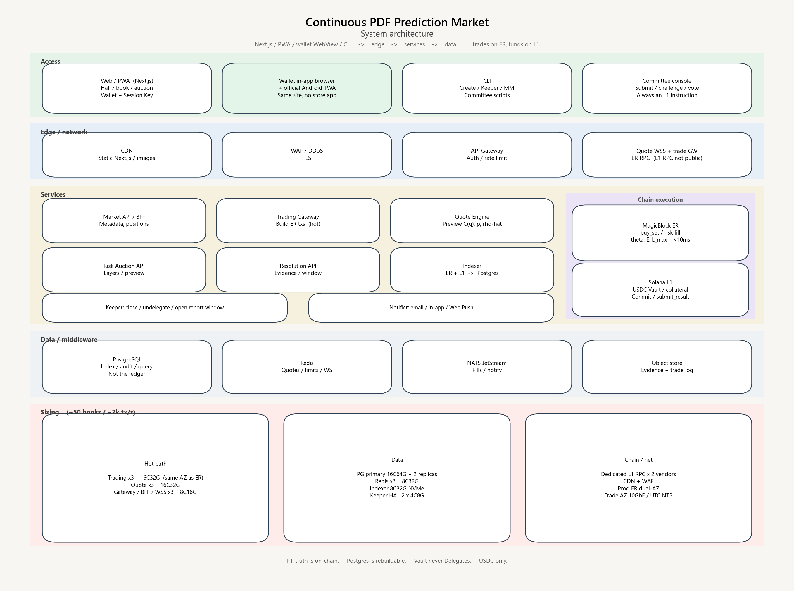

# System Architecture — Continuous PDF Prediction Market

| Item | Content |
| --- | --- |
| Version | 1.3 |
| Product counterpart | `product-specification.md` v1.6 |
| Scope | Web / PWA / CLI, business services, network, chain, server resource allocation |

This document only answers “which clients and machines make up the system, and how requests flow.” Frameworks and algorithms are in `technical-architecture.md`.



---

## 1. Overview

The system has six layers. Trading uses a low-latency path. Funds and settlement use Solana L1. Business queries use centralized services.

```text
┌─────────────── Access Layer ────────────────┐
│  Web/PWA  Wallet WebView  CLI  Committee Console │
└───────────┬──────────────────┬──────────────┘
            │ HTTPS / WSS      │ Trading Session
            ▼                  ▼
┌──────── Edge ────────┐  ┌──────── Trading Path ────────┐
│ CDN / WAF / Gateway  │  │ MagicBlock ER RPC            │
└──────────┬───────────┘  └────────────┬─────────────────┘
           ▼                           ▼
┌──── Business Service Cluster ────┐     ┌──── On-chain Execution ────┐
│ Quotes / Accounts / Auctions     │     │ buy_set on ER              │
│ Market create / Committee / Clear│     │ L1 funds and settlement    │
│ Index / Notify / Keeper          │     └───────▲────────────────────┘
└──────────┬───────────────────────┘             │ Commit / submit_result
           ▼                                     │
┌──── Data and Middleware ────┐     ┌──── Solana L1 ────────┐
│ PG / Redis / Object Store   │     │ Vault / Collateral / PDA │
└─────────────────────────────┘     └───────────────────────┘
```

Principles:

- **Fill truth lives on-chain** (ER trades; L1 funds and finalization)
- **Display and search live on the server** (index database, WebSocket push)
- **Results must land on-chain via `submit_result`**; there is no off-chain private rewrite of the PDF
- One prediction book maps to one Vault and one risk-auction book

---

## 2. Clients

### 2.1 Web client

For traders, Risk LPs, and market browsing. In the browser:

| Module | Responsibility |
| --- | --- |
| Market lobby `/` | Search / page every indexed board (family and status, not a second create taxonomy) |
| Trading board `/m/[id]` | Interval pick **and** football typed lines; coverage warning; **implied PDF** $p_k$ / score heatmap (not $E$); pre-bet ticket; rules strip; pending fill; public $x^*$ / $\rho$ after close — product §8.1, §14.6 |
| Wallet chrome | Connect → SIWS → deposit → open / renew / revoke Session; revoke ≠ disconnect |
| Risk auction `/auctions`, `/auction/[id]` | Published layers only; rates; collateral; current $L_{\max}$ |
| LP book `/lp` | This wallet’s $D_i$, $H$, premium, surplus claim |
| Positions `/portfolio` | Tickets, Vault cash, estimated $\hat\rho$, settlement / refund claim |
| Create `/create` | Distribution family + full field list; then the reviewer opens the board |
| Committee `/committee` | `submit_result` / evidence / challenge / vote (same Next.js app until it earns a split) |
| Ops `/ops` | Read-only lag, coverage, Vault identity, $C_P$ pool, keeper heartbeat. No Vault withdraw |

Deploy: Next.js. Static assets via CDN; APIs via the gateway. Trades are **client-signed** in the browser, then go **Trading Gateway → ER RPC**; they do not traverse the ordinary business API on the hot path.

**Web wallet integration (locked):**

1. `@solana/wallet-adapter-react`, Wallet Standard; must integrate Phantom, Solflare, Backpack  
2. After connect, do **SIWS**; the BFF issues a JWT (queries / push only; never a substitute for on-chain signatures)  
3. Deposit / withdraw / open Session: the main wallet popup signs L1  
4. In-play `buy_set`: the Session Key signs; Trading Gateway only forwards  
5. Framework, IDL, and Session details are in `technical-architecture.md` sections 2 and 5  

### 2.2 Mobile (not a store App)

No App Store / Play, and no Flutter / RN. Phones use **the same Next.js stack**:

- Safari / Chrome, or Add to Home Screen **PWA**
- **In-wallet browser** (Phantom / Solflare) opening this site — the primary mobile path
- Android home-screen icon: official-site **TWA APK**, not via Play
- In-play boards: WebSocket in the foreground; chrome Inbox for close / commit / settle alerts

There is only one BFF / gateway contract. Distribution is in `technical-architecture.md` sections 2.2 / 2.9.

### 2.3 CLI

For ops, market making, Keeper, and committee scripts. It does not replace a wallet App. **Keeper writes** (`close` / Commit / Undelegate) live here; the Next.js `/ops` page is read-only (SRS FR-UI-27 / FR-UI-28).

| Command group | Use |
| --- | --- |
| `market create-*` | Create markets (football / macro / elections / daily price / binary) |
| `market close / undelegate` | Halt trading; write state back to L1 |
| `trade buy-set` | Scripted orders, market making |
| `risk bid` | LP quotes and cancels |
| `resolve submit / challenge / vote / finalize` | Committee and bots |
| `keeper run` | Halt trading, lock risk, remind of the reporting window |
| `index status` | Indexer lag, ER health |

The CLI talks directly to chain RPC + the admin API, using the ops hot wallet or a multisig.

### 2.4 Committee console

A standalone Web console (can also be embedded in the main site): markets awaiting report, evidence attachments, challenge list, votes, audit log. All writes still end as on-chain `submit_result` / `challenge` / `vote`.

---

## 3. Service split

| Service | Responsibility | Hot path? |
| --- | --- | --- |
| **API Gateway** | Auth, rate limit, routing, TLS termination | Yes (queries) |
| **BFF / Market API** | Market metadata, templates, candlestick-style PDF snapshots, user position queries | No |
| **Trading Gateway** | Session Key, assemble ER transactions, quote preview (does not write the final ledger) | **Yes** |
| **Quote Engine** | Read-only $\theta$ snapshot; compute $C_S(q)$, $p_S$, $\hat\rho$ | **Yes** |
| **Risk Auction API** | Layers, order book, quote pre-check; fill instructions still go on-chain | Medium |
| **Resolution API** | Reporting window, evidence upload, challenge state; assemble on-chain instructions | No |
| **Indexer** | Subscribe to ER + L1 logs; write Postgres | Yes (consume) |
| **Keeper** | Time-based halt, undelegate, open the reporting window; writes inbox events | No, but must be highly available |
| **Object Store gateway** | Committee evidence, event graphics, rules PDFs | No |

On-chain programs (not traditional microservices, but part of the system):

| Program | Chain | Responsibility |
| --- | --- | --- |
| `continuous_pdf_market` (Anchor) | L1 create / ER trade | Market create, Delegate, `buy_set`, $\theta$ / $E$ |
| `risk_auction` | L1; may use ER during the trading period | Layers, quotes, lock collateral |
| `vault` | **L1 only** | USDC custody, fees, payout, draw LP |
| `resolution` | **L1 only** | `submit_result`, challenge, vote, finalize |

Funds programs are not Delegated to ER, so the high-speed layer never holds withdrawal authority.

---

## 4. Network and traffic

### 4.1 Paths

| Traffic | Path | Latency target |
| --- | --- | --- |
| Pages, images | User → CDN | — |
| Market list, positions | User → WAF → Gateway → Market API → PG/Redis | < 150 ms |
| Real-time PDF / book | User → WSS → Quote / Indexer push | < 50 ms |
| **Place order** | User → Trading Gateway → **ER RPC** | **< 10 ms in-chain execution** (excludes wallet confirmation) |
| Market create | User / CLI → L1 RPC | Slot confirmation |
| Halt write-back | Keeper → MagicBlock Commit / Undelegate → L1 | Seconds |
| Report / settlement transfer | Committee / Keeper → L1 RPC | Slot confirmation |

### 4.2 Domains and isolation

| Domain | Use |
| --- | --- |
| `www` / `app` | Web |
| `api` | Queries and non-hot trading |
| `quote` / `ws` | Quote WebSocket |
| `trade` | Trading Gateway (may colocate with ER) |
| `er-rpc` | MagicBlock nodes (terminals may reach them only via the Gateway) |
| `l1-rpc` | Self-hosted or vendor Solana RPC (not exposed naked to public users) |

ER and Trading Gateway deploy in the same region, same-city low latency; no transoceanic hop.

### 4.3 Security boundary

- WAF: DDoS, CC, geo and rate
- Gateway: JWT / wallet-signed session, IP rate limit
- Trading: Session Key allowance, per-market rate, anomalous $q$ intercept
- L1 RPC: private network + vendor allowlist only
- Committee: hardware or multisig + audit log
- Keys: ops hot wallets in HSM / cloud KMS; they do not enter application images

---

## 5. Data landing

| Store | What it holds | Who writes |
| --- | --- | --- |
| Solana L1 PDA | Market params, Vault, collateral, $x^*$, payout results | Chain programs |
| ER state | $\theta$, $E$, in-play order traces | ER transactions |
| PostgreSQL | Indexed markets, fills, positions, auction book, committee audit | Indexer |
| Redis | Quote cache, coverage ratio, WS presence, rate limits | Quote / Gateway |
| Object store | Evidence attachments, static assets | Resolution / CDN origin |

PG is the query primary, **not** the fill ledger. Reconciliation follows the chain; the index is rebuildable.

---

## 6. Servers and resource allocation

Size for “50 concurrent live markets, peak 2,000 orders/s, 10,000 quote subscriptions.” Beyond that, scale Trading / Quote / WS horizontally by group.

### 6.1 Application nodes

| Role | Spec (per box) | Count | Notes |
| --- | --- | --- | --- |
| API Gateway | 8C 16G, 25G NIC | 3 | Multi-AZ |
| Market API / BFF | 8C 16G | 3 | Stateless |
| Trading Gateway | 16C 32G, same AZ adjacent to ER | 3+ | Must not contend for cores with indexing |
| Quote Engine | 16C 32G | 3 | Memory holds $\theta$ snapshots |
| WS gateway | 8C 16G, high connection count | 3 | Separate process from Quote |
| Risk / Resolution API | 4C 8G | 2 | May share a cluster with BFF but deploy separately |
| Indexer | 8C 32G, NVMe | 2 (primary + hot standby) | Must not drop slots |
| Keeper | 4C 8G | 2 (primary/standby, different AZs) | Halt and reporting window |
| Committee console | 4C 8G | 2 | May fold into BFF |
| CLI jump host | 2C 4G | 1 | Ops VPN only |

### 6.2 Data nodes

| Role | Spec | Count |
| --- | --- | --- |
| PostgreSQL primary | 16C 64G, 1T NVMe | 1 |
| PostgreSQL replica | Same as primary | 2 (reads + backup) |
| Redis cluster | 8C 32G | 3 primary 3 replica |
| Object store | Cloud OSS / S3 | Cross-region redundancy |
| Logs / traces | Dedicated cluster or managed | Retain ≥ 30 days |

### 6.3 Chain and RPC

| Role | Config |
| --- | --- |
| Solana L1 RPC | Paid dedicated nodes from ≥ 2 vendors (primary + standby); do not mix with public free RPCs |
| MagicBlock ER | Production ER nodes per vendor SLA; if self-hosted, 16C 64G, same-city active-active |
| Transaction send | Trading Gateway connection pool pinned to ER; on failure, degrade to a user prompt; do not automatically fall back to L1 for hot trades |

### 6.4 Network and edge

| Item | Config |
| --- | --- |
| CDN | Global static; dynamic APIs need not be origin-cached |
| WAF / DDoS | One entry layer; separate policies for trade/ws |
| Bandwidth | Edge ≥ 5 Gbps burst; 10 GbE inside the trading AZ |
| Certificates | Wildcard + automatic rotation |
| Timezone / NTP | NTP on all nodes; `observe_ts` / `close_ts` always UTC |

### 6.5 Capacity rules of thumb

| Resource | Rule of thumb |
| --- | --- |
| Per-market grid 1024 + 121 score cells | Quote memory on the order of tens of MB of snapshots per market |
| 2,000 tx/s | Three 16C Trading Gateway boxes can hold; add groups beyond that |
| PG | Trade tables partitioned by `market_id`, archived monthly |
| Redis | Quote keys have short TTL; Indexer/ER subscriptions are the source |

---

## 7. Environments

| Environment | Chain | Use |
| --- | --- | --- |
| local | solana-test-validator + local ER simulation | Development |
| staging | Solana devnet / testnet + test ER | Integration, committee drills |
| production | Solana mainnet + production ER | Real money |

Three isolated config sets: RPC, wallets, PG, Redis, and object buckets must not cross-contaminate.

---

## 8. Observability and on-call

- Metrics: ER latency, order success rate, indexer slot lag, coverage ratio, Vault balance, Keeper heartbeat
- Logs: structured; trace IDs from Web through Gateway
- Tracing: full sample or head-based sample on Trading and Quote
- Alerts: indexer lag, ER unreachable, Keeper missed close, reporting window with no submission, Vault imbalance

---

## 9. Funds safety

Funds safety is the floor of public trust. It does not rely on TEE, Postgres, or Light compression.

### 9.1 Where the money sits

| Asset | Custody | Forbidden |
| --- | --- | --- |
| User margin, trading proceeds | L1 `vault` PDA, Circle USDC Token Account **only** | Into ops hot wallets, into ER withdrawable accounts, accept SOL or other coins, in-protocol FX |
| Risk LP collateral | This market’s L1 Risk Vault (same USDC mint) | Count $C_R$ before lock; fund collateral with SOL or another mint |
| Fees | Booked at trade time on the platform fee ledger; `claim_fees` to the platform UserVault at any time. Never $C_P$ | Mix a fill’s fee into that same board’s $C_{\max}$ or $C_P$ |
| Platform adjustment fund **pool** $C_P^{\mathrm{pool}}$ | One protocol L1 vault PDA (Circle USDC). Boards only receive $C_P^{\mathrm{alloc}}$ at settlement | Per-board $C_P$ wallets; unlimited guarantee; `admin_withdraw`; bake into LMSR |
| Unsettled surplus | Stay in this market’s Vault; split by $\alpha$ after `settle` | Arbitrary ops withdrawal |

Users first `vault.deposit`. ER only mirrors **available balance**; halt and L1 netting follow. An ER crash cannot make money “disappear”: L1 custody remains. In-play $\theta$ must not be discarded on the theory that “if it was not Committed it never happened” — $\theta$ is restored by replaying the trade log (see section 10.5).

### 9.2 Authority

- Program upgrades: multisig + timelock (e.g. 48h); pause withdrawals during the `vault` upgrade window  
- There is no `admin_withdraw`. The only outflows are: user withdrawal of unused margin, settlement payout, LP draw, $C_P$ allocation, surplus split, platform fee claim, VOID refund  
- Keeper / committee keys can only send allowed instructions; they cannot touch Token account owners  
- Session Key: per-market allowance, expiry, revocable; if lost, loss is capped at the authorized allowance  
- Same invariant tests before and after upgrades: $\sum$ amounts paid $\le C_{\max}$, Vault token balance = sum of the books  

### 9.3 What happens to money in an incident

| Incident | Funds |
| --- | --- |
| Trading / Quote / PG down | Untouched. Money is on L1 |
| ER node dead | User principal is on L1; confirmed fills replay from the log per 10.5, restoring $\theta$ and positions. Do not roll receipted fills back to “never happened” |
| Program bug | Timelock pause + multisig; the insurance fund does not replace Vault accounting |
| Malicious committee proposal | Challenge window; after passage, $x^*$ still pays by the rules; no extra back-door transfer |

Reconciliation: hourly, the Indexer aligns each market’s Vault balance with $\sum$ margin $+R_{\mathrm{net}}+$ undrawn collateral. On mismatch, alert and halt that market’s outflows.

---

## 10. Data storage and node-crash recovery

### 10.1 Data tiers

| Tier | Data | Storage | If lost |
| --- | --- | --- | --- |
| S0 funds and terminal state | Vault, collateral, $x^*$, settled payouts | **L1 only** | Must not be lost; the chain provides replicas |
| S0.5 confirmed fills | Each `buy_set` / auction fill receipt and order | ER replication log + object-store trade log + Indexer persist; L1 periodically commits `trades_root` | **Must not vanish because a single node crashed**. See 10.5 |
| S1 in-play hot state | $\theta$, $E$, $L_{\max}$, ER margin mirror | ER memory; periodic Commit back to L1 | Process death may lose memory; must be replayable from S0.5 |
| S2 query projection | Fill list, position view, auction book, **listing identity**, **listing applications / review log**, **board comments**, **fill-journal $S$** | PG via **sqlx in Rust Market API / Indexer** (DDD repos; Next.js does not connect) | Rebuildable from S0.5 / chain logs (listings/journal are off-chain helpers). Applications/review/comments are catalog-only (FR-UI-42–45), not settlement. PG down only means temporarily unqueryable |
| S3 cache | Quotes, coverage ratio, sessions | Redis | Recompute if lost; RPO is not measured |
| S4 evidence and static | Attachments, rules text | Object store + hash on L1 | If files are lost, verify by hash; buckets must be cross-region |

Principle: **S2/S3 must never be the ledger.** Recovery order is L1 checkpoint → **replay the trade log** → rebuild PG — not “write balances back from a backup DB,” and not “treat uncommitted fills as never happened.”

Application persistence is DDD + sqlx + associated-type `Context`: `docs/architecture/ddd-sqlx.md`. `listing`, `listing_application`, `review_log`, `market_comment`, `fill_journal`, and `market_proj` live in Postgres (local machine service or production). Memory is a cache; restart reloads from PG. Comments are accepted only for an approved indexed board. Listing applications need reviewer approve, then the reviewer signs on-chain create (reviewer is owner).

### 10.2 Backups

| Component | Backup | RPO / RTO (target) |
| --- | --- | --- |
| L1 | The chain itself + self-hosted RPC from two vendors | RPO=0 (confirmed transactions) |
| ER | High-frequency state-root snapshots + last L1 Commit | See 10.3 |
| PG | Streaming replica + daily local + cross-region PITR 7 days | RPO ≤ 1 min, RTO ≤ 15 min (promote replica) |
| Redis | Do not back up as a ledger; AOF only to speed warmup | RTO ≤ 2 min start with empty cache |
| Object store | Cross-region replication, versioning, deletion protection | RPO ≈ 0 |
| Keys | Multi-region KMS; Keeper primary/standby in different AZs | If lost, rotate; do not copy private keys from disk |

### 10.3 How each node comes back

| Node | Recovery |
| --- | --- |
| Gateway / BFF / App | Stateless; Kubernetes restart is enough |
| Trading Gateway | No local ledger; reconnect to ER; in-flight signed txs follow chain receipts (at-least-once) |
| Quote | Rebuild memory from Redis or ER/Indexer $\theta$ snapshot; do not treat stale cache as fills |
| Indexer | Replay from `last_slot` via Yellowstone; drop from read traffic if lag exceeds the threshold |
| Keeper | Standby takes over if primary dies; instructions are idempotent (the same `close_ts` cannot close twice) |
| PG primary | Promote replica; apps switch connection string |
| **ER** | Hot standby takes over the same Delegated accounts; if that fails, replay from “$\theta$ at last L1 Commit” + “trade log after that Commit” through the last receipted fill before the crash, then Delegate to a new ER. See 10.5 |
| Committee console | Stateless; proposals live on L1 |

ER must have a **Commit cadence**: do not wait only for `close_ts`. In production, at a fixed interval (e.g. every 30–60s or every N fills) checkpoint $\theta$, $E$, `trades_root`, and the margin mirror back to L1. Commit is a checkpoint that speeds recovery; **it is not the criterion for whether a fill exists**.

### 10.4 Drills

Once a month: kill Indexer, kill Keeper, kill PG primary, kill a single ER. Verify Vault books unchanged, **every receipted fill still present**, $\theta$ matches replay, the index can catch up, and halt still fires. An unrehearsed recovery plan does not exist.

### 10.5 Fills must survive node crashes

Nodes can die. **Fills that have already been established for the user cannot.**

$\theta$ is not the raw ledger; it is a function of the prior plus the fill sequence:

$$\theta_t = \mathrm{Update}(\theta_0,\; \mathrm{trade}_1,\ldots,\mathrm{trade}_t)$$

So as long as the fill sequence exists, hot state can be replayed. The earlier line that “fills between two L1 Commits may be lost” is withdrawn: the Commit interval only affects where replay starts, not whether a fill exists.

#### 10.5.1 When a fill is considered established

All of the following must hold before the user sees “filled” and before the fill enters the log:

1. ER (or L1) has executed the `buy_set` / risk-auction fill instruction  
2. A **signed receipt** is returned: `tx_sig` or ER sequence number, `market_id`, wallet, `nonce`, set / quantity, amount paid, $E$ increment, post-execution state root  
3. The receipt has been written to a **replication-log majority** (at least 2 copies, different machines; see below)

Gateway reports only `pending` until the receipt is durable. If the user refreshes and sees pending, retry with the same `nonce`; on-chain idempotency prevents double spend. A request without a receipt **was never a fill**; that is not the same as “a fill was lost.”

#### 10.5.2 The log has at least two paths that do not share fate

| Replica | What it writes | If it fails alone |
| --- | --- | --- |
| ER replication log (primary + sync standby, or MagicBlock sequencer log) | Per-fill order, state root | Standby takes over and continues the same sequence |
| Trade-log object store (append-only per `market_id`) | The same receipt; history is immutable | Indexer / new ER replays from here |
| Indexer → PG | Query projection | Replay from the log; the user’s list is temporarily empty; the fill is still there |
| Client receipt | The user can present it locally | In a dispute, check against the log / chain |

L1 does not require every fill to land on mainnet immediately. Periodic Commit includes the `trades_root` (Merkle) up to that point, to audit that “the log was not rewritten after the fact.” Funds still only recognize the Vault.

Forbidden:

- Store fills only in a single ER’s memory  
- Store fills only in PG and “guess” from the DB when ER dies  
- Tell the user it filled before the receipt is in hand  
- On recovery, revert receipted fills to unfilled (unless the whole market is VOID under product rules, and that is a governance decision, not the crash default)

#### 10.5.3 How fills survive each failure

| What failed | Fills |
| --- | --- |
| Gateway / BFF / App | No books. Receipts live in the ER log and on the client |
| Quote | No fills. Restart and pull $\theta$ |
| Indexer or PG | Fills are in the log and ER. Catch up slots and replay; the list comes back |
| Redis | Irrelevant |
| Single ER | Standby continues from the same replication log; or a new ER replays from the L1 $\theta$ checkpoint + the log. User positions, amounts paid, and order are unchanged |
| Entire ER cluster + object store gone at once | This is a dual-active datacenter-class incident. Intervals whose `trades_root` is already Committed can still be audited; the last few seconds without a committed root require manual reconciliation of client receipts against L1 margin netting. **The design goal is that this never happens**: the log bucket and the ER log must be in different AZs / different vendors |

Replay rule: execute official `crates/math` in strict `nonce` / sequence order; the resulting $\theta$, $E$, $L_{\max}$ must match the state root of the last receipt before the crash. On mismatch, halt the market and alert; **do not delete fills to force alignment**.

Funds side: margin deductions for filled trades follow the receipt; L1 Vault nets at the next Commit / halt. Do not wipe bought positions and refund because a node died, unless the user actively closes under product rules or the whole market is VOID.

---

## 11. Light Protocol: rent savings for cold data only; not for the hot path or funds

Light (ZK Compression) puts account data in a compression tree and leaves only a hash on-chain; **updates need a validity proof and UTXO-style invalidation of old leaves**. Throughput and CU fit “many accounts, rarely updated,” not a book that mutates $\theta$ every second.

| Data | Use Light? | Reason |
| --- | --- | --- |
| Vault / collateral / transfers | **No** | The funds path cannot depend on proof latency, the Forester queue, or RPC-supplied leaf data |
| In-trade $\theta$, $E$, `buy_set` | **No** | Every fill would need a proof + a larger transaction, which conflicts with the ER <10 ms target |
| Active market-parameter PDA | **No** | Halt, Delegate, and settlement need in-place read/write |
| **CLOSED** grid archives | **Allowed** | Thousands of historical books with 256–1024 cells occupy rent; compress into compressed accounts, leave the root on-chain, query via Photon / a self-built index |
| Settled position receipts / historical fill tickets | **Allowed** | Many users; written once and almost never updated |
| Original committee evidence | **Do not use Light** | Put it in object storage; L1 stores only the hash |

Try these cost levers first, then consider Light:

1. Keep hot state on ER; do not park large grids on L1 long-term  
2. After close and `settle`, **close accounts and reclaim rent** (`close` the grid buffer); do not let dead markets occupy rent forever  
3. Do not model positions as “one L1 PDA per user per market”  
4. If that is still not enough, compress **closed markets** into Light  

If Light is adopted: only an `archive_market` instruction that compresses settled read-only state; query recovery goes through the index. `buy_set` / `vault.settle` must not touch compressed accounts. The indexer must also subscribe to compression events, or historical markets vanish in the App.

---

## 12. Data security

Funds safety answers “can money be moved.” Data security answers “who can read, who can write, and what happens if it leaks.” About half of this protocol’s data **must be public** (otherwise $\rho$ cannot be recomputed); the other half must be locked down.

### 12.1 Classification

| Tier | Examples | Public? | Requirement |
| --- | --- | --- | --- |
| Public ledger | Market params, $f$ / $P$, fills, $E$, $x^*$, $\rho$, payouts | **Must be public** | Recomputable; do not encrypt the book |
| Secret | Program upgrade keys, Keeper / committee hot keys, KMS, RPC tokens, DB passwords | Not public | Least privilege, hardware or cloud KMS, audit |
| Restricted | IP, devices, KYC (if any), original committee evidence | Not on-chain | Encrypted at rest, access audit, time-limited deletion |
| Internal | Logs, traces, metric tags | Not public | Redact: wallets may remain; IP does not enter logs by default |

There is no “private position” on-chain. A user’s order is public. Product copy must say so; do not promise on-chain anonymity.

### 12.2 Encryption in transit and at rest

- **In transit**: site-wide TLS 1.2+; ER / L1 RPC, PG, Redis, and NATS all use TLS; no plaintext to the public internet  
- **At rest**: cloud disks / PG / object store use KMS-managed encryption (AES-256); backups are encrypted the same way; keys are not stored with the backups  
- **Object-store evidence**: SSE-KMS, private bucket, readable only by the Resolution service role; L1 stores only `sha256`  
- **Redis**: AUTH + TLS; no private keys, no Session Key plaintext seeds  
- **Laptops / jump hosts**: disk encryption; do not copy production DB dumps home  

The public ledger is plaintext on L1/ER by design, not a vulnerability. Do not use Light or TEE to encrypt the PDF as a “data-security” measure — that destroys recomputability.

### 12.3 Access control

| Who | What they can touch |
| --- | --- |
| Anonymous user | Public quotes, market params |
| Logged-in wallet | Own deposit / order / position queries (others can also see fills on-chain) |
| Committee | This market’s report / challenge / vote; matching prefix in the evidence bucket |
| Ops read-only | PG read replica, dashboards; no Vault instructions |
| Keeper | Only `close` / `undelegate` / open the reporting window |
| Upgrade multisig | Program upgrades, inside the timelock |

PG uses separate roles: Indexer write-only, API read-only on necessary tables; no superuser attached to business processes. Object storage is isolated by the `evidence/{market_id}/` prefix. Revoke IAM and multisig immediately on departure.

### 12.4 Keys and sessions

- Upgrade authority and Vault are never a single-person hot key  
- Keeper / reporting bots: KMS-signed, memory only, never to disk; primary/standby in different AZs with different keys  
- Session Key: one-shot authorization, allowance, expiry, user-revocable; the client does not write plaintext into LocalStorage  
- Seed phrases never enter the server  
- Rotation: rotate RPC tokens and DB passwords on a schedule; on leak, revoke per the incident response  

### 12.5 Logs, privacy, compliance

- Default log fields: `market_id`, `tx_sig`, truncated `pubkey`, error code; **do not log** phone, government id, or plaintext IP (when risk control needs it: hash + short TTL)  
- If KYC is done: a separate subsystem, isolated from the trading DB; ID numbers never written on-chain  
- Retention: finance and settlement related ≥ regulatory requirement  

### 12.6 Injection, privilege escalation, backup leaks

- All API queries are parameterized; no concatenated SQL  
- Object-store files are fetched by hash only, not by user-controlled path traversal  
- Committee uploads: type allowlist, size cap, antivirus / content scan before entering the bucket  
- PG backups and log exports are treated as secret; recovery drills use redacted copies  
- If the index DB is exfiltrated: the attacker gets fills that were already crawlable on-chain  

### 12.7 Incidents

Key leak: rotate immediately, pause upgrades, inspect Vault instruction logs.  
PG leak: disclose scope (which data was already public on-chain), rotate DB secrets.  
Evidence-bucket leak: notify committee members per market, rotate bucket keys; on-chain hashes still verify authenticity.  

Data security does not replace section 9 funds safety: even if the DB is stolen, it must not enable one extra USDC transfer.

---

## 13. Mapping to the product flow

| Product step | System landing |
| --- | --- |
| Choose distribution, create market | Web/CLI → Market API → L1 `create_*` |
| Trading gets more expensive as you buy | Web / PWA / Wallet WebView → Trading Gateway → ER `buy_set` |
| Risk auction | Web → Risk API + L1/ER quote instructions |
| Halt trading | Keeper → Undelegate / Commit |
| Committee report | Console/CLI → L1 `submit_result` |
| Settlement payout | L1 `settle` reads $x^*$, transfers from Vault |

Detailed algorithms and framework choices are in `technical-architecture.md`.
